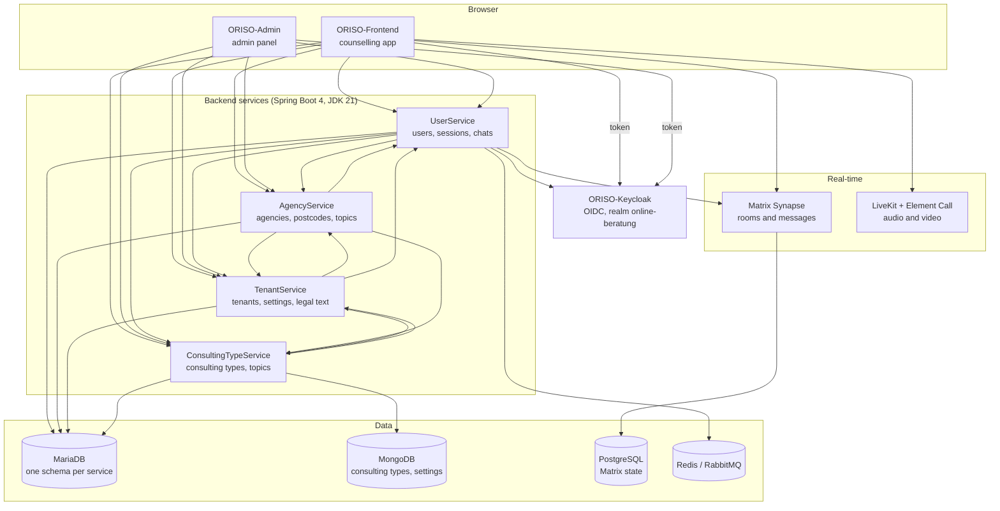

# ORISO end-to-end architecture

Two browser applications, four Spring Boot services, one identity provider, one Matrix
homeserver for real-time communication, and one Helm chart that deploys the lot. This
page is the map; every box links to the repository, and the sections below name the file
you open when you need to touch that edge.

## The service landscape

Arrows point in the direction of the call. Edge directions are taken from the
cross-service graph described in
[how we keep the docs honest](./understand-anything.md); the numbers behind them are
literal-path matches between callers and OpenAPI/Spring endpoints.

Two things about this picture are worth internalising early.

**The backend is a mesh, not a layer cake.** All four services call each other. A change
to a TenantService response shape can surface as a UserService failure, and the graph
counts 19 such service-to-service dependencies. Before changing a response, check who
consumes it.

**Neither UI owns data.** Frontend and Admin are pure API consumers with a Keycloak
token. Anything that looks like state in the browser is a cache of something a service
owns.

## Layers and owners

| Layer | Repositories | What lives here |
| --- | --- | --- |
| UI | [ORISO-Frontend](https://github.com/OpenResilienceInitiative/ORISO-Frontend), [ORISO-Admin](https://github.com/OpenResilienceInitiative/ORISO-Admin) | React apps, routing, API clients, Storybook |
| Identity | [ORISO-Keycloak](https://github.com/OpenResilienceInitiative/ORISO-Keycloak) | realm, clients, roles, token issuance |
| Services | [UserService](https://github.com/OpenResilienceInitiative/ORISO-UserService), [AgencyService](https://github.com/OpenResilienceInitiative/ORISO-AgencyService), [TenantService](https://github.com/OpenResilienceInitiative/ORISO-TenantService), [ConsultingTypeService](https://github.com/OpenResilienceInitiative/ORISO-ConsultingTypeService) | OpenAPI contracts, controllers, domain logic, persistence |
| Data | [ORISO-Database](https://github.com/OpenResilienceInitiative/ORISO-Database), and the schemas shipped with the chart | MariaDB schemas, MongoDB documents, Matrix PostgreSQL |
| Runtime | [ORISO-Helm](https://github.com/OpenResilienceInitiative/ORISO-Helm) | the umbrella chart, ingress, secrets, all subcharts |

## Where do I intervene?

| I want to change… | Open this first |
| --- | --- |
| A screen or a component | the route table — [`ORISO-Frontend/src/components/app/RouterConfig.tsx`](https://github.com/OpenResilienceInitiative/ORISO-Frontend/blob/dev/src/components/app/RouterConfig.tsx) or [`ORISO-Admin/src/App.tsx`](https://github.com/OpenResilienceInitiative/ORISO-Admin/blob/dev/src/App.tsx) |
| How the browser calls an API | the fetch wrapper — [`ORISO-Frontend/src/api/fetchData.ts`](https://github.com/OpenResilienceInitiative/ORISO-Frontend/blob/dev/src/api/fetchData.ts), [`ORISO-Admin/src/api/fetchData.ts`](https://github.com/OpenResilienceInitiative/ORISO-Admin/blob/dev/src/api/fetchData.ts) |
| The shape of a backend endpoint | the OpenAPI contract in that service's `api/` folder, then the controller |
| Who may call an endpoint | the service's security configuration — see [authentication and Keycloak](./authentication-and-keycloak.md) |
| Which tenant a request belongs to | the tenant resolvers — [`TenantResolverService`](https://github.com/OpenResilienceInitiative/ORISO-TenantService/blob/dev/src/main/java/com/vi/tenantservice/api/tenant/TenantResolverService.java#L23-L30) |
| A table or a column | the owning service, never another service's schema — see [database and data model](./database-and-data-model.md) |
| Routing, hostnames, secrets, resources | the chart — [`ORISO-Helm`](https://github.com/OpenResilienceInitiative/ORISO-Helm), see [Kubernetes deployment](./kubernetes-deployment.md) |

## Rules that survive refactors

- **Service ownership is absolute.** Never write another service's schema directly, even
  when the connection string would work. Cross-service identifiers exist without
  database-level foreign keys precisely because the boundary is meant to be the API.
- **Contract before code.** The OpenAPI file in `api/` is the first source for an
  endpoint's shape; the controller tells you the behaviour behind it.
- **A Keycloak role is necessary, not sufficient.** Tenant resolution and per-service
  authorisation rules run on top of the role in the token.
- **Environment files in a UI repository are not production truth.** The chart values are.
- **One domain, path-based routing.** Everything is served from a single host with path
  rules; Matrix is the one deliberate exception. See
  [ADR-011](/decisions/adr-011) and [ADR-005](/decisions/adr-005).

## Related

- [Install and run locally](./install-and-run-locally.md)
- [Backend services](./backend-services.md)
- [Authentication and Keycloak](./authentication-and-keycloak.md)
- [Database and data model](./database-and-data-model.md)
- [Kubernetes deployment](./kubernetes-deployment.md)
