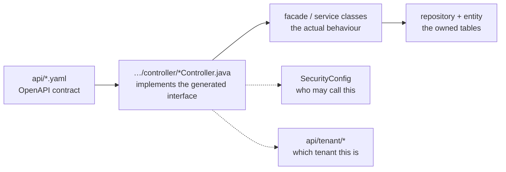

# Backend services

Four Spring Boot services, all built the same way: Maven wrapper, JDK 21, an OpenAPI
contract in `api/` from which the API interfaces are generated, controllers that
implement those interfaces, and a MariaDB schema the service alone writes to.

## At a glance

| Service | Owns | Endpoints it exposes | Tables | Calls |
| --- | --- | --- | --- | --- |
| [UserService](#userservice) | users, consultants, sessions, conversations, chats, appointments, notifications | 186 | 54 | Agency, ConsultingType, Tenant, Keycloak |
| [AgencyService](#agencyservice) | agencies, postcode ranges, agency topics, dioceses | 40 | 7 | Tenant, ConsultingType, User |
| [TenantService](#tenantservice) | tenants, settings, theming, legal texts | 43 | 12 | Agency, ConsultingType, User |
| [ConsultingTypeService](#consultingtypeservice) | consulting types, topics, topic groups, application settings | 23 | 5 | Tenant |

Endpoint and table counts come from the cross-service graph — see
[how we keep the docs honest](./understand-anything.md). "Endpoints it exposes" counts
only the service's own routes, not the peer contracts it also carries in `api/`.

## How to read a service

The same four steps work for all of them, and doing them in this order saves most of the
guesswork:

1. **The contract** tells you the shape: path, verb, request and response models.
2. **The controller** tells you the authorisation annotation and the delegation target.
3. **The facade or service** is where the behaviour lives, including calls to peers.
4. **The repository and entity** show what is persisted, and in which schema.

## UserService

[Repository](https://github.com/OpenResilienceInitiative/ORISO-UserService) · the largest
service by a wide margin: user and consultant accounts, enquiries, counselling sessions,
session lists, group chats, appointments, notifications, account deletion, and the
application-side lifecycle of Matrix rooms.

**Contracts**
[`api/userservice.yaml`](https://github.com/OpenResilienceInitiative/ORISO-UserService/blob/dev/api/userservice.yaml) ·
[`api/useradminservice.yaml`](https://github.com/OpenResilienceInitiative/ORISO-UserService/blob/dev/api/useradminservice.yaml) ·
[`api/conversationservice.yaml`](https://github.com/OpenResilienceInitiative/ORISO-UserService/blob/dev/api/conversationservice.yaml) ·
[`api/appointmentservice.yaml`](https://github.com/OpenResilienceInitiative/ORISO-UserService/blob/dev/api/appointmentservice.yaml) ·
[`api/userstatisticsservice.yaml`](https://github.com/OpenResilienceInitiative/ORISO-UserService/blob/dev/api/userstatisticsservice.yaml)

**Entry points**
Controllers live under
[`adapters/web/controller/`](https://github.com/OpenResilienceInitiative/ORISO-UserService/blob/dev/src/main/java/de/caritas/cob/userservice/api/adapters/web/controller/UserController.java);
the surface is wide, from `UserController` and `ConversationController` through
`AppointmentController` to `CaseHandoverController` and `EventNotificationController`.

**Security**
[`SecurityConfig#L98-L112`](https://github.com/OpenResilienceInitiative/ORISO-UserService/blob/dev/src/main/java/de/caritas/cob/userservice/api/config/auth/SecurityConfig.java#L98-L112) ·
[`RoleAuthorizationAuthorityMapper`](https://github.com/OpenResilienceInitiative/ORISO-UserService/blob/dev/src/main/java/de/caritas/cob/userservice/api/config/auth/RoleAuthorizationAuthorityMapper.java) ·
tenant resolution under
[`api/tenant/`](https://github.com/OpenResilienceInitiative/ORISO-UserService/blob/dev/src/main/java/de/caritas/cob/userservice/api/tenant/TenantResolverService.java)

**Watch out**: it owns 54 tables and 186 endpoints, of which the graph finds a confirmed
caller for 70. Before you assume an endpoint is unused, remember that runtime-assembled
paths do not produce a `calls` edge.

## AgencyService

[Repository](https://github.com/OpenResilienceInitiative/ORISO-AgencyService) · public
agency lookup, agency administration, postcode ranges, topic and demographic enrichment,
and the Matrix service accounts agencies need.

**Contracts**
[`api/agencyservice.yaml`](https://github.com/OpenResilienceInitiative/ORISO-AgencyService/blob/dev/api/agencyservice.yaml) ·
[`api/agencyadminservice.yaml`](https://github.com/OpenResilienceInitiative/ORISO-AgencyService/blob/dev/api/agencyadminservice.yaml)

**Security**
[`SecurityConfig`](https://github.com/OpenResilienceInitiative/ORISO-AgencyService/blob/dev/src/main/java/de/caritas/cob/agencyservice/config/SecurityConfig.java) ·
[`JwtAuthConverter`](https://github.com/OpenResilienceInitiative/ORISO-AgencyService/blob/dev/src/main/java/de/caritas/cob/agencyservice/config/security/JwtAuthConverter.java)

**Watch out**: agency creation depends on an encryption key supplied through the chart
(`agencyService.serviceEncryptionAppkey`). An empty key does not fail loudly — see
[Kubernetes deployment](./kubernetes-deployment.md).

## TenantService

[Repository](https://github.com/OpenResilienceInitiative/ORISO-TenantService) · the tenant
registry: identity, subdomain, licensing limits, theming, feature settings, multilingual
legal content and content activation dates. It also exposes a restricted public view used
before a caller has an authenticated tenant context.

**Contract**
[`api/tenantservice.yaml`](https://github.com/OpenResilienceInitiative/ORISO-TenantService/blob/dev/api/tenantservice.yaml)

**Layering** — the clearest example of the pattern described above:
`api/tenantservice.yaml` → `TenantController` →
`TenantServiceFacade` → `TenantService` / `TenantRepository` / `TenantEntity`, with
[`WebSecurityConfig#L30-L56`](https://github.com/OpenResilienceInitiative/ORISO-TenantService/blob/dev/src/main/java/com/vi/tenantservice/config/security/WebSecurityConfig.java#L30-L56)
and
[`JwtAuthConverter#L34-L51`](https://github.com/OpenResilienceInitiative/ORISO-TenantService/blob/dev/src/main/java/com/vi/tenantservice/config/security/JwtAuthConverter.java#L34-L51)
on the side.

**Tenant resolution** lives here in its canonical form:
[`TenantResolverService#L23-L49`](https://github.com/OpenResilienceInitiative/ORISO-TenantService/blob/dev/src/main/java/com/vi/tenantservice/api/tenant/TenantResolverService.java#L23-L49).

**Watch out**: `/tenant/public/**` is deliberately unauthenticated. Anything you add
under that prefix is world-readable.

## ConsultingTypeService

[Repository](https://github.com/OpenResilienceInitiative/ORISO-ConsultingTypeService) ·
consulting type settings, topics, topic groups and application settings, with
tenant-aware access. It is the only service that keeps a substantial part of its data in
MongoDB rather than MariaDB.

**Contracts**
[`api/consultingtypeservice.yml`](https://github.com/OpenResilienceInitiative/ORISO-ConsultingTypeService/blob/dev/api/consultingtypeservice.yml) ·
[`api/topicservice.yml`](https://github.com/OpenResilienceInitiative/ORISO-ConsultingTypeService/blob/dev/api/topicservice.yml) ·
[`api/applicationsettingsservice.yml`](https://github.com/OpenResilienceInitiative/ORISO-ConsultingTypeService/blob/dev/api/applicationsettingsservice.yml)

**Security**
[`SecurityConfig`](https://github.com/OpenResilienceInitiative/ORISO-ConsultingTypeService/blob/dev/src/main/java/de/caritas/cob/consultingtypeservice/config/SecurityConfig.java)

## Cross-service calls

Each service carries its peers' contracts under `api/` or `services/` and calls them
through generated clients. That is why the count of endpoints "in" a repository is much
larger than the count it actually exposes: UserService's checkout contains 109 consumed
and 58 external endpoints on top of its own 186.

Consequences for a change:

- **Changing a response model is a cross-repository change.** Find the consumers in the
  cross-service graph before you edit the contract.
- **Peer calls run as a technical user**, not as the end user. Authorisation on the
  receiving side sees the technical role, so a permission bug can hide behind it.
- **A service is allowed to fail alone.** Do not add a synchronous peer call to a path
  that must work when that peer is down.

## Related

- [Architecture](./architecture.md) — the call graph
- [Authentication and Keycloak](./authentication-and-keycloak.md) — the security pieces
- [Database and data model](./database-and-data-model.md) — the owned schemas
- [Install and run locally](./install-and-run-locally.md) — how to start one
