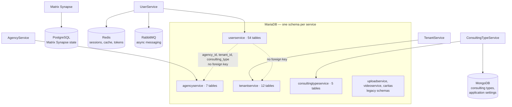

# Database and data model

Five stores, one ownership rule. The rule is the important part: **a table belongs to
exactly one service, and only that service writes it.**

## Ownership

| Schema | Owner | Notable tables |
| --- | --- | --- |
| `userservice` | UserService | `user`, `consultant`, `session`, `session_data`, `session_topic`, `session_supervisor`, `chat`, `group_chat_participant`, `appointment`, `draft_message`, `event_notification`, `agency_invite_link`, `identity_tombstone` |
| `agencyservice` | AgencyService | `agency`, `agency_postcode_range`, `agency_topic`, `diocese` |
| `tenantservice` | TenantService | `tenant` |
| `consultingtypeservice` | ConsultingTypeService | `topic`, `topic_group`, `topic_group_x_topic` |
| `uploadservice`, `videoservice`, `caritas` | — | legacy schemas; the owning repositories are not part of this platform |

The schemas that ship with the deployment live in the chart, for example
[`charts/mariadb/sql-schemas/userservice-schema.sql`](https://github.com/OpenResilienceInitiative/ORISO-Helm/blob/dev/charts/mariadb/sql-schemas/userservice-schema.sql).
[ORISO-Database](https://github.com/OpenResilienceInitiative/ORISO-Database) additionally
holds schema exports, MongoDB dumps and the operational documentation for Redis,
RabbitMQ and Matrix PostgreSQL.

Every schema carries `DATABASECHANGELOG` and `DATABASECHANGELOGLOCK` tables from
Liquibase. Whether Liquibase actually runs is a per-service, per-environment setting —
verify it against the running environment rather than assuming from the presence of the
tables.

## The trap: identifiers without foreign keys

`agency_id`, `user_id`, `session_id`, `consulting_type` and `tenant_id` appear in several
schemas, but they cross service and database boundaries, so **MariaDB does not enforce
them**. Three consequences you will meet in practice:

1. **Deleting through the API is not the same as deleting a row.** A row can reference an
   agency that no longer exists, and the database will not object.
2. **A join you would like to write does not exist.** Combining data across two services
   means two API calls, not one query.
3. **Test fixtures lie.** A fixture that inserts rows directly can create a state the
   real API would refuse.

## Where do I intervene?

| I want to… | Do this |
| --- | --- |
| Add a column | change it in the owning service's entity and migration; never patch another service's schema |
| Read another service's data | call its API; if there is no endpoint, that is the change to make |
| Understand a table | find the entity class in the owning service, then the repository that queries it |
| Check what production actually has | inspect the live schema — the exported files are snapshots, not a migration history |

## Risks worth checking before you scale

- Index coverage is thin outside `userservice`; check it before tenant-heavy or
  session-heavy load tests.
- Dump and backup files can contain personal data. Treat them accordingly.
- Cross-service identifiers make cascading cleanup an application concern, not a database
  one.

## Related

- [Backend services](./backend-services.md) — the owners
- [Architecture](./architecture.md) — why the boundary is where it is
- [Tenant lifecycle](./tenant-lifecycle.md)
- [Kubernetes deployment](./kubernetes-deployment.md) — where the schemas are applied
