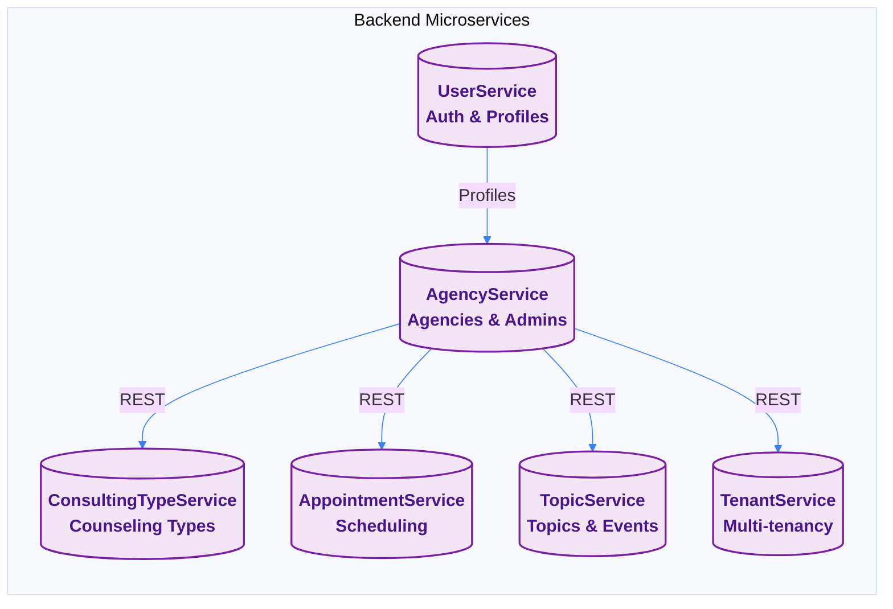

```mermaid
%%{init: { 'theme': 'base', 'themeVariables': { 'fontSize': '18px', 'lineColor': '#3B82F6' } }}%%

flowchart TB

  subgraph Backend["Backend Microservices"]
    direction TB
    B1[("UserService\nAuth & Profiles")]:::backend
    B2[("TenantService\nMulti-tenancy")]:::backend
    B3[("ConsultingTypeService\nCounseling Types")]:::backend
    B4[("AgencyService\nAgencies & Admins")]:::backend
    B5[("AppointmentService\nScheduling")]:::backend
    B6[("TopicService\nTopics & Events")]:::backend
  end

  %% Inter-service REST (examples)
  B4 -->|REST| B3
  B4 -->|REST| B5
  B4 -->|REST| B6
  B4 -->|REST| B2
  B1 -->|Profiles| B4

  %% Styling
  classDef backend fill:#f3e5f5,stroke:#7b1fa2,stroke-width:2px,color:#4a148c,font-weight:bold
```

