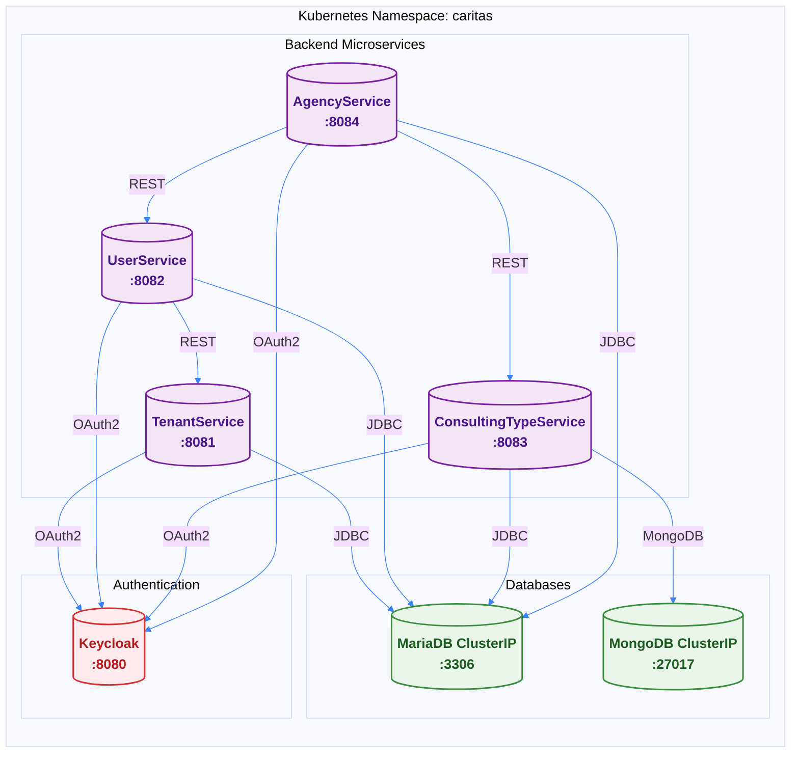

## Backend Services Overview

ORISO Platform includes 4 core backend microservices, all deployed via Helm charts in the Kubernetes `caritas` namespace.



## Service Details

### TenantService
- **Port:** 8081
- **Purpose:** Multi-tenancy management
- **Database:** MariaDB (tenantservice database)
- **Technology:** Spring Boot 2.7.14, Java 17
- **Service Name:** `oriso-platform-tenantservice.caritas.svc.cluster.local:8081`
- **Health Endpoint:** `/actuator/health`

### UserService
- **Port:** 8082
- **Purpose:** User management, authentication, profiles, Matrix integration
- **Database:** MariaDB (userservice database)
- **Technology:** Spring Boot 2.7.14, Java 17
- **Service Name:** `oriso-platform-userservice.caritas.svc.cluster.local:8082`
- **Health Endpoint:** `/actuator/health`
- **Special Features:** Matrix user creation, room management

### ConsultingTypeService
- **Port:** 8083
- **Purpose:** Counseling type management
- **Database:** MariaDB (consultingtypeservice database) + MongoDB (consulting_types collection)
- **Technology:** Spring Boot 2.7.14, Java 17
- **Service Name:** `oriso-platform-consultingtypeservice.caritas.svc.cluster.local:8083`
- **Health Endpoint:** `/actuator/health`

### AgencyService
- **Port:** 8084
- **Purpose:** Agency and admin management
- **Database:** MariaDB (agencyservice database)
- **Technology:** Spring Boot 2.7.14, Java 17
- **Service Name:** `oriso-platform-agencyservice.caritas.svc.cluster.local:8084`
- **Health Endpoint:** `/actuator/health`

## Technology Stack

### Common Stack
- **Framework:** Spring Boot 2.7.14
- **Java Version:** 17
- **Build Tool:** Maven
- **Database Migration:** Liquibase **DISABLED** (schemas managed in ORISO-Database)

### Database Connections
All services connect to MariaDB via Kubernetes ClusterIP:
```
jdbc:mariadb://oriso-platform-mariadb.caritas.svc.cluster.local:3306/<database-name>
```

### Inter-Service Communication
Services communicate via Kubernetes DNS using REST:
```
http://oriso-platform-<service-name>.caritas.svc.cluster.local:<port>
```

## Database Schema Management

### Liquibase Status
**Liquibase is DISABLED in all services.** Database schemas are managed centrally in the ORISO-Database repository.

### Schema Location
- **Repository:** `caritas-workspace/ORISO-Database`
- **MariaDB Schemas:** `mariadb/*/schema.sql`
- **MongoDB Schemas:** `mongodb/consulting_types/`
- **Setup Script:** `scripts/setup/00-master-setup.sh`

### Schema Updates
1. Update schema files in ORISO-Database repository
2. Run migration scripts manually
3. Services do NOT auto-migrate on startup

## Health Checks

All services expose Spring Boot Actuator health endpoints:

```bash
# Check service health
curl http://oriso-platform-userservice.caritas.svc.cluster.local:8082/actuator/health

# From outside cluster (via Ingress)
curl https://api.oriso.org/actuator/health
```

### Health Check Response
```json
{
  "status": "UP",
  "components": {
    "db": {
      "status": "UP",
      "details": {
        "database": "MariaDB",
        "validationQuery": "isValid()"
      }
    }
  }
}
```

## Deployment

### Helm Deployment
All backend services are deployed via the `oriso-platform` umbrella Helm chart:

```bash
cd caritas-workspace/ORISO-Kubernetes/helm
helm install oriso-platform ./oriso-platform \
  --namespace caritas \
  --create-namespace \
  -f values.yaml
```

### Individual Service Deployment
Services can be upgraded individually:

```bash
helm upgrade oriso-platform ./oriso-platform \
  --namespace caritas \
  -f values.yaml \
  --set userservice.enabled=true
```

## Configuration

### Environment Variables
Services are configured via Kubernetes ConfigMaps and Secrets:

```yaml
env:
  - name: SPRING_DATASOURCE_URL
    value: jdbc:mariadb://oriso-platform-mariadb.caritas.svc.cluster.local:3306/userservice
  - name: SPRING_DATASOURCE_USERNAME
    valueFrom:
      secretKeyRef:
        name: mariadb-secrets
        key: MYSQL_USER
  - name: KEYCLOAK_URL
    value: http://oriso-platform-keycloak.caritas.svc.cluster.local:8080
```

### Service Discovery
All service URLs use Kubernetes DNS:
- No hardcoded IPs
- Automatic DNS resolution
- Load balancing via Kubernetes Service proxy

## Monitoring

### Health Dashboard
All services are monitored by the Health Dashboard:
- **URL:** http://91.99.219.182:9001
- **Checks:** Every 60 seconds
- **Endpoints:** `/actuator/health`

### SignOZ Integration
Services can be instrumented with OpenTelemetry for distributed tracing:
- **OTEL Collector:** `signoz-otel-collector.platform.svc.cluster.local:4317`
- **Metrics Export:** Automatic via Java agent

## Troubleshooting

### Service Not Starting
```bash
# Check pod status
kubectl get pods -n caritas | grep <service-name>

# Check logs
kubectl logs -n caritas deployment/oriso-platform-<service-name> --tail=100

# Check events
kubectl describe pod -n caritas <pod-name>
```

### Database Connection Issues
```bash
# Verify database is accessible
kubectl exec -n caritas deployment/oriso-platform-<service-name> -- \
  curl http://oriso-platform-mariadb.caritas.svc.cluster.local:3306

# Check database credentials
kubectl get secret mariadb-secrets -n caritas -o yaml
```

### Inter-Service Communication Issues
```bash
# Test service DNS resolution
kubectl exec -n caritas deployment/oriso-platform-<service-name> -- \
  nslookup oriso-platform-userservice.caritas.svc.cluster.local

# Test HTTP connectivity
kubectl exec -n caritas deployment/oriso-platform-<service-name> -- \
  curl http://oriso-platform-userservice.caritas.svc.cluster.local:8082/actuator/health
```


