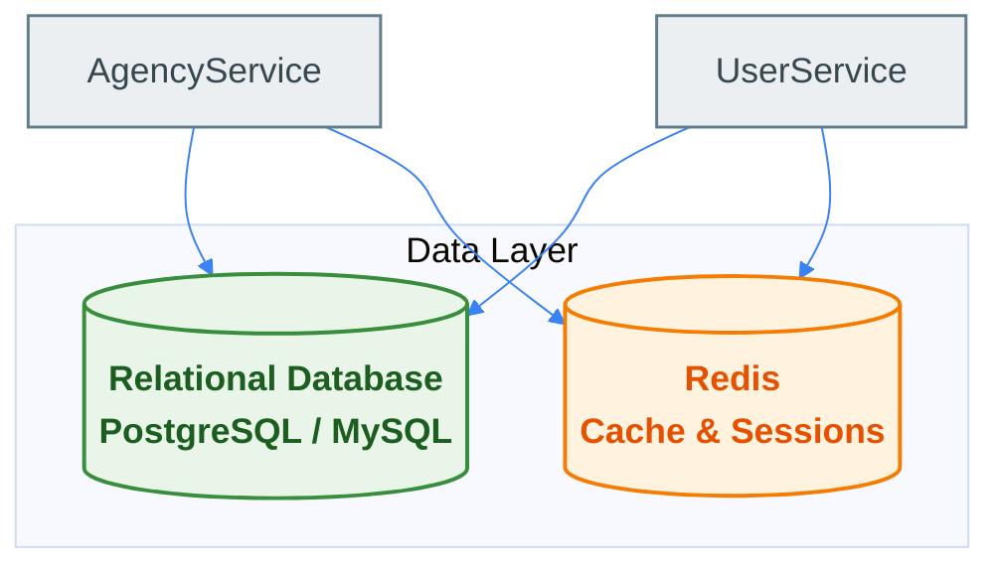

```mermaid
%%{init: { 'theme': 'base', 'themeVariables': { 'fontSize': '18px', 'lineColor': '#3B82F6' } }}%%

flowchart TB

  subgraph Data["Data Layer"]
    direction TB
    D1[(Relational Database\nPostgreSQL / MySQL)]:::database
    D2[(Redis\nCache & Sessions)]:::cache
  end

  %% Example readers/writers
  B4[AgencyService]:::svc --> D1
  B1[UserService]:::svc --> D1
  B1 --> D2
  B4 --> D2

  %% Styling
  classDef database fill:#e8f5e8,stroke:#388e3c,stroke-width:2px,color:#1b5e20,font-weight:bold
  classDef cache fill:#fff3e0,stroke:#f57c00,stroke-width:2px,color:#e65100,font-weight:bold
  classDef svc fill:#eceff1,stroke:#607d8b,stroke-width:1.5px,color:#37474f
```

