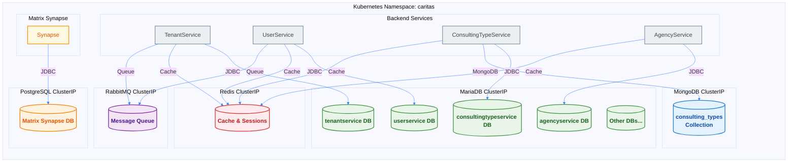

## Data Architecture Overview

ORISO Platform uses multiple database types, all managed centrally through the ORISO-Database repository. **Liquibase is DISABLED in all services** - schemas are managed separately.



## Database Types

### MariaDB (Primary Database)
- **Purpose:** Main relational database for backend services
- **Total Databases:** 7
- **Service Name:** `oriso-platform-mariadb.caritas.svc.cluster.local:3306`
- **Connection Type:** ClusterIP (internal only)
- **Databases:**
  1. `tenantservice` - Tenant management
  2. `userservice` - User management
  3. `consultingtypeservice` - Consulting types
  4. `agencyservice` - Agency management
  5. Additional service databases as needed

### MongoDB
- **Purpose:** NoSQL storage for consulting types
- **Database:** `consulting_types`
- **Service Name:** `oriso-platform-mongodb.caritas.svc.cluster.local:27017`
- **Connection Type:** ClusterIP (internal only)
- **Used By:** ConsultingTypeService

### PostgreSQL
- **Purpose:** Matrix Synapse database only
- **Database:** `synapse`
- **Service Name:** `oriso-platform-postgresql.caritas.svc.cluster.local:5432`
- **Connection Type:** ClusterIP (internal only)
- **Used By:** Matrix Synapse (not backend services)

### Redis
- **Purpose:** Caching and session storage
- **Service Name:** `oriso-platform-redis.caritas.svc.cluster.local:6379`
- **Connection Type:** ClusterIP (internal only)
- **Features:**
  - Session storage
  - Cache for frequently accessed data
  - Rate limiting
  - Temporary data storage

### RabbitMQ
- **Purpose:** Message queue for asynchronous processing
- **Service Name:** `oriso-platform-rabbitmq.caritas.svc.cluster.local:5672`
- **Management UI:** Port 15672 (ClusterIP)
- **Connection Type:** ClusterIP (internal only)
- **Features:**
  - Asynchronous task processing
  - Event publishing
  - Work queues

## Schema Management Philosophy

### Centralized Schema Management
**All database schemas are managed in the ORISO-Database repository**, not by individual services.

### Liquibase Status
**Liquibase is DISABLED in all backend services.** This means:
- Services do NOT auto-migrate on startup
- Schemas must be managed manually
- Schema changes are version-controlled in ORISO-Database
- Migration scripts are run separately

### Schema Location
```
caritas-workspace/ORISO-Database/
├── mariadb/
│   ├── tenantservice/
│   │   └── schema.sql
│   ├── userservice/
│   │   └── schema.sql
│   ├── consultingtypeservice/
│   │   └── schema.sql
│   └── agencyservice/
│       └── schema.sql
├── mongodb/
│   └── consulting_types/
│       └── schema.json
└── scripts/
    └── setup/
        └── 00-master-setup.sh
```

## Database Setup

### Master Setup Script
**Location:** `caritas-workspace/ORISO-Database/scripts/setup/00-master-setup.sh`

**What it does:**
1. Creates all MariaDB databases
2. Imports all schema files
3. Creates system users
4. Sets up MongoDB collections
5. Initializes PostgreSQL (if needed)

**Usage:**
```bash
cd caritas-workspace/ORISO-Database
./scripts/setup/00-master-setup.sh
```

### Individual Database Setup
Each database has its own setup script in `ORISO-Database/mariadb/<service>/setup.sh`

## Connection Strings

### MariaDB Connection
```properties
# application.properties
spring.datasource.url=jdbc:mariadb://oriso-platform-mariadb.caritas.svc.cluster.local:3306/userservice
spring.datasource.username=${MYSQL_USER}
spring.datasource.password=${MYSQL_PASSWORD}
```

### MongoDB Connection
```properties
spring.data.mongodb.uri=mongodb://oriso-platform-mongodb.caritas.svc.cluster.local:27017/consulting_types
```

### Redis Connection
```properties
spring.redis.host=oriso-platform-redis.caritas.svc.cluster.local
spring.redis.port=6379
spring.redis.password=${REDIS_PASSWORD}
```

### RabbitMQ Connection
```properties
spring.rabbitmq.host=oriso-platform-rabbitmq.caritas.svc.cluster.local
spring.rabbitmq.port=5672
spring.rabbitmq.username=${RABBITMQ_USER}
spring.rabbitmq.password=${RABBITMQ_PASSWORD}
```

## System Users

### MariaDB System Users
Created via `system-users-job.yaml`:
- `caritas_admin` - Admin user for Caritas operations
- `oriso_call_admin` - Admin for call management
- `group-chat-system` - System user for group chats

**Creation:**
```bash
cd caritas-workspace/ORISO-Database/scripts
kubectl apply -f system-users-job.yaml
```

## Backup and Restore

### Backup Scripts
**Location:** `caritas-workspace/ORISO-Database/scripts/backup/`

**Available Scripts:**
- `backup-all.sh` - Backup all databases
- `backup-mariadb.sh` - Backup MariaDB only
- `backup-mongodb.sh` - Backup MongoDB only

**Usage:**
```bash
cd caritas-workspace/ORISO-Database/scripts/backup
./backup-all.sh
```

### Restore Scripts
**Location:** `caritas-workspace/ORISO-Database/scripts/restore/`

**Available Scripts:**
- `restore-mariadb.sh` - Restore MariaDB from backup
- `restore-mongodb.sh` - Restore MongoDB from backup

**Usage:**
```bash
cd caritas-workspace/ORISO-Database/scripts/restore
./restore-mariadb.sh <backup-file>
```

### Automated Backups
Matrix PostgreSQL has automated backups via CronJob:
```yaml
# matrix-cronjobs.yaml
apiVersion: batch/v1
kind: CronJob
metadata:
  name: matrix-postgres-backup
spec:
  schedule: "0 2 * * *"  # Daily at 2 AM
  jobTemplate:
    spec:
      template:
        spec:
          containers:
          - name: backup
            image: postgres:13
            command: ["pg_dump", "-U", "synapse_user", "synapse"]
```

## Data Persistence

### Persistent Volumes
All databases use Kubernetes PersistentVolumeClaims (PVCs):
- **MariaDB:** `mariadb-data` (20Gi)
- **MongoDB:** `mongodb-data` (10Gi)
- **PostgreSQL:** `matrix-postgres-data` (10Gi)
- **Redis:** `redis-data` (5Gi)
- **RabbitMQ:** `rabbitmq-data` (5Gi)

### Volume Retention
PVCs are retained on Helm uninstall (data is preserved):
```yaml
# Helm values.yaml
persistence:
  enabled: true
  storageClass: local-path  # k3s default
  size: 20Gi
```

## Security

### Internal-Only Access
All databases are ClusterIP services (not exposed externally):
- No direct external access
- Accessible only from within Kubernetes cluster
- Services connect via Kubernetes DNS

### Credentials Management
All database credentials stored in Kubernetes Secrets:
```bash
# MariaDB secrets
kubectl get secret mariadb-secrets -n caritas

# Redis secrets
kubectl get secret redis-secret -n caritas

# RabbitMQ secrets
kubectl get secret rabbitmq-secrets -n caritas
```

## Monitoring

### Database Health Checks
Services expose database health via Actuator:
```bash
curl http://oriso-platform-userservice.caritas.svc.cluster.local:8082/actuator/health
```

**Response:**
```json
{
  "status": "UP",
  "components": {
    "db": {
      "status": "UP",
      "details": {
        "database": "MariaDB",
        "validationQuery": "isValid()"
      }
    }
  }
}
```

## Troubleshooting

### Database Connection Issues
```bash
# Test MariaDB connection
kubectl exec -n caritas deployment/oriso-platform-userservice -- \
  mysql -h oriso-platform-mariadb.caritas.svc.cluster.local -u user -p

# Check database pod
kubectl get pods -n caritas | grep mariadb

# Check database logs
kubectl logs -n caritas deployment/oriso-platform-mariadb
```

### Schema Issues
```bash
# Verify schema exists
kubectl exec -n caritas deployment/oriso-platform-mariadb -- \
  mysql -u root -p -e "SHOW DATABASES;"

# Check table structure
kubectl exec -n caritas deployment/oriso-platform-mariadb -- \
  mysql -u root -p userservice -e "SHOW TABLES;"
```

### Backup/Restore Issues
```bash
# Verify backup file
ls -lh caritas-workspace/ORISO-Database/backups/

# Test restore on test database first
kubectl exec -i matrix-postgres-0 -n caritas -- \
  psql -U synapse_user test_db < backup.sql
```


