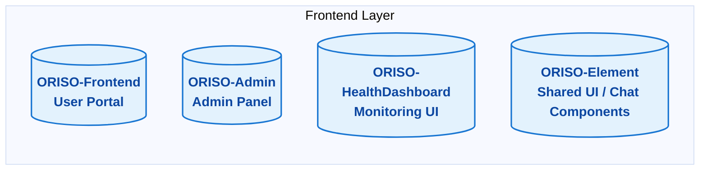

```mermaid
%%{init: { 'theme': 'base', 'themeVariables': { 'fontSize': '18px', 'lineColor': '#3B82F6' } }}%%

flowchart TB

  subgraph Frontend["Frontend Layer"]
    direction TB
    F1[("ORISO-Frontend\nUser Portal")]:::frontend
    F2[("ORISO-Admin\nAdmin Panel")]:::frontend
    F3[("ORISO-HealthDashboard\nMonitoring UI")]:::frontend
    F4[("ORISO-Element\nShared UI / Chat Components")]:::frontend
  end

  %% Clickable links
  click F1 "https://github.com/ORISO-Frontend" "Open User Portal repo"
  click F2 "https://github.com/ORISO-Admin" "Open Admin Panel repo"

  %% Styling
  classDef frontend fill:#e3f2fd,stroke:#1976d2,stroke-width:2px,color:#0d47a1,font-weight:bold
```

