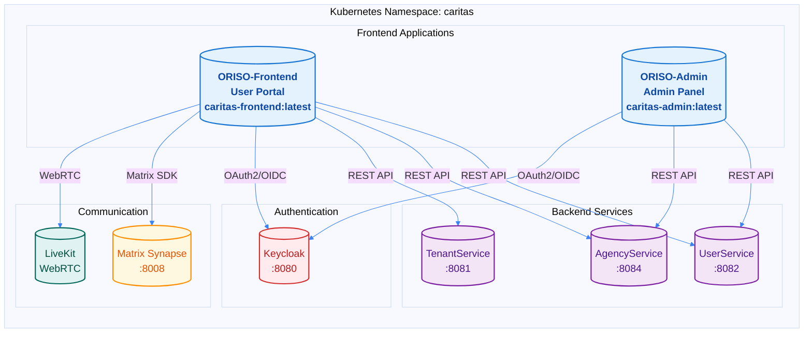

## Frontend Overview

ORISO Platform includes 2 main frontend applications built with React and Vite, deployed on Kubernetes via Helm charts.



## Frontend Applications

### ORISO-Frontend (User Portal)
- **Docker Image:** `caritas-frontend:latest`
- **Purpose:** Main user-facing application for clients seeking counseling
- **Technology:** React 18, Vite 4, TypeScript
- **Access:** https://app.oriso.org
- **Key Features:**
  - User authentication via Keycloak
  - Real-time chat via Matrix SDK
  - Video calls via LiveKit/WebRTC
  - Appointment scheduling
  - Profile management

### ORISO-Admin (Admin Panel)
- **Docker Image:** `caritas-admin:latest`
- **Purpose:** Administrative interface for agencies and consultants
- **Technology:** React 18, Vite 4, TypeScript
- **Access:** https://admin.oriso.org
- **Key Features:**
  - Agency management
  - User management
  - Consulting type configuration
  - System administration

## Technology Stack

### Build Tools
- **Build System:** Vite 4 (not Create React App)
- **Framework:** React 18
- **Language:** TypeScript
- **Package Manager:** npm/yarn

### Key Dependencies
- **Matrix SDK:** `matrix-js-sdk` for real-time messaging
- **Keycloak JS:** `keycloak-js` adapter for authentication
- **WebRTC:** LiveKit SDK for video calls
- **HTTP Client:** Axios or fetch API

## Build Process

### Development Build
```bash
cd caritas-workspace/ORISO-Frontend
npm install
npm run dev
```

### Production Build
```bash
# Build Docker image
docker build -t caritas-frontend:latest .

# Import to k3s
sudo k3s ctr images import <(docker save caritas-frontend:latest)

# Deploy via Helm
cd caritas-workspace/ORISO-Kubernetes/helm
helm upgrade oriso-platform ./oriso-platform \
  --namespace caritas \
  -f values.yaml
```

## Environment Variables

### Build-Time Variables
Environment variables are baked into the build at build time (not runtime):

```bash
# .env file
VITE_API_URL=https://api.oriso.org
VITE_KEYCLOAK_URL=https://auth.oriso.org
VITE_KEYCLOAK_REALM=online-beratung
VITE_KEYCLOAK_CLIENT_ID=app
VITE_MATRIX_HOMESERVER_URL=https://matrix.oriso.org
VITE_MATRIX_SERVER_NAME=caritas.local
VITE_LIVEKIT_URL=wss://livekit.oriso.org
```

### Docker Build
```dockerfile
# Dockerfile
FROM node:18-alpine AS builder
WORKDIR /app
COPY package*.json ./
RUN npm install
COPY . .
ARG VITE_API_URL
ARG VITE_KEYCLOAK_URL
ENV VITE_API_URL=$VITE_API_URL
ENV VITE_KEYCLOAK_URL=$VITE_KEYCLOAK_URL
RUN npm run build

FROM nginx:alpine
COPY --from=builder /app/dist /usr/share/nginx/html
```

## Matrix SDK Integration

### Matrix Client Service
**Location:** `src/services/matrixClientService.ts`

**Features:**
- Matrix SDK initialization
- User authentication
- Room creation and management
- Real-time message sync
- Event handling

### Matrix Call Service
**Location:** `src/services/matrixCallService.ts`

**Features:**
- WebRTC call initiation
- Call state management
- LiveKit integration for group calls
- Call UI components

### Matrix Live Event Bridge
**Location:** `src/services/matrixLiveEventBridge.ts`

**Features:**
- Real-time event synchronization
- Message notifications
- Presence updates
- Typing indicators

## Keycloak Integration

### Keycloak JS Adapter
**Location:** `src/services/keycloakService.ts`

**Configuration:**
```typescript
import Keycloak from 'keycloak-js';

const keycloak = new Keycloak({
  url: import.meta.env.VITE_KEYCLOAK_URL,
  realm: import.meta.env.VITE_KEYCLOAK_REALM,
  clientId: import.meta.env.VITE_KEYCLOAK_CLIENT_ID,
});

await keycloak.init({
  onLoad: 'check-sso',
  checkLoginIframe: false,
});
```

### Authentication Flow
1. User accesses frontend
2. Keycloak JS adapter checks for existing session
3. If no session, redirects to Keycloak login
4. After login, receives JWT tokens
5. Tokens included in API requests

## Deployment

### Kubernetes Deployment
Frontend applications are deployed via Helm:

```yaml
# Helm values.yaml
frontend:
  enabled: true
  image:
    repository: caritas-frontend
    tag: latest
  ingress:
    enabled: true
    host: app.oriso.org
```

### Ingress Configuration
```yaml
apiVersion: networking.k8s.io/v1
kind: Ingress
metadata:
  name: frontend-ingress
  namespace: caritas
  annotations:
    cert-manager.io/cluster-issuer: letsencrypt-prod
spec:
  tls:
  - hosts:
    - app.oriso.org
    secretName: frontend-tls
  rules:
  - host: app.oriso.org
    http:
      paths:
      - path: /
        pathType: Prefix
        backend:
          service:
            name: oriso-platform-frontend
            port:
              number: 80
```

## Service Communication

### Backend API Calls
```typescript
// Example API call
const response = await fetch(`${import.meta.env.VITE_API_URL}/api/users`, {
  headers: {
    'Authorization': `Bearer ${keycloak.token}`,
    'Content-Type': 'application/json',
  },
});
```

### Matrix Communication
```typescript
// Matrix SDK usage
import { createClient } from 'matrix-js-sdk';

const client = createClient({
  baseUrl: import.meta.env.VITE_MATRIX_HOMESERVER_URL,
  userId: '@user:caritas.local',
  accessToken: matrixAccessToken,
});

await client.startClient();
```

## Monitoring

### Health Checks
Frontend applications serve static files via Nginx, health checks verify:
- Nginx is running
- Static files are accessible
- Ingress routing works

### Error Tracking
Consider integrating:
- Sentry for error tracking
- Google Analytics for usage metrics
- Custom analytics endpoints

## Troubleshooting

### Build Issues
```bash
# Clear node_modules and reinstall
rm -rf node_modules package-lock.json
npm install

# Clear Vite cache
rm -rf node_modules/.vite
```

### Runtime Issues
```bash
# Check pod logs
kubectl logs -n caritas deployment/oriso-platform-frontend

# Verify environment variables
kubectl exec -n caritas deployment/oriso-platform-frontend -- env | grep VITE

# Test ingress
curl -I https://app.oriso.org
```

### Matrix Connection Issues
1. Verify Matrix homeserver URL is correct
2. Check CORS settings in Matrix Synapse
3. Verify Matrix credentials in localStorage
4. Check browser console for errors


