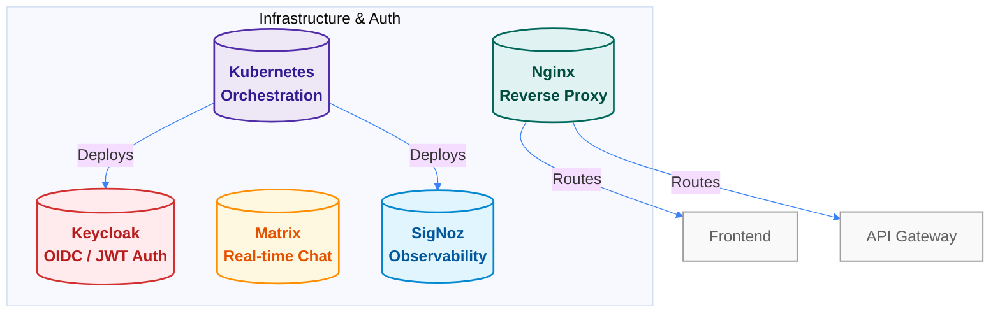

```mermaid
%%{init: { 'theme': 'base', 'themeVariables': { 'fontSize': '18px', 'lineColor': '#3B82F6' } }}%%

flowchart TB

  subgraph Infra["Infrastructure & Auth"]
    direction TB
    I1[("Keycloak\nOIDC / JWT Auth")]:::auth
    I2[("Nginx\nReverse Proxy")]:::proxy
    I3[("Kubernetes\nOrchestration")]:::k8s
    I4[("Matrix\nReal-time Chat")]:::matrix
    I5[("SigNoz\nObservability")]:::monitoring
  end

  %% Example routes/deployments
  I2 -->|Routes| F1[Frontend]:::placeholder
  I2 -->|Routes| B1[API Gateway]:::placeholder
  I3 -->|Deploys| I1
  I3 -->|Deploys| I5

  %% Clickable link
  click I1 "https://keycloak.org" "Open Keycloak docs"

  %% Styling
  classDef auth fill:#ffebee,stroke:#d32f2f,stroke-width:2px,color:#b71c1c,font-weight:bold
  classDef proxy fill:#e0f2f1,stroke:#00695c,stroke-width:2px,color:#004d40,font-weight:bold
  classDef k8s fill:#ede7f6,stroke:#512da8,stroke-width:2px,color:#311b92,font-weight:bold
  classDef matrix fill:#fff8e1,stroke:#ff8f00,stroke-width:2px,color:#e65100,font-weight:bold
  classDef monitoring fill:#e1f5fe,stroke:#0288d1,stroke-width:2px,color:#01579b,font-weight:bold
  classDef placeholder fill:#f9f9f9,stroke:#9e9e9e,stroke-width:1.5px,color:#616161
```

