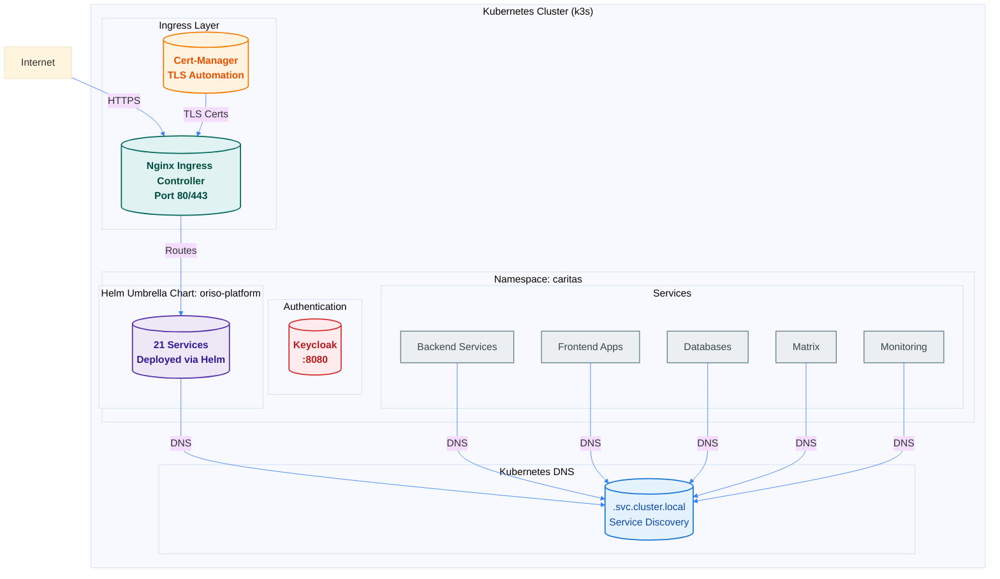

## Infrastructure Overview

ORISO Platform v3.0.0 is deployed on Kubernetes using Helm charts with automated TLS via cert-manager and Ingress-based routing.



## Kubernetes Platform

### Cluster Type
- **Platform:** k3s (lightweight Kubernetes)
- **Version:** Kubernetes 1.24+
- **Namespace:** `caritas`
- **Deployment Method:** Helm 3.x

### Why k3s?
- Lightweight and easy to install
- Single binary, no complex setup
- Perfect for single-node or small clusters
- Full Kubernetes API compatibility

## Helm Architecture

### Umbrella Chart Pattern
All services are deployed via a single umbrella Helm chart:

```
caritas-workspace/ORISO-Kubernetes/helm/
├── oriso-platform/          # Umbrella chart
│   ├── Chart.yaml
│   ├── values.yaml
│   └── charts/              # Sub-charts
│       ├── userservice/
│       ├── agencyservice/
│       ├── mariadb/
│       └── ...
└── values.yaml              # Global values
```

### Deployment Command
```bash
cd caritas-workspace/ORISO-Kubernetes/helm
helm dependency update oriso-platform
helm install oriso-platform ./oriso-platform \
  --namespace caritas \
  --create-namespace \
  -f values.yaml
```

### Chart Dependencies
The umbrella chart manages dependencies for all 21 services:
- Infrastructure (databases, cache, queue)
- Authentication (Keycloak)
- Backend services (4 services)
- Frontend (2 applications)
- Communication (Matrix, Element)
- Monitoring (SignOZ, Health Dashboard)

## Ingress Architecture

### Nginx Ingress Controller
- **Purpose:** External access to all services
- **Ports:** 80 (HTTP), 443 (HTTPS)
- **Deployment:** Via Helm
- **Namespace:** `ingress-nginx`

### Ingress Resources
**Location:** `caritas-workspace/ORISO-Kubernetes/ingress/`

**Statistics:**
- **Total Files:** 22 YAML files
- **Total Ingress Resources:** 33
- **Features:**
  - Path rewriting
  - CORS support
  - TLS automation
  - Service routing

### Ingress Deployment
```bash
cd caritas-workspace/ORISO-Kubernetes/ingress
kubectl apply -f .
```

### Example Ingress Resource
```yaml
apiVersion: networking.k8s.io/v1
kind: Ingress
metadata:
  name: frontend-ingress
  namespace: caritas
  annotations:
    cert-manager.io/cluster-issuer: letsencrypt-prod
    nginx.ingress.kubernetes.io/rewrite-target: /
spec:
  tls:
  - hosts:
    - app.oriso.org
    secretName: frontend-tls
  rules:
  - host: app.oriso.org
    http:
      paths:
      - path: /
        pathType: Prefix
        backend:
          service:
            name: oriso-platform-frontend
            port:
              number: 80
```

## TLS/SSL Management

### Cert-Manager
- **Purpose:** Automatic TLS certificate management
- **Issuer:** Let's Encrypt
- **Type:** ClusterIssuer (cluster-wide)
- **Automation:** Automatic certificate issuance and renewal

### ClusterIssuer Configuration
```yaml
apiVersion: cert-manager.io/v1
kind: ClusterIssuer
metadata:
  name: letsencrypt-prod
spec:
  acme:
    server: https://acme-v02.api.letsencrypt.org/directory
    email: your-email@example.com
    privateKeySecretRef:
      name: letsencrypt-prod
    solvers:
    - http01:
        ingress:
          class: nginx
```

### Certificate Management
Certificates are automatically created when Ingress resources are created:
```bash
# Check certificates
kubectl get certificate -n caritas

# Check certificate status
kubectl describe certificate frontend-tls -n caritas
```

## Service Discovery

### Kubernetes DNS
All services use Kubernetes DNS for discovery:
- **Pattern:** `<service-name>.<namespace>.svc.cluster.local`
- **Example:** `oriso-platform-userservice.caritas.svc.cluster.local:8082`

### Service Types
- **ClusterIP:** Internal services (databases, backend services)
- **NodePort:** Not used (Ingress handles external access)
- **LoadBalancer:** Not used (Ingress handles external access)

### Service Naming Convention
All services use `oriso-platform-*` prefix:
- `oriso-platform-userservice`
- `oriso-platform-mariadb`
- `oriso-platform-keycloak`
- `oriso-platform-frontend`

## Network Architecture

### Internal Communication
All internal communication uses ClusterIP services:
- No external IPs needed
- Automatic load balancing
- DNS-based service discovery
- Secure within cluster

### External Access
All external access via Ingress:
- Single entry point (ports 80/443)
- TLS termination at Ingress
- Path-based routing
- Host-based routing

### Required Ports
**External (Firewall):**
- `80` - HTTP (redirects to HTTPS)
- `443` - HTTPS
- `6443` - Kubernetes API (optional, for kubectl)

**Internal (Cluster):**
- All service ports accessible via ClusterIP
- No direct external access to services

## Namespace Structure

### Main Namespace: `caritas`
All ORISO services deployed in `caritas` namespace:
```bash
kubectl get all -n caritas
```

### Other Namespaces
- `ingress-nginx` - Ingress Controller
- `cert-manager` - Cert-Manager
- `platform` - SignOZ (optional)

## Authentication Infrastructure

### Keycloak
- **Purpose:** OIDC/OAuth2 authentication
- **Service:** `oriso-platform-keycloak.caritas.svc.cluster.local:8080`
- **External URL:** https://auth.oriso.org
- **Realm:** `online-beratung`
- **Client:** `app`

### Keycloak Configuration
- **Realm Import:** From `ORISO-Keycloak/realm.json`
- **HTTP Access:** Configured via `configure-http-access.sh`
- **Token Lifespans:** 5 hours access, 30 min SSO idle

## Monitoring Infrastructure

### SignOZ
- **Purpose:** Observability and APM
- **Namespace:** `platform`
- **Access:** http://91.99.219.182:3001
- **Components:**
  - SignOZ Backend
  - ClickHouse (time-series DB)
  - OTEL Collector

### Health Dashboard
- **Purpose:** Service health monitoring
- **Service:** `oriso-platform-health-dashboard`
- **Access:** http://91.99.219.182:9001
- **Checks:** All `/actuator/health` endpoints

### Status Page
- **Purpose:** Public status page
- **URL:** http://status.oriso.site

## Resource Management

### Resource Requests/Limits
All services have resource constraints:
```yaml
resources:
  requests:
    cpu: 250m
    memory: 512Mi
  limits:
    cpu: 500m
    memory: 1Gi
```

### Persistent Storage
All databases use PersistentVolumeClaims:
- **Storage Class:** `local-path` (k3s default)
- **Retention:** Retained on Helm uninstall

## Deployment Phases

1. **Infrastructure** - Databases, cache, queue
2. **Authentication** - Keycloak
3. **Communication** - Matrix, Element
4. **WebRTC** - LiveKit
5. **Backend** - 4 microservices
6. **Frontend** - 2 applications
7. **Monitoring** - SignOZ, Health Dashboard

## Troubleshooting

### Ingress Issues
```bash
# Check Ingress Controller
kubectl get pods -n ingress-nginx

# Check Ingress resources
kubectl get ingress -n caritas

# Check Ingress logs
kubectl logs -n ingress-nginx -l app.kubernetes.io/component=controller
```

### TLS Certificate Issues
```bash
# Check cert-manager
kubectl get pods -n cert-manager

# Check certificates
kubectl get certificate -n caritas
kubectl describe certificate <cert-name> -n caritas

# Check certificate requests
kubectl get certificaterequest -n caritas
```

### Service Discovery Issues
```bash
# Test DNS resolution
kubectl run test-pod --rm -it --image=busybox --restart=Never -- \
  nslookup oriso-platform-userservice.caritas.svc.cluster.local

# Check service endpoints
kubectl get endpoints -n caritas
```

### Helm Issues
```bash
# Check Helm release
helm list -n caritas

# Check release status
helm status oriso-platform -n caritas

# View release values
helm get values oriso-platform -n caritas
```


