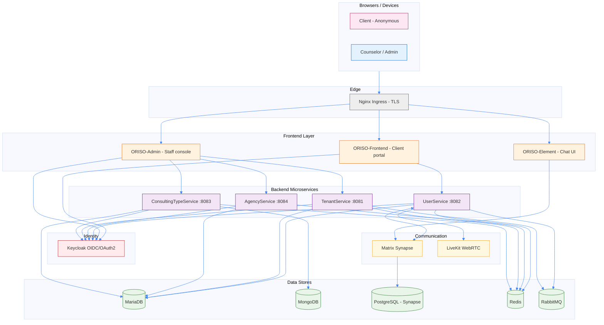
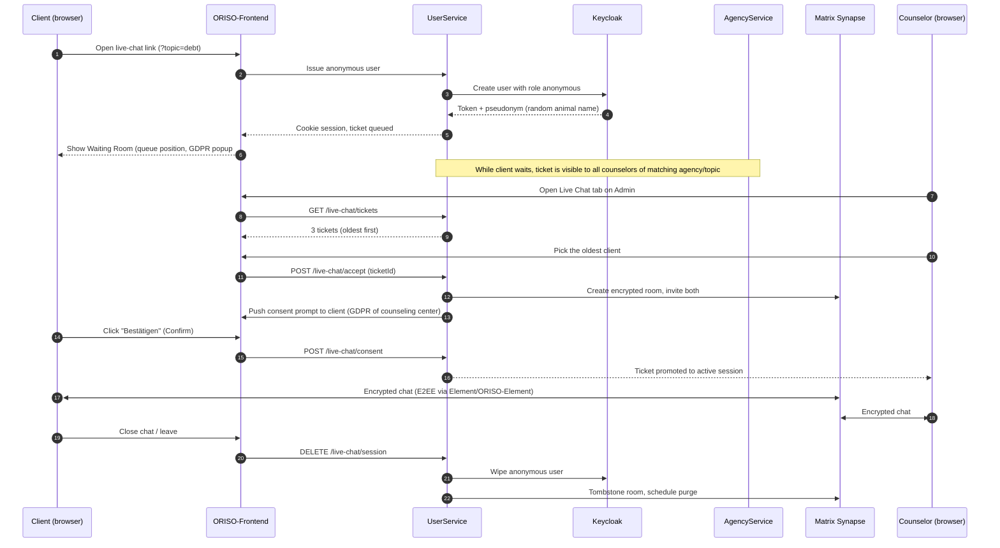

<Info>
This page is the **product-level** architecture view. For deep infrastructure details (Helm chart, Kubernetes services, ingress) see [Architecture: Backend](/oriso-platform/architecture/backend) and [Architecture: Infra](/oriso-platform/architecture/infra).
</Info>

## 2.1 The Big Picture

ORISO is built as a **microservice platform** running on Kubernetes (k3s) with a single umbrella Helm chart. There are five logical layers:

1. **Frontend layer** — what the user sees in the browser.
2. **Identity layer** — Keycloak, the single source of truth for who is who.
3. **Backend service layer** — Spring Boot services that own business logic and data.
4. **Communication layer** — Matrix Synapse for chat rooms; LiveKit for video.
5. **Data & infrastructure layer** — MariaDB, MongoDB, PostgreSQL, Redis, RabbitMQ.



## 2.2 Key Components

### Frontend layer

| App | Purpose | Users |
|---|---|---|
| **ORISO-Frontend** | The client-facing portal: zip-code lookup, agency search, **waiting room**, GDPR consent popup, live-chat UI | Clients (anonymous), authenticated users |
| **ORISO-Admin** | The staff console: tenant management, counseling-center configuration, counselor invitations, live-chat link generation, settings | Platform Admin, Tenant Admin, Counselor Admin |
| **ORISO-Element** | A customized fork of Element.io used as the in-product chat UI (sits on top of Matrix Synapse) | Counselors and clients during a chat session |
| **ORISO-ElementCall** | A customized Element Call build for video/voice rooms over LiveKit | Counselors and clients during a video session |

Both core apps are React 18 + Vite 4. They consume Keycloak tokens for OIDC, and talk to the backend via REST.

### Identity layer

**Keycloak** is the single OIDC/OAuth2 provider. Every user (Platform Admin, Tenant Admin, Counselor Admin, Counselor, anonymous Client) is a Keycloak user with one or more **realm roles** that gate API access.

The realm roles that exist today (from `ORISO-Keycloak/realm.json` and `UserRole.java`):

```
anonymous, user, consultant, technical, group-chat-consultant,
user-admin, single-tenant-admin, tenant-admin,
agency-admin, restricted-agency-admin,
restricted-consultant-admin, supervisor-consultant,
topic-admin, notifications-technical
```

The 4-tier business hierarchy (Frank's huddle definition) maps onto these realm roles — see [Roles & Permissions](/product/roles-permissions) for the full map.

### Backend service layer

| Service | Port | Owns |
|---|---|---|
| **TenantService** | 8081 | Tenants, tenant-level Imprint/Data-Policy/GDPR templates, tenant settings |
| **UserService** | 8082 | Users, sessions, enquiries, live-chat tickets, Matrix room creation, LiveKit JWTs |
| **ConsultingTypeService** | 8083 | Topics ("debt counseling", "family", "addiction", …), consulting-type config |
| **AgencyService** | 8084 | Agencies (a.k.a. *counseling centers*), agency↔consultant↔postcode bindings |

All services are Spring Boot 2.7.14 (Java 17), share a single MariaDB instance with separate logical databases, talk to each other via REST over Kubernetes DNS, and validate Keycloak JWTs on every request.

### Communication layer

| Component | Role |
|---|---|
| **Matrix Synapse** | The encrypted chat fabric. Every counseling chat is a Matrix room. Messages are end-to-end encrypted (Olm/Megolm). The waiting-room screen even tells the client: *"messages are end-to-end encrypted and auto-deleted after 48 h"*. |
| **LiveKit** | WebRTC SFU. Video calls between counselor and client get their own room and a short-lived JWT issued by UserService. |
| **Matrix Discovery Service** | Federation/.well-known discovery in front of Synapse. |

### Data & infrastructure layer

- **MariaDB** — 7 logical databases (one per service plus shared utilities). Source of relational truth for users, sessions, enquiries, agencies, tenants.
- **MongoDB** — `consulting_types` collection (rich JSON config per topic).
- **PostgreSQL** — exclusively for Matrix Synapse.
- **Redis** — session caches, rate limiting, ephemeral state (waiting-room counters, etc.).
- **RabbitMQ** — async tasks (e.g., notifications, scheduled cleanup of stale anonymous users).

<Note>
**Liquibase is disabled** in all backend services. Schemas are managed centrally in `ORISO-Database`. See [Data Layer](/oriso-platform/architecture/data).
</Note>

## 2.3 End-to-End Data Flow: A Live-Chat Inquiry

The most important flow in the product. Read this once and you understand 80% of how ORISO works.



The four critical guarantees in this flow:

1. **No client identity is ever required.** A pseudonym is generated server-side.
2. **Two distinct GDPR consents** are taken: one when entering the waiting room (platform-level default), and a second, mandatory one when the counselor accepts the chat (the **counseling center's** GDPR).
3. **The counselor picks** the client — the system intentionally avoids "auto-assign next in queue" so it can later support zip-code/topic-aware picking.
4. **Wipe-on-disconnect** is non-negotiable. Anonymous users left dangling in the waiting room are deleted within seconds-to-minutes.

## 2.4 Integration Points

### External (third-party / cross-system)

| Integration | Direction | Purpose |
|---|---|---|
| **Keycloak (OIDC)** | All apps → KC | Auth, role checks, MFA enforcement for admins |
| **Matrix Federation** | Synapse ↔ remote Matrix | Optional federation; usually disabled in production |
| **LiveKit** | UserService → LiveKit | Issue JWTs for video rooms |
| **SignOZ / OpenTelemetry** | Services → OTel collector | Observability, distributed tracing |
| **Cert-Manager / Let's Encrypt** | Cluster → ACME | Automatic TLS for `*.oriso-dev.site` |
| **SMTP (planned)** | Services → mail provider | Transactional emails for staff invites and password resets |

### Internal (service-to-service)

- All inter-service calls are **REST** over Kubernetes DNS (e.g. `oriso-platform-userservice.caritas.svc.cluster.local:8082`).
- All calls carry a **Keycloak service-account JWT** for the calling service; permission checks are enforced inside the called service.
- **Matrix integration** (UserService ↔ Synapse) uses the Matrix Application Service / admin API to provision rooms and users.

## 2.5 Cross-Cutting Concerns

| Concern | How ORISO handles it |
|---|---|
| **AuthN** | Keycloak OIDC; clients get an `anonymous` token, staff get role-bound tokens. MFA is **mandatory** for Platform Admin and Tenant Admin. |
| **AuthZ** | Spring Security gates every endpoint via `Authority.java` mappings. Realm-role → granted-authority is in `Authority.java`. |
| **Encryption in transit** | TLS at the ingress, mTLS optional inside cluster, Megolm E2EE in chat. |
| **Encryption at rest** | Matrix message bodies are E2EE so the DB only sees ciphertext. Personal fields in MariaDB are column-encrypted (per the audit trail). IPs are never persisted in production (dev-mode is forbidden). |
| **Privacy** | "Hacker-platform mindset": assume an external auditor will probe the system; data-minimization is the default. |
| **Observability** | SignOZ (distributed traces, logs), Health Dashboard (per-pod uptime), Status Page (public). |

## 2.6 Where Each Concept Lives

| Product concept | Lives in |
|---|---|
| **Tenant** | `tenantservice` DB; `TenantService` API; Keycloak attribute on user |
| **Counseling center (Agency)** | `agencyservice` DB; `AgencyService` API; bound to a tenant |
| **Topic / Consulting Type** | `consultingtypeservice` DB + MongoDB; `ConsultingTypeService` API |
| **Counselor / User / Admin** | `userservice` DB + Keycloak; `UserService` API |
| **Chat session, enquiry, live-chat ticket** | `userservice` DB + Matrix room; `UserService` API |
| **GDPR / Imprint / Data Policy text** | Stored on the entity it belongs to (platform / tenant / agency); inherited if not overridden |
| **Live-chat link / pincode** | `agencyservice` DB; bound to an agency + topic |
