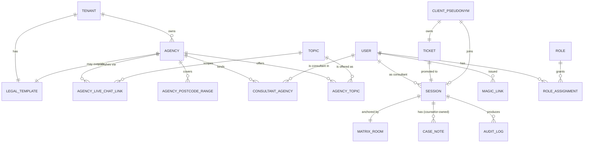

<Info>
This is the **conceptual** data model — the product entities and their relationships. The precise relational schema lives in `ORISO-Database`; this page maps each entity to its owning service so you can navigate the code without effort.
</Info>

## 7.1 Entity-Relationship Map

## 7.2 Entities

### 7.2.1 Tenant

Owned by **TenantService**.

| Attribute | Type | Notes |
|---|---|---|
| id | UUID | PK |
| name | string | Display name (e.g. "Caritas Berlin") |
| region | string | Regional identifier |
| data_policy_signed_at | timestamp | Required before agency creation |
| live_chat_enabled | boolean | Tenant-wide live-chat kill-switch |
| created_at | timestamp | |
| disabled_at | timestamp | Soft-disable for account suspension |

**Relationships**: 1 → N **Agency**, 1 → 1 tenant-level **LegalTemplate**.

### 7.2.2 Agency (Counseling Center)

Owned by **AgencyService**.

| Attribute | Type | Notes |
|---|---|---|
| id | UUID | PK |
| tenant_id | UUID | FK to Tenant; **immutable** |
| slug | string | URL-friendly; unique within tenant |
| name | string | Display name |
| description | text | Public-facing description |
| live_chat_enabled | boolean | Per-center toggle (AND'd with tenant flag) |
| imprint_overrides | jsonb \| null | If null, inherits |
| data_policy_overrides | jsonb \| null | If null, inherits |
| gdpr_overrides | jsonb \| null | If null, inherits |
| created_at | timestamp | |

**Relationships**: N → 1 Tenant, 1 → N **AgencyLiveChatLink**, 1 → N **AgencyPostcodeRange**, M ↔ N **User** via **ConsultantAgency**, M ↔ N **Topic** via **AgencyTopic**.

### 7.2.3 Topic (Consulting Type)

Owned by **ConsultingTypeService** (relational + MongoDB).

| Attribute | Type | Notes |
|---|---|---|
| id | UUID | PK |
| slug | string | URL slug (e.g. `debt`) |
| title_i18n | jsonb | Localised titles |
| description_i18n | jsonb | Localised descriptions |
| default_gdpr_snippet_i18n | jsonb | Optional fallback |
| ui_metadata | jsonb (Mongo) | Rich UI hints (icons, colors, ordering) |

### 7.2.4 User

Owned by **UserService** + Keycloak.

| Attribute | Type | Notes |
|---|---|---|
| id | UUID | PK; same as Keycloak user id |
| email | string \| null | Required for staff, **null for anonymous clients** |
| display_name | string | Pseudonym for anonymous; real for staff |
| language | string | ISO 639-1 |
| created_at | timestamp | |
| disabled_at | timestamp | |
| mfa_enrolled_at | timestamp | Mandatory for tenant/platform admins |

**Subtype: Consultant attributes** (when role includes `consultant`):

| Attribute | Type | Notes |
|---|---|---|
| supervisor_function | boolean | Maps to `supervisor-consultant` role |
| live_chat_enabled | boolean | Per-counselor live-chat toggle |
| group_chat_enabled | boolean | Maps to `group-chat-consultant` role |

**Subtype: Anonymous Client** (when role = `anonymous`):

| Attribute | Type | Notes |
|---|---|---|
| pseudonym | string | Auto-generated, never reused |
| cookie_session_id | string | Bound to browser cookie |
| topic | string \| null | If joined via topic-attached link |
| zip_code | string \| null | If client typed one |
| last_seen_at | timestamp | Heartbeat marker |
| **expected_lifespan** | seconds–minutes | Wiped on disconnect |

### 7.2.5 Role & RoleAssignment

Source of truth: **Keycloak realm**. Mirrored read-only in UserService for fast checks.

| Role | What it grants |
|---|---|
| `user-admin` | Platform Admin |
| `tenant-admin` | Tenant Admin |
| `single-tenant-admin` | Restricted Tenant Admin |
| `agency-admin` / `restricted-agency-admin` | Counselor Admin |
| `restricted-consultant-admin` | A subset of consultant-admin powers |
| `consultant` | Counselor |
| `supervisor-consultant` | Supervisor function (flag) |
| `group-chat-consultant` | Group-chat-capable counselor (flag) |
| `topic-admin` | Manages global topics |
| `anonymous` | Client in waiting room |
| `user` | Reserved for future registered client |
| `technical` / `notifications-technical` | Service accounts |

**RoleAssignment** has `(user_id, role, scope)` where `scope` is optional (e.g. agency_id for `agency-admin`).

### 7.2.6 Ticket (Live-Chat Ticket)

Owned by **UserService**.

| Attribute | Type | Notes |
|---|---|---|
| id | UUID | PK |
| agency_id | UUID | The agency the link / zip routed them to |
| topic_id | UUID \| null | From the link or client choice |
| client_user_id | UUID | The anonymous user |
| state | enum | `Waiting`, `Accepted`, `Consented`, `Active`, `Paused`, `Ended`, `Abandoned`, `Purged` |
| accepted_by | UUID \| null | Counselor who picked it |
| created_at | timestamp | |
| updated_at | timestamp | |

When `state` reaches `Consented`, the ticket spawns a **Session**.

### 7.2.7 Session

Owned by **UserService**.

| Attribute | Type | Notes |
|---|---|---|
| id | UUID | PK; the **opaque** session id |
| ticket_id | UUID | FK |
| agency_id | UUID | Denormalized for fast queries |
| consultant_id | UUID | The counselor |
| client_pseudonym | string | Wiped on `Purged` |
| topic_id | UUID \| null | |
| matrix_room_id | string | `!abc:matrix.oriso-dev.site` |
| started_at | timestamp | |
| ended_at | timestamp \| null | |
| purged_at | timestamp \| null | |
| state | enum | Mirrors ticket state machine |

### 7.2.8 MatrixRoom

Owned by **Matrix Synapse** (PostgreSQL). Not a row we manage from backend services; we hold only the room id in our `Session`.

### 7.2.9 CaseNote (planned)

Owned by **UserService**.

| Attribute | Type | Notes |
|---|---|---|
| id | UUID | PK |
| consultant_id | UUID | FK; **owner** of the note |
| session_id | UUID | Opaque link; **does not** identify a person |
| body_encrypted | bytes | Encrypted at rest |
| ai_assisted | boolean | True if AI-summarized |
| created_at | timestamp | |
| updated_at | timestamp | |

### 7.2.10 AgencyLiveChatLink

Owned by **AgencyService**.

| Attribute | Type | Notes |
|---|---|---|
| id | UUID | PK |
| agency_id | UUID | FK |
| topic_id | UUID \| null | Null = any topic |
| slug | string | Used in URL |
| enabled | boolean | Soft-disable |
| created_by | UUID | FK to user |
| created_at | timestamp | |

### 7.2.11 AgencyPostcodeRange

Owned by **AgencyService**.

| Attribute | Type | Notes |
|---|---|---|
| id | UUID | |
| agency_id | UUID | |
| postcode_from | string | German PLZ string-comparison-safe |
| postcode_to | string | |
| topic_id | UUID \| null | |

### 7.2.12 ConsultantAgency

Many-to-many binding of counselors to agencies.

| Attribute | Type | Notes |
|---|---|---|
| consultant_id | UUID | |
| agency_id | UUID | |
| role | enum | `consultant`, `agency-admin`, `restricted-agency-admin` |
| topics | UUID[] | The topics this counselor handles at this agency |
| supervisor_function | boolean | |
| created_at | timestamp | |

### 7.2.13 LegalTemplate

Owned by whatever entity provides it (platform / tenant / agency).

| Attribute | Type | Notes |
|---|---|---|
| id | UUID | |
| owner_type | enum | `platform`, `tenant`, `agency` |
| owner_id | UUID \| null | Null for platform (singleton) |
| imprint_text_i18n | jsonb | |
| data_policy_text_i18n | jsonb | |
| gdpr_text_i18n | jsonb | |
| version | int | Bumped on every save |
| stamped_at | timestamp | When it became "active" |

Inheritance is a **read-side concern**: the resolver walks `agency → tenant → platform` and returns the most specific non-null version.

### 7.2.14 MagicLink

Owned by **UserService**.

| Attribute | Type | Notes |
|---|---|---|
| jti | UUID | PK |
| issued_to_email | string | |
| role | string | Realm role to assign |
| agency_id | UUID \| null | If applicable |
| issued_at | timestamp | |
| expires_at | timestamp | 24 h |
| consumed_at | timestamp \| null | Single-use guard |

### 7.2.15 AuditLog

Owned by **UserService**.

| Attribute | Type | Notes |
|---|---|---|
| id | UUID | |
| timestamp | timestamp | |
| actor_id | UUID \| null | The user who acted (or null for system) |
| action | string | e.g. `session.accept`, `session.purge`, `magic_link.consumed`, `legal_template.update` |
| target_type | string | |
| target_id | UUID | |
| metadata | jsonb | Opaque data — never PII |

## 7.3 Cardinalities and Lifetime Comparison

| Entity | Cardinality | Lifetime |
|---|---|---|
| Platform Admin | 1–2 | Persistent |
| Tenant | 1–N | Persistent |
| Tenant Admin | 1+ per tenant | Persistent |
| Agency | 1+ per tenant | Persistent |
| Counselor Admin | 1+ per agency | Persistent |
| Counselor | 1+ per agency | Persistent |
| Topic | global, finite list | Persistent |
| Live-chat link | 1+ per agency | Persistent (until disabled) |
| Magic link | many | 24 h |
| Anonymous Client | many, ephemeral | Seconds-to-hours, then **wiped** |
| Ticket | many, ephemeral | Until session ends |
| Session | many, ephemeral | Until purged (≤ 48 h post-end) |
| Matrix room | one per session | Until purged (≤ 48 h post-end) |
| Case note | one or more per session | Persistent (counselor-owned) |
| Audit row | many | 1 year |

## 7.4 Privacy-Sensitive Fields (Quick Reference)

| Field | Where | Treatment |
|---|---|---|
| `pseudonym` | UserService | Wiped on disconnect |
| `cookie_session_id` | UserService | Wiped with pseudonym |
| `client.email` | n/a | **Never stored** |
| `client.ip` | n/a | **Never stored**, only used in-memory at ingress |
| `consultant.email` | UserService + Keycloak | Encrypted column |
| `matrix message body` | Synapse | Megolm ciphertext only |
| `case_note.body_encrypted` | UserService | At-rest encrypted |
| `magic_link.token` | not stored | Only its `jti` and metadata |

## 7.5 May-2026 Additions (from Figma)

The Figma extraction surfaces several entities that were not in the original model. Each is owned by an existing service to keep the topology stable.

### 7.5.1 ChatType

Owned by **AgencyService** + frontend constants.

| Attribute | Type | Notes |
|---|---|---|
| key | enum | `anonymous`, `one_to_one`, `group`, `supervision` |
| label_i18n | jsonb | UI labels |
| feature_permissions | jsonb | links to `FeaturePermission` rows |

### 7.5.2 GroupChat (subtype of Session)

Owned by **UserService**.

| Attribute | Type | Notes |
|---|---|---|
| id | UUID | PK; same as `Session.id` when applicable |
| chat_type | enum | one of `team`, `peer_support`, `family`, `internal_round`, `supervision` |
| label_subtype | string | "Lokal 1:1", "Live 1:1", "Kreis", "Intern", "Fachblick", "Trauerhilfe", … (UI label) |
| supervision_enabled | boolean | mirrors the room flag |
| schedule_at | timestamp \| null | for live-scheduled rounds |
| created_by | UUID | FK to User |

### 7.5.3 MessageAddressing

Owned by **UserService** (logged) + **Matrix** (delivered).

| Attribute | Type | Notes |
|---|---|---|
| event_id | string | Matrix event id of the original |
| recipient_set | UUID[] | The N recipients (subset of room members) |
| visibility_label | string | The pill text shown ("3 Moderators", etc.) |
| restricted_send_strategy | enum | `relay_bot`, `per_recipient_megolm` |

This is the data layer behind [Multi-Recipient Send](/product/features/group-chats#4-5-4-multi-recipient-send-w%C3%A4hle-wer-diese-nachricht-sehen-soll).

### 7.5.4 MarkAnnotation / BlurAnnotation

Stored as **encrypted Matrix events** of type `de.oriso.annotation.mark` or `de.oriso.annotation.blur`. Logical structure:

| Attribute | Type | Notes |
|---|---|---|
| event_id | string | Annotation event id |
| target_event_id | string | The message being annotated |
| range | { start, end } | Character offsets |
| color | string | Highlight color |
| label | string \| null | "Great Aspects", "Dangerous Behaviors", … |
| blur | boolean | If true, applies the 80%-white overlay |
| visibility | enum | `private_to_author`, `shared_in_thread` |

### 7.5.5 HandoverEvent

Owned by **UserService**.

| Attribute | Type | Notes |
|---|---|---|
| id | UUID | PK |
| session_id | UUID | The opaque session affected |
| from_counselor_id | UUID | |
| to_counselor_id | UUID | |
| reason | enum | `holiday`, `sickness`, `emergency`, `law_violation`, `colleague_fired`, `custom` |
| custom_reason_text | text \| null | Only when `reason = custom` |
| consents | jsonb | { client: bool, counselor_b: bool, supervisor: bool } |
| started_at | timestamp | |
| completed_at | timestamp \| null | |

### 7.5.6 EscalationRequest

Owned by **UserService**.

| Attribute | Type | Notes |
|---|---|---|
| id | UUID | PK |
| session_id | UUID | |
| requester_id | UUID | The counselor who triggered |
| recipient_id | UUID \| null | The internal escalation target (counselor / supervisor) |
| mode | enum | `internal`, `external` |
| note | text | Counselor's note for context (encrypted at rest) |
| status | enum | `requested`, `accepted`, `resolved`, `cancelled`, `expired` |
| created_at | timestamp | |
| resolved_at | timestamp \| null | |

### 7.5.7 Notification

Owned by **UserService**.

| Attribute | Type | Notes |
|---|---|---|
| id | UUID | PK |
| recipient_id | UUID | Target user |
| type | string | `inquiry.accepted`, `handover.completed`, `appointment.reminder`, … |
| title_i18n | jsonb | |
| body_i18n | jsonb | |
| linked_session_id | UUID \| null | For deep-link |
| read_at | timestamp \| null | |
| email_sent | boolean | true if mirrored to email |
| created_at | timestamp | |

### 7.5.8 ClientEmail

Owned by **UserService** (privileged column).

| Attribute | Type | Notes |
|---|---|---|
| user_id | UUID | PK |
| email_encrypted | bytes | column-encrypted |
| verified_at | timestamp \| null | After click-through |
| visible_to_roles | enum[] | `platform_admin` only — never to counselors |

### 7.5.9 MFAFactor

Owned by **Keycloak** (mirror in UserService for query speed).

| Attribute | Type | Notes |
|---|---|---|
| user_id | UUID | |
| type | enum | `app_totp`, `email_magic`, `webauthn` |
| enrolled_at | timestamp | |

### 7.5.10 FeaturePermission

Owned by **TenantService** (platform-default + tenant-override) + **AgencyService** (agency-override).

| Attribute | Type | Notes |
|---|---|---|
| id | UUID | PK |
| owner_type | enum | `platform`, `tenant`, `agency` |
| owner_id | UUID \| null | Null for platform |
| chat_type | enum | `anonymous`, `one_to_one`, `group`, `supervision` |
| feature_key | string | e.g. `audio_calls`, `voice_messages`, `multi_recipient_send` |
| enabled | boolean | |
| updated_at | timestamp | |

The resolver returns the AND of all levels: `effective = platform.enabled AND tenant.enabled AND agency.enabled`.

### 7.5.11 ChatTag

Owned by **AgencyService**.

| Attribute | Type | Notes |
|---|---|---|
| id | UUID | |
| agency_id | UUID | |
| name_i18n | jsonb | |
| color | string | |
| created_at | timestamp | |

### 7.5.12 SystemMessage

Computed at render-time; persisted as a **synthetic Matrix event** with `type=de.oriso.system_message`. Logical:

| Attribute | Type | Notes |
|---|---|---|
| key | string | `inquiry.accepted`, `e2ee.enabled`, `supervision.added`, `handover.completed`, `live_call.active`, `chat.archived`, `holiday`, `sickness`, `emergency`, … |
| body_i18n | jsonb | Templated copy |
| level | enum | `info`, `important`, `warning`, `legal` |

## 7.7 Why This Schema Looks the Way It Does

- **Separation of Tenant / Agency / Topic** — historical and intentional. Tenants own legal liability; agencies own day-to-day work; topics are global so a "debt" client landing on a different agency still finds the right counselors.
- **Anonymous user ≠ persistent user** — they share a table out of pragmatism, but the lifecycle is completely different and is enforced via state and scheduled cleanup.
- **CaseNote owned by counselor, not session** — so when a session is purged the note stays useful and untraceable to a person.
- **LegalTemplate as polymorphic owner** — single resolver, simple inheritance, single source of truth for "what does this client see".
