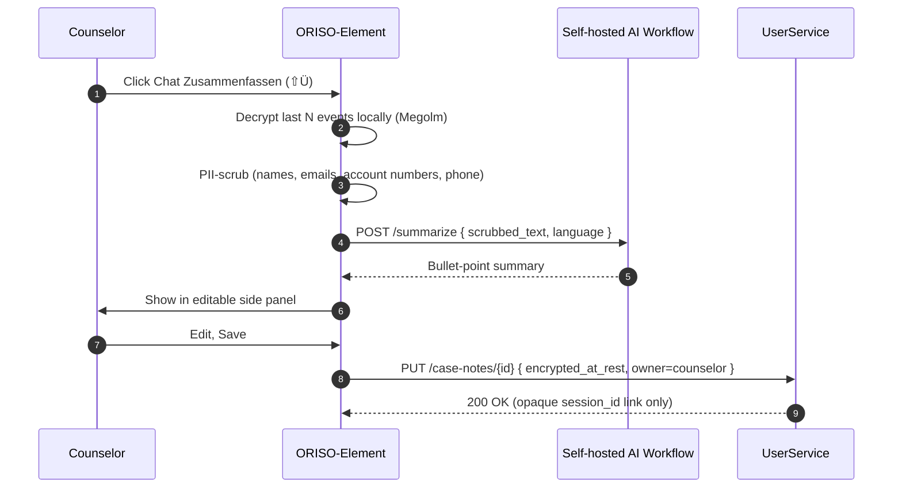

<Info>
The May-2026 Figma upgrades the AI track from "planned" to **active design**: a dedicated **Chat Zusammenfassen** button (`⇧Ü`) appears in the room settings, paired with a **Mark Text + PII Blur** toolbar in the message context menu. This page replaces the previously planned-only [4.1 Transcripts](/product/features/transcription).
</Info>

## 4.6.1 The Three Tools, in One Sentence Each

| Tool | What it does |
|---|---|
| **Chat Summary** (`⇧Ü`) | Counselor clicks "Chat Zusammenfassen" → AI returns a bullet-point summary of the conversation; counselor edits & saves as a case note. |
| **Mark Text** | Highlight ranges of any message with multiple colors and labels (e.g. *"Great Aspects"*, *"Dangerous Behaviors"*); send marked excerpts to a side-thread or to a private case-note editor. |
| **PII Blur** | Apply a uniform 80%-white overlay to a marked range so the receiver sees an unreadable region with the message *"Counsellor blurred some personal please be aware in future."* |

All three respect the **non-negotiable privacy rule**: the server **never** receives unencrypted message bodies or PII.

## 4.6.2 Chat Summary

### What the user sees

A button in the **Chatraum Einstellungen** menu:

> 🪶 **Chat Zusammenfassen** — *"Spare Zeit, mit Hilfe unseres vollends Datenschutzkonformen KI Workflows."*

Click → side panel with a generated summary, editable, savable as a counselor-owned case note.

### How it actually works



### Hard rules

- Decryption happens **only in the browser**.
- The AI service is run **inside the cluster** (self-hosted). No third-party LLM calls in production.
- Output is **counselor-owned**, not client-owned — survives client wipe.
- The note saves only an opaque `session_id` link, **never** a pseudonym after wipe.
- Counselor can disable AI for any room; admin can disable it tenant-wide.

### Edge cases

- **AI service down** → button greys out, counselor falls back to manual note. No crash, no data loss.
- **Window of unread events** → counselor picks how many last-N events to summarise; default = whole open session.
- **Mid-session run** → Summary marked as "interim" so the counselor can refresh later.

## 4.6.3 Mark Text

### What it is

A Tiptap-style highlighter on every message. The counselor selects text, picks a color from a palette, and the marked range is preserved as an annotation — independent of the original encrypted body.

### Use cases

- **Qualitative coding**: tag sentences as *"Great Aspects"* (green), *"Dangerous Behaviors"* (red), *"Step 1 / 2 / 3 …"*, etc.
- **Build a case note**: send all marked text to the side editor.
- **Build a thread**: send a single marked excerpt to a side-thread for team discussion.

### UX vocabulary (from Figma)

| Element | Notes |
|---|---|
| Color palette | "Selects color, now tool works like text mark tool in tiptap" |
| Eye toggle (👁) | Hide/show the marked excerpt's body in the result view |
| Result with eye **on** | Original message body visible alongside the note |
| Result with eye **off** | Note shown as a quotation mark with just the color |
| Send buttons | "sends it to thread" / "sends it to editor" / "send all to thread" / "send all to editor" |
| Multiple labels per message | "first shown" / "second marking shown" / "third marking shown" |

### How it actually works (proposed)

Marks are **annotation events** in Matrix, separate from the message event:

```
{
  type: "de.oriso.annotation.mark",
  content: {
    target_event_id: "$abc:matrix.oriso-dev.site",
    range: { start: 12, end: 47 },
    color: "#FFD54F",
    label: "Great Aspects",
    blur: false,
    visibility: "private_to_author"  // or "shared_in_thread"
  }
}
```

The annotation is itself encrypted (Megolm). Receivers fetch annotations alongside messages and overlay them client-side. This keeps marks **portable across re-keys** and avoids polluting the original message.

### Status

**[NEW FEATURE]** — needs the annotation event type to be added to the Element fork (`ORISO-Element`).

## 4.6.4 PII Blur

The same flow as Mark Text but with a **blur** flag set on the range.

### Visual specification

- Uniform white overlay at **80% alpha**, blur radius **4 px** (per Figma label `fff 80% Overlay Blur (uniform) 4`).
- Overlay covers the exact selected range; receiver sees an opaque rectangle.
- A system message accompanies the first blur: *"Counsellor blurred some personal please be aware in future."*
- The eye toggle in the counselor's own view lets them peek under the blur (since they own the original); receivers cannot.

### Who can blur

- **Counselor**: yes (default).
- **Supervisor**: yes (so they can teach by example).
- **Client**: **no** (clients should not be redacting their own counselor's text).

### How it actually works

The blur metadata is part of the same annotation event as Mark Text, with `blur: true`. Receivers' clients honour the flag at render time. Bodies remain encrypted; the blur is purely a presentation rule.

### Edge cases

- **Blur on a message that gets deleted** → annotation is orphaned; client garbage-collects.
- **Blur on a thread that gets archived** → annotation persists with the chat; deleted with the chat.
- **Receiver has older client without blur support** → fallback: render the body in plain text but show a banner *"This message contains content the counselor wished to blur — please disregard."* (Decision needed — see [Figma analysis §4.4](/product/figma-analysis-2026-05#4-4-pii-blur-durability-of-marks).)

## 4.6.5 Per-User Visibility — *"Message Visible to..."*

Both Mark and Blur can be combined with the **Multi-Recipient Send** (see [Group Chats §4.5.4](/product/features/group-chats#4-5-4-multi-recipient-send-w%C3%A4hle-wer-diese-nachricht-sehen-soll)) so that a marked, blurred excerpt is visible only to the moderators while the original message remains visible to all.

## 4.6.6 Permissions

These tools are **counselor-only** by default and can be globally toggled by admins. The Permissions Matrix (see [Roles & Permissions](/product/roles-permissions#3-7-per-chat-type-permissions-matrix)) controls them per chat-type.

| Tool | Anonymous | 1-zu-1 | Group | Supervision |
|---|---|---|---|---|
| Chat Summary | counselor only | counselor only | counselor only | counselor only |
| Mark Text | counselor only | counselor only | counselor only | counselor only |
| PII Blur | counselor only | counselor only | counselor only | counselor only |

Admins (Tenant / Agency) can disable any of these per chat type to satisfy strict-privacy customers.

## 4.6.7 Hard Rules (Reaffirmed)

- ❌ Server **never** sees plain text.
- ❌ AI service is **never** third-party in production.
- ❌ Marks / Blurs **never** leak the underlying body to non-counselor receivers.
- ✅ Counselor can edit any AI-generated content before saving.
- ✅ Save retains only opaque `session_id` link after client wipe.
- ✅ Tenant / Agency admin can disable any tool with one click.

## 4.6.8 Related

- [Group Chats (4.5)](/product/features/group-chats) — multi-recipient send pairs with these tools.
- [Roles & Permissions](/product/roles-permissions) — per-chat-type matrix.
- [Edge Cases](/product/edge-cases) — failure modes for AI, blur, marks.
- [Figma Analysis](/product/figma-analysis-2026-05) — source screens.
