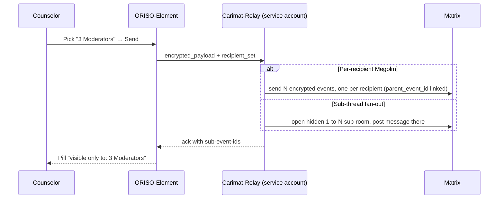

<Info>
The May-2026 Figma confirms that ORISO is **not 1-1 only**. Group chats are first-class — with their own type taxonomy, permission profile, and counselor-only collaboration tools. See the [Figma Analysis](/product/figma-analysis-2026-05) for the underlying screens.
</Info>

## 4.5.1 What Group Chats Are

A **group chat** is a Matrix room with **two or more members of any role**, optionally including the client. Group chats serve four real-world needs:

| Group type | Example label | Members | Purpose |
|---|---|---|---|
| **Team consultation** | *Teamberatung*, *Team Intern* | counselors only | Internal case discussion. |
| **Peer-support / round** | *Supportgruppe Alkohol*, *Montagstreffen Kreuzbund*, *Gesprächsrunde Trauerhilfe* | many clients + 1-2 counselors as moderators | Group counseling with shared topic. |
| **Family counseling** | *Familienberatung* | a few related clients + counselor | Multi-party conversation with adjacent stakeholders. |
| **Internal admin** | *Träger Admins Caritas* | admins / supervisors | Operational coordination. |

Sub-flavours visible in Figma: `Lokal 1:1`, `Live 1:1`, `Kreis` (circle), `Intern`, `Fachblick`, `Trauerhilfe`. These are **labels on top of the same underlying group-chat primitive**, used for filtering and routing — not separate technical types.

## 4.5.2 How a Group Chat Is Created

Two paths:

1. **Promotion of an existing 1-1** — a counselor in an active room clicks **Invite more people** (`⇧I`) in the Chatraum-Einstellungen menu. Anyone the admin policy permits can be invited. The room becomes a group; the client receives a system message and (per tenant policy) may be asked for re-consent.
2. **Direct creation** — `Erstelle Chat` opens the participant picker (`Add` → search → multi-select). The creator chooses chat-type label, optional supervision flag, optional schedule (`live Mo 9.Sep 2026 um 18:00 Uhr`).

```mermaid
flowchart LR
  A[Counselor clicks Erstelle Chat]:::a --> B[Pick participants]:::b
  B --> C[Choose chat-type label]:::b
  C --> D[Optional Supervision On]:::b
  D --> E[Optional schedule]:::b
  E --> F[Group room created<br/>(Matrix encrypted)]:::c
  F --> G[Members invited<br/>+ system message]:::c

  classDef a fill:#fff3e0,stroke:#ef6c00
  classDef b fill:#e3f2fd,stroke:#1565c0
  classDef c fill:#e8f5e8,stroke:#2e7d32
```

## 4.5.3 Member Roles Inside a Group

| Role inside the room | Origin | Capabilities |
|---|---|---|
| **Owner / Creator** | The counselor who created or promoted the room | Invite, archive, mute, delete-message, configure supervision, summarise |
| **Counselor (moderator)** | Invited counselor | Send to all / to subset (multi-recipient), reply-in-thread, mark/blur, forward, summarise |
| **Supervisor** | Counselor with `supervisor-consultant` flag, invited or auto-attached | Read-only or full participation depending on configuration; appears with a system banner |
| **Client (advice-seeker)** | Anonymous Keycloak user | Send messages; reply-in-thread *if admin permits*; **no** multi-recipient send, mark/blur, summarise, handover, escalation |

Counselor-only tools are hidden from clients in the UI **and** rejected by the API as a defense-in-depth measure.

## 4.5.4 Multi-Recipient Send ("Wähle wer diese Nachricht sehen soll")

The most novel collaboration tool. A counselor can target a single message to a **subset** of the room.

### Send-button rules (Figma-confirmed)

| Condition | Behaviour |
|---|---|
| **A** Room has only 2 participants (1-1) | Hide the multi-recipient button entirely. |
| **B** Room has > 2 participants | Show grey button (default state). |
| **B2** Touch zones | Provide AAA-accessible touch areas. |
| **C** Icon | Use the chat-type icon (people/group), not a generic person icon. |
| **D** Memory | Remember the last selection per chat. |
| **E** Client visibility | **Always hidden** for advice-seekers. |

### Recipient picker

The picker shows:
- A flat list of room members with checkboxes.
- Quick selectors: `Select All`, `Select All Counsellors`, `Select All Moderators`.
- A live result chip: *"visible only to: Ich"*, *"3 Moderators"*, *"+23"*, etc.
- A "Reply directly" / "Reply in Thread" toggle controls the destination.

### How it actually works (proposed)

Matrix has no native "visible only to N members" message-level restriction, so we propose a **server-side relay** ("Carimat-relay" service account):



Decision pending — see [Figma analysis §4.3](/product/figma-analysis-2026-05#4-3-multi-recipient-send-server-side-enforcement).

### Status pills

After send, the message in the chat shows a chip explaining who can see it:

| Pill text | Meaning |
|---|---|
| *visible only to: Ich* | Note-to-self / draft saved in the thread |
| *visible only to: 3 Moderators* | Visible to those three users + the sender |
| *visible only to: 0 Counsellors / 1 Advice Seeker* | Visible only to the named client |
| *(no pill)* | Visible to the whole room (default) |

## 4.5.5 Reply Directly vs Reply in Thread

The composer offers four send modes:

1. **Direct send** — main thread, all members.
2. **Reply directly** — quote a parent message, main thread.
3. **Reply in Thread** — open / continue a side-thread off the parent message.
4. **Multi-recipient** — restrict either of the above to a subset.

UX rule: *"Important. When I click again in text field, clicking now on send will only send this item directly into either the thread or editor."* — i.e., once a thread is open, the next send goes to that thread until explicitly switched back.

## 4.5.6 Forwarding & Deleting

- **Forward Message** — opens a recipient picker similar to multi-recipient send; sends a copy preserving original timestamp. Forwards are also restricted to counselors.
- **Delete Message** — Matrix redaction event; visible as a tombstone "Message deleted".

## 4.5.7 File Upload

- Drop zone copy: *"Ziehen Sie die Datei in das Feld, um sie hochzuladen."*
- Allowed: `.jpg, .png, .pdf, .docx, .xlsx`.
- Max: **10 MB** per file.
- Stored in Matrix media repo, encrypted at rest.

## 4.5.8 Group Chat Settings ("Chatraum Einstellungen")

| Item | Shortcut | Effect |
|---|---|---|
| **Archiviere Chat** | `⇧A` | Archive; the chat goes inactive and is auto-deleted in **12 months** (per Figma copy: *"Archivierte Benachrichtigungen sind inaktiv. Der Chat wird in 12 Monaten gelöscht."*) |
| **Stummschalten** | `⇧Ö` | Mute notifications for this chat only. |
| **Hilfe Anfragen** | `⇧Ä` | Internal/external escalation — see [Notifications & Help Requests](/product/features/notifications). |
| **Weitere Personen einladen** | `⇧I` | Invite more participants. Constrained by admin policy. |
| **Supervision On / Off** | `⇧I` (figma) | Toggle supervisor visibility; system message broadcast. |
| **Chat Zusammenfassen** | `⇧Ü` | AI summary — see [AI Tools](/product/features/ai-tools). |

## 4.5.9 Filters, Phases & List Views

The chat list now sorts and filters across multiple axes. Tabs at the top of a counselor's inbox:

`Ungelesen` · `1-1 Beratung` · `Live-Chat` · `Gruppen` · `Aktiv` · `Termine` · `Archiv` · `Anfragen`

Filter chips (visible in the rail): `Personen`, `Type`, `Beratungsstelle`, `Archived`. Plus the secondary tabs: `Gespräche`, `Reports`, `Mein Profil`, `Logs`, `Entwürfe` (drafts), `Aktivität` (activity), `Zeitstrahl` (timeline), `Gemerkt` (pinned), `Terminiert` (scheduled).

### Phase model (counselor inbox)

Each list row shows the phase the chat is in:

| Phase | Meaning |
|---|---|
| **Anfragephase** | Inquiry/ticket created, no counselor accepted. |
| **Vermittlungsphase** | Counselor accepted but room not yet finalised — covers GDPR-#2-pending and handover-pending. |
| **Aktiv** | Both consents given, conversation in flight. |
| **Archiv / Terminiert** | Past or scheduled conversations. |

## 4.5.10 Lifecycle & Retention

| Event | Behaviour |
|---|---|
| **Member leaves group** | Their pseudonym wiped immediately; their authored messages remain in the room with author label *"Ehemaliger Teilnehmer"* (E2EE bodies are not personal data). |
| **Last advice-seeker leaves** | The room is auto-archived; counselors are informed via system message. |
| **Counselor leaves group** | Their seat is released; if they were the only counselor, the room becomes admin-attention-required. |
| **Group archived** | Read-only; auto-deleted after 12 months unless restored. |
| **Group ended** | Room tombstone; messages purged after 48 h (the standard rule). |

## 4.5.11 Edge Cases (Group-Chat Specific)

For the full catalogue see [Edge Cases](/product/edge-cases). Key group-chat ones:

- **Client deletes themselves mid-group-chat** → see [9.1.8](/product/edge-cases#9-1-8-client-deletes-self-from-group-chat).
- **Multi-recipient send with offline recipient** → message is delivered as soon as the recipient's Megolm session is back online; never visible to non-recipients.
- **Counselor invites a non-permitted user** → API returns 403 with the admin-policy reason.
- **Admin disables Group Chats globally** → existing groups become read-only; no new groups can be created; no data loss.

## 4.5.12 Related

- [Live Chat (4.2)](/product/features/live-chat) — the 1-1 entry point most groups grow out of.
- [AI Tools (4.6)](/product/features/ai-tools) — Summary, Mark/Blur.
- [Notifications & Help Requests (4.7)](/product/features/notifications).
- [Roles & Permissions](/product/roles-permissions) — per-chat-type permission matrix.
- [Figma Analysis](/product/figma-analysis-2026-05) — the source for everything on this page.
