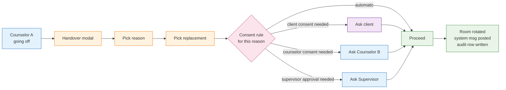

<Info>
The May-2026 Figma introduces an explicit **Handover** flow with a fixed reason taxonomy and per-reason consent rules. Example copy: *"Deine Beratung wurde an Gudrun übergeben: Grund sie ist leider krank."*
</Info>

## 4.7.1 What Handover Is

Sometimes the assigned counselor cannot continue: vacation, illness, emergency, departure from the agency, or a hard policy/legal trigger. Handover is the controlled flow that **transfers a single case** to a new counselor at the **same agency** — without breaking E2EE, GDPR consent, or audit trails.



## 4.7.2 Reason Taxonomy

Confirmed in Figma:

| Reason key | Label (DE) | Default consent rule | Default audit visibility |
|---|---|---|---|
| `holiday` | Holiday / Urlaub | Counselor + Client consent | Standard |
| `sickness` | Sickness / Krankheit | Counselor consent only (client notified) | Standard |
| `emergency` | Emergency / Notfall | Auto (client notified post-fact) | Elevated |
| `law_violation` | Law Violation | Supervisor + Law Enforcement Representative | Locked, restricted view |
| `colleague_fired` | Colleague fired / Mitarbeiter entlassen | Supervisor approval | Elevated |
| `custom` | Custom Explanation | Counselor + Client consent | Standard |

<Note>
Each tenant can override the default consent rules in the **Berechtigungen** matrix (see [Roles & Permissions §3.7](/product/roles-permissions#3-7-per-chat-type-permissions-matrix)).
</Note>

## 4.7.3 Consent Matrix

| Reason | Client consent | Counselor B consent | Supervisor approval | Reason text shown to client |
|---|:-:|:-:|:-:|---|
| Holiday | ✅ | ✅ | ❌ | *"Deine vorherige Beraterin ist im Urlaub …"* |
| Sickness | informed only | ✅ | ❌ | *"Deine vorherige Beraterin ist leider krank …"* |
| Emergency | informed only (post-fact OK) | ✅ (best effort) | optional | *"Aus dringenden Gründen wurde dein Fall übertragen …"* |
| Law Violation | restricted notification | ✅ | ✅ + LEO repr. | locked text from legal team |
| Colleague fired | informed only | ✅ | ✅ | *"Aus organisatorischen Gründen wurde dein Fall übertragen …"* |
| Custom | ✅ | ✅ | ❌ | counselor-typed reason text |

The system enforces these rules **server-side** before the room is rotated.

## 4.7.4 Detailed Sequence

```mermaid
sequenceDiagram
  autonumber
  participant Co1 as Counselor A
  participant Co2 as Counselor B
  participant FE as ORISO-Admin
  participant US as UserService
  participant MX as Matrix
  participant Cl as Client

  Co1->>FE: Chatraum Einstellungen → Handover Case
  FE->>Co1: Modal with reason + replacement picker
  Co1->>FE: Pick reason (e.g. "Sickness") + Counselor B
  FE->>US: POST /handover { sessionId, from, to, reason, customText? }
  US->>US: load consent rule for reason

  alt requires Counselor B consent
    US->>Co2: Notification "Übernahme angefragt"
    Co2-->>US: accept
  end
  alt requires Supervisor approval
    US->>SU: Notification with locked context
    SU-->>US: approve
  end
  alt requires Client consent
    US->>Cl: Push consent prompt in chat
    Cl-->>US: accept
  end

  US->>MX: invite Co2; remove Co1
  US->>Cl: System message ("Deine Beratung wurde an Gudrun übergeben: Grund …")
  US->>US: write audit row { from, to, reason, consents, started_at, completed_at }
  US-->>FE: 200 OK
```

## 4.7.5 What Happens to the Room

- **Same Matrix room** is preserved — the conversation history is retained for the client.
- **Counselor A is removed** from the member list (no longer receives messages).
- **Counselor B is invited** and joins via Element/ORISO-Element.
- **Megolm keys**: Counselor B receives forward history depending on the room's `m.room.history_visibility`. Default for ORISO is `shared` (members see history from when they were invited). For sensitive sessions the tenant can switch to `joined` (no back-history) so a new counselor starts clean.
- **Client identity** is unchanged — same pseudonym, same cookie. The client doesn't get re-paired; only the counselor seat changes.

## 4.7.6 Constraints

- **Cross-agency handover is forbidden** — replacements must be from the same agency. If the agency has no other counselor, a tenant-level escalation path is required (planned, see [Figma analysis §4.6](/product/figma-analysis-2026-05#4-6-handover-reasons-consent)).
- **Cross-tenant handover is forbidden** — period.
- **Handover during an active video call** — the call is gracefully ended, then handover proceeds.
- **Handover during the GDPR-#2-pending state** — handover is denied; ticket is returned to the queue instead.
- **No automatic re-pairing of an anonymous client to a new counselor**: a client who refuses the handover gets a graceful fall-back message and their session is wiped.

## 4.7.7 Client Experience

The client always sees an in-chat **System Message** of type `Handover` with a templated body:

> Deine vorherige Beraterin ist leider krank. Deshalb wurde dein Fall an **{Beraterin}** übergeben von der **{Beratungsstelle}**.

Buttons (depending on consent rule):

- **Akzeptieren** — accept the new counselor, conversation continues.
- **Ablehnen** — refuse; case is closed; client wiped.
- **Mehr erfahren** — opens a modal with the full reason text and contact for the agency.

## 4.7.8 Audit & Compliance

- Every handover writes an `audit_log` row with: `session_id` (opaque), `from_counselor_id`, `to_counselor_id`, `reason`, `consents_collected`, `started_at`, `completed_at`.
- For `law_violation`, an additional record is filed in the privileged-access log readable only by Platform Admin and the appointed Law-Enforcement Representative.
- **No message bodies are ever written to the audit log** (E2EE rule preserved).

## 4.7.9 Edge Cases

See [Edge Cases §9.10](/product/edge-cases) for the full set. Top ones:

- **Counselor B refuses** → ticket returns to the agency pool with a "needs handover" flag.
- **Client refuses** → session ends with a "no handover possible" message; client is wiped.
- **Reason `law_violation` selected by mistake** → action is irreversible from the counselor side; only Platform Admin can recall (with audit row).
- **Active multi-party group chat** → handover only swaps Counselor A's seat; other counselors and clients remain.

## 4.7.10 Related

- [Roles & Permissions](/product/roles-permissions) — handover permissions per role.
- [Data Model](/product/data-model) — `HandoverEvent` entity.
- [Edge Cases](/product/edge-cases#9-10-handover-edge-cases).
- [Figma Analysis](/product/figma-analysis-2026-05).
