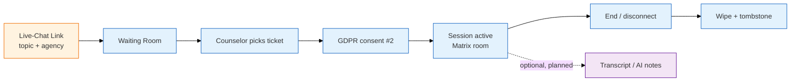

ORISO's product surface grew with the May-2026 Figma drop. There are now eight feature pillars; everything else (admin panel, settings, deployments) supports them.

<CardGroup cols={2}>
<Card title="4.2 Live Chat" icon="comments" href="/product/features/live-chat">
The flagship feature. Anonymous waiting room, counselor pickup, GDPR-gated entry, encrypted Matrix room.
</Card>

<Card title="4.5 Group Chats & Multi-Recipient Send" icon="users" href="/product/features/group-chats">
**[NEW]** Team / family / peer-support / internal rounds. Multi-recipient send, reply-in-thread, file upload, group lifecycle.
</Card>

<Card title="4.6 AI Tools" icon="wand-magic-sparkles" href="/product/features/ai-tools">
**[NEW]** Chat Summary (`⇧Ü`), Mark Text, PII Blur. Counselor-side, browser-decrypted, self-hosted AI.
</Card>

<Card title="4.7 Case Handover" icon="user-doctor" href="/product/features/handover">
**[NEW]** Transfer cases between counselors with reason taxonomy and consent rules.
</Card>

<Card title="4.8 Notifications & Help Requests" icon="bell" href="/product/features/notifications">
**[NEW]** Notifications inbox, system messages, internal/external escalation, Carimat scripted bot.
</Card>

<Card title="4.3 Pincode-Based Chat & Access" icon="hashtag" href="/product/features/pincode-chat">
How clients reach a counselor via a public live-chat link with a topic and (optionally) a zip code.
</Card>

<Card title="4.4 Session Management" icon="clock-rotate-left" href="/product/features/session-management">
The lifecycle of a counseling session — creation, joining, state transitions, wipe-on-disconnect.
</Card>

<Card title="4.1 Transcripts (legacy)" icon="microphone-lines" href="/product/features/transcription">
The original transcripts page; superseded by [AI Tools](/product/features/ai-tools) — kept for historical context.
</Card>
</CardGroup>

<Note>
For the full background on what's new in May 2026, see [Figma Analysis (May 2026)](/product/figma-analysis-2026-05).
</Note>

## How they fit together

