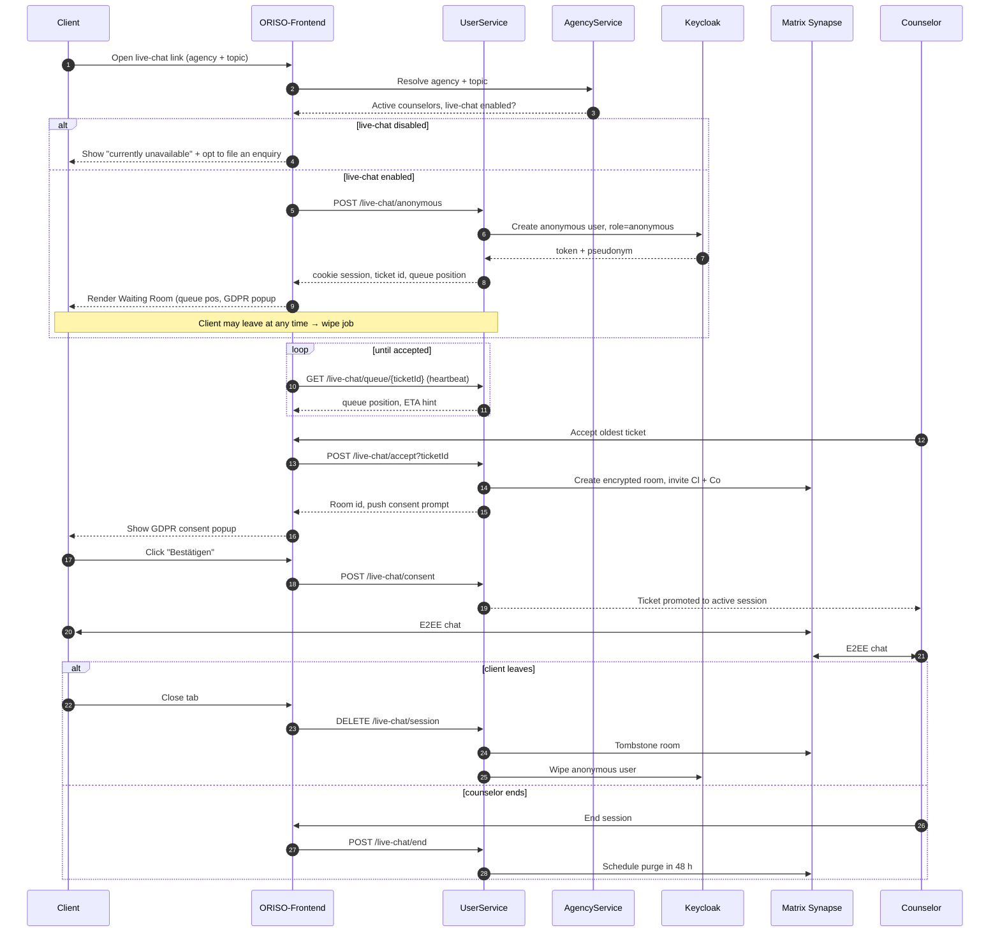
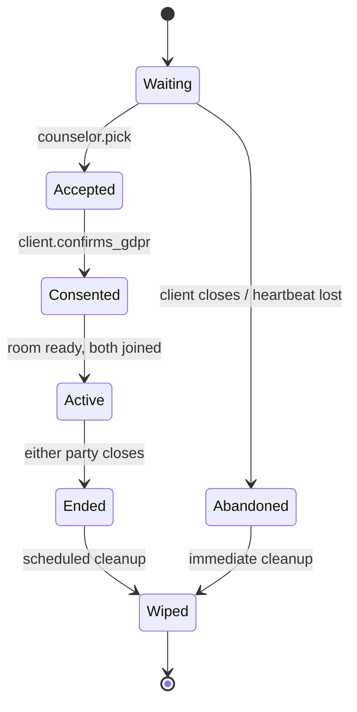

<Info>
Live Chat is the **flagship feature** of ORISO. Most of the system exists to make this work safely, anonymously and at scale.
</Info>

## 4.2.1 What Live Chat Is

A no-registration, anonymous, real-time text chat between a **client in distress** and an **available counselor** at a counseling center. Optionally promotable to a video call (LiveKit). The session is end-to-end encrypted and cleaned up immediately after the conversation ends.

The product distinguishes Live Chat from the legacy "**Enquiry Chat**" (zip-code-based, registered, async) — both flows exist in the codebase, but Live Chat is the modern, anonymous-first path.

<Note>
**Live Chat is the 1-1 entry point**, but a session does not stay 1-1 forever. A counselor in an active room can click **Invite more people** (`⇧I`) to add peers, supervisors, or other clients — the room then becomes a [Group Chat](/product/features/group-chats). The May-2026 Figma also confirms that **video calls** (LiveKit) embed inside the same room rather than spawning a separate session.
</Note>

## 4.2.2 How It Is Activated

Two activations have to be true for a client to enter Live Chat with a real counselor:

### A. **Counseling-center activation** (admin-side)

- A Counselor Admin (or Tenant Admin) opens the admin panel.
- Generates a **live-chat link** for the agency, with an optional **topic** parameter (e.g. `?topic=debt`).
- Sets the agency's **live-chat enabled** flag.

### B. **Counselor activation** (per-counselor)

- The counselor logs into the admin panel.
- Toggles their personal **Live Chat: ON**.
- They are now visible in the live-chat ticket queue for their counseling center.

<Note>
**Important UX rule** (huddle, 2026-05-05): When a counselor toggles **Live Chat: OFF**, the live-chat section must **stay visible but deactivated**, with a hint to re-enable it. It must **not** disappear from the navigation. This prevents the "I lost a feature" confusion that occurred in earlier versions.
</Note>

## 4.2.3 The Real-Time Flow (Step-by-Step)



## 4.2.4 Role-by-Role Interaction

### Client (anonymous)

- Lands on the live-chat link.
- Is auto-issued a **pseudonym** (e.g. *"geschmeidiges Kanninchen Kim"* — a German animal-adjective combination).
- Sees the **waiting room** with: queue position ("23 Noch vor Ihnen" — 23 still ahead of you), an animated breathing-game distraction, and a banner that reads *"messages are end-to-end encrypted and auto-deleted after 48 h"*.
- Receives the **first GDPR popup** ("Bestätigen") covering the platform's default Data Policy.
- Once a counselor picks them, sees the **second GDPR popup** with that specific counseling center's terms.
- Once consent is given, the chat opens.

### Counselor

- Sees a **ticket queue** in the Live Chat tab, **oldest-first** (intentionally — prioritizes the client who has waited longest).
- Each ticket shows pseudonym, "Joined N minutes ago", topic.
- Picks any visible ticket (intentionally not auto-assigned — to leave room for future zip-code awareness).
- Sees the chat room open with a system message "Awaiting client GDPR consent".
- Once the client confirms, full chat is enabled.

### Counselor Admin (Agency lead)

- Watches aggregate queue size and active counselors for the center.
- Can toggle the agency's live-chat enabled flag.
- Configures the live-chat link (topic and per-link override).

### Platform / Tenant Admin

- Cannot see ticket content.
- Can see aggregate metrics (number of waiting clients, average wait).
- Defines the legal-text templates that flow down the inheritance chain.

## 4.2.5 The Two GDPR Consents (Why Two?)

This is **the** detail Frank emphasised in the huddle. There are **two** consent moments because they cover **two** distinct data scopes:

| When | What it covers | Owner | Scope of data collected |
|---|---|---|---|
| **#1 — On entering the waiting room** | The platform's default Data Policy + Imprint | Platform Admin | Pseudonym, cookie, queue counter, optional topic and zip code |
| **#2 — When counselor picks the client** | The **counseling center's** GDPR Agreement | Counselor Admin / inherits from Tenant / inherits from Platform | Anything the client and counselor exchange in the chat |

If a client refuses #2, the chat **never opens** — the counselor is told "client declined" and the client's pseudonym is wiped.

## 4.2.6 Backend Logic (Inferred from Code & Huddle)

Routes (UserService, REST):

```
POST   /live-chat/anonymous         create pseudonymous user + ticket
GET    /live-chat/queue/{ticketId}  long-poll / WS heartbeat
POST   /live-chat/accept            counselor accepts ticket
POST   /live-chat/consent           client confirms GDPR #2
POST   /live-chat/end               either side closes
DELETE /live-chat/session           explicit teardown + wipe
```

State machine for a ticket:



Side effects on transition:

- `Waiting → Abandoned`: Keycloak user deleted; ticket row deleted; cookie invalidated.
- `Active → Ended`: Matrix room kept for ≤ 48 h then purged; session-metadata anonymized.
- Any → `Wiped`: pseudonym scrubbed from all stores; only an opaque, non-identifying session_id can remain for audit.

## 4.2.7 Edge Cases (Live Chat Specific)

- **Counselor goes offline mid-pickup** → Ticket is returned to queue automatically after a heartbeat timeout.
- **Counselor accepts but client's tab is dead** → System retries consent prompt with timeout; on timeout, ticket is returned to queue and client is wiped.
- **Multiple counselors race to accept** → AgencyService uses a row-level lock; second click sees "already taken".
- **Live-chat link generated for a disabled agency** → Returns a friendly "currently unavailable" page with a fallback enquiry option.
- **Topic missing on link** → Falls back to the agency-wide queue (any topic).
- **Browser language detection** → On first paint, the UI loads the browser's preferred language; falls back to English (not German). Frank's explicit requirement.

For the full edge-case catalogue, see [Edge Cases](/product/edge-cases).

## 4.2.8 Anti-Patterns (Things ORISO Must Not Do)

- ❌ Auto-assigning a client to the next-in-queue counselor (loses zip-code/topic flexibility).
- ❌ Hiding the live-chat section when toggled off (use *deactivated state* instead).
- ❌ Writing client IPs to logs or DB.
- ❌ Persisting unaccepted tickets indefinitely (was a real bug — clients piled up forever).
- ❌ Skipping consent #2 because consent #1 was given.
- ❌ Bringing the live chat back online while in dev mode.

## 4.2.9 Related

- [Group Chats & Multi-Recipient Send (4.5)](/product/features/group-chats) — what a 1-1 chat becomes after `Invite more people`.
- [AI Tools (4.6)](/product/features/ai-tools) — Mark, Blur, Summary inside the chat.
- [Case Handover (4.7)](/product/features/handover) — transferring this chat to another counselor.
- [Notifications & Help Requests (4.8)](/product/features/notifications) — escalation from inside the chat.
- [Pincode-Based Chat & Access](/product/features/pincode-chat)
- [Session Management](/product/features/session-management)
- [User Flow: Live Chat Activation](/product/user-flows#5-5-live-chat-activation)
- [UI/UX Interpretation](/product/ui-ux)
- [Figma Analysis (May 2026)](/product/figma-analysis-2026-05)
