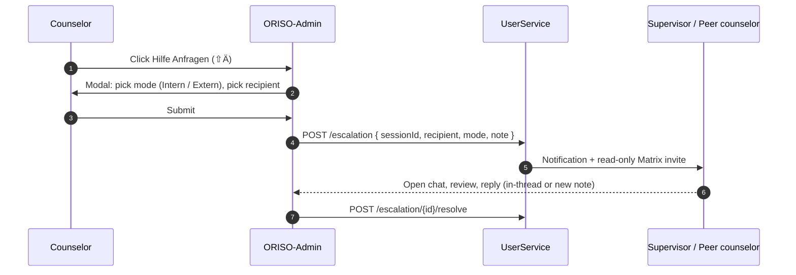

<Info>
The May-2026 Figma adds a dedicated **Notifications** page and a structured **Help-Request / Escalation** flow inside Chat-Room Settings. Together they form the platform's asynchronous + escalation messaging layer.
</Info>

## 4.8.1 What's New

| Feature | Origin |
|---|---|
| **Notifications inbox** | Standalone page in side rail with badge counter |
| **System Messages** with typed banners (Holiday, Sickness, Emergency, …) | In-chat |
| **Help Requests** modal `⇧Ä` from Chatraum-Einstellungen | In-chat |
| **Email mirror** of notifications (only if client gave email) | Backend |
| **Carimat / Chatbot-scripted onboarding messages** | New system-message origin |

## 4.8.2 Notifications Inbox

### What the user sees

A dedicated page (`Notifications`) reachable from a button on the side rail; the button shows an unread counter.

Each notification row contains:
- **Type badge** (System Notification, Inquiry Update, Handover, Important Notification, Holiday, Sickness, Emergency).
- **Title** (e.g. *"Your inquiry has been accepted by a consultant."*).
- **Body** (e.g. *"Your recent request for the consultation has been accepted, now you can chat with the consultant."*).
- **Date** in `MM/DD/YYYY` format.
- **Reply** button (opens the relevant chat).
- **View Chats** CTA at the top of the inbox.

### Source of notifications

| Source | Example |
|---|---|
| `inquiry.accepted` | "Your inquiry has been accepted by a consultant." |
| `handover.completed` | "Deine Beratung wurde an Gudrun übergeben." |
| `appointment.reminder` | "Live Mo 9. Sep 2026 um 18:00 Uhr — Kreis Suchtberatung" |
| `chat.archived` | "Archivierte Benachrichtigungen sind inaktiv. Der Chat wird in 12 Monaten gelöscht." |
| `mfa.required` | "Bitte aktivieren Sie 2FA, um Ihr Konto zu schützen." |
| `account.deletion` | "Ihr Konto wurde gelöscht." |
| `system.maintenance` | "Wartungsfenster heute 02:00–03:00 UTC." |

### Channels

- **In-app** (always).
- **Email** (only if the client provided one — never visible to counselors).
- **Push** (planned via Matrix Push Gateway — see [Figma analysis §4.7](/product/figma-analysis-2026-05#4-7-notification-channels)).

### Persistence & retention

- Notifications are **per-user**.
- Unread → 90 days, then archived.
- Archived → 12 months, then purged.
- A client's notifications are wiped together with the client on disconnect / account deletion.

## 4.8.3 Help Requests / Internal Escalation

Triggered from **Chatraum Einstellungen → Hilfe Anfragen (`⇧Ä`)** with the copy:

> *"Eskaliere den Fall intern oder extern ohne den Datenschutz zu vernachlässigen."*
> *"Wähle intern von einer Person ohne den Datenschutz zu vernachlässigen."*

### Flow

### Modes

| Mode | Behaviour |
|---|---|
| **Internal** | Pick another counselor or supervisor inside the same agency. They are added to the room (Matrix invite) — read-only by default. |
| **External** | Trigger a handover or a human-language escalation (e.g. crisis hotline, regulator). External recipients **never** get message bodies — only metadata + an opt-in invite link. |

### Privacy guarantees

- The recipient gets the same E2EE protection as a regular member.
- For external escalation, only **opaque metadata** + a contact-back token is sent.
- The audit log records the escalation event but never message bodies.

## 4.8.4 System Messages In-Chat

A typed taxonomy of system-generated banners that can appear inside a chat:

| Type key | Banner copy (DE/EN) | Trigger |
|---|---|---|
| `inquiry.accepted` | *"Your inquiry has been accepted by a consultant."* | Counselor accepts a ticket |
| `consent.required` | *"Bitte stimmen Sie der Datenschutzerklärung der Beratungsstelle zu."* | GDPR #2 prompt |
| `e2ee.enabled` | *"Ihre Nachrichten sind Ende-zu-Ende verschlüsselt …"* | Room creation |
| `supervision.added` | *"A supervisor has been added to this chat by the consultant which will supervise this chat."* | Supervisor join |
| `handover.completed` | *"Deine Beratung wurde an {Berater:in} übergeben: Grund {reason}."* | Handover done |
| `live_call.active` | *"Currently Active Call → Join Video Call"* | A LiveKit call starts |
| `live_call.ended` | *"Calling Session ended."* | Call ended |
| `chat.archived` | *"Archivierte Benachrichtigungen sind inaktiv. Der Chat wird in 12 Monaten gelöscht."* | Chat archived |
| `holiday`, `sickness`, `emergency`, `law_violation`, `colleague_fired` | Reason-specific copy | Handover or counselor unavailability |
| `chatbot.onboarding` | scripted multi-turn (Carimat) | First-time user onboarding |
| `chatbot.quick_guide` | scripted help | Counselor or client requests guide |

System messages render with a distinctive style (centered, neutral colour) to distinguish them from human messages.

## 4.8.5 Carimat — Scripted Bot

Carimat is the platform's planned **rule-based** onboarding bot. It is **not** an LLM. Behaviour:

- Posts the first system messages (E2EE banner, GDPR text).
- Optionally walks new clients through a multi-turn quick guide.
- Listens for explicit commands like `/help`, `/topic`, `/language`.
- Cannot read replies — it only posts pre-scripted content based on triggers.

Status: **[NEW FEATURE]** — name confirmed in Figma; behaviour proposed.

## 4.8.6 Permissions & Settings

Per-chat-type controls (see [Roles & Permissions §3.7](/product/roles-permissions#3-7-per-chat-type-permissions-matrix)):

- Notifications can be muted per chat (`Stummschalten ⇧Ö`).
- A tenant admin can disable Help-Requests for a chat type entirely.
- Email mirror is opt-in at the user level + permitted at the tenant level.

## 4.8.7 Edge Cases

- **User with no email** opts in to email mirror → UI explains the opt-in is unavailable until an email is added.
- **Notification arrives for a wiped pseudonym** → notification is dropped silently; sender does not get a delivery error.
- **Help Request to a counselor on holiday** → falls back to the next-up Supervisor in the agency.
- **External escalation timeout** → cancel after 24 h; counselor is informed; nothing leaves the system.

## 4.8.8 Related

- [Group Chats](/product/features/group-chats) — Help Requests live in chat-room settings.
- [Handover](/product/features/handover) — pairs with system messages and notifications.
- [Roles & Permissions](/product/roles-permissions).
- [Figma Analysis](/product/figma-analysis-2026-05).
