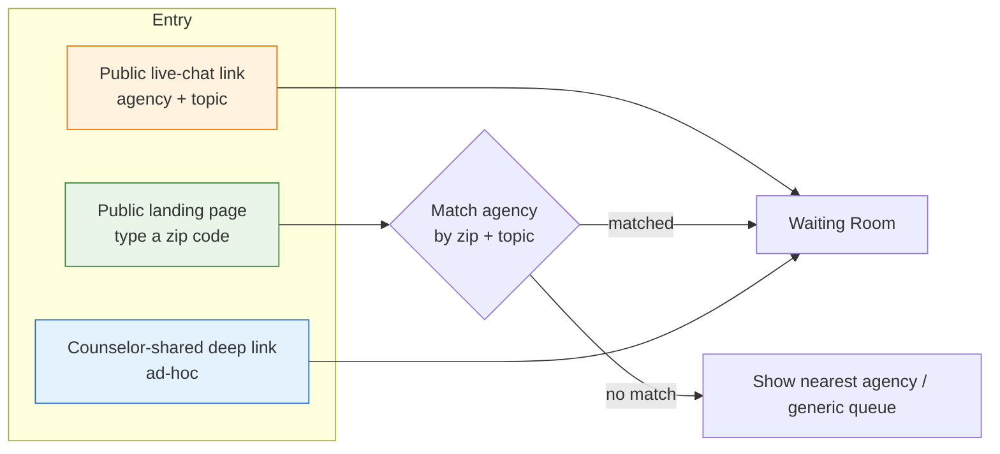

<Info>
"Pincode" in ORISO refers to **two related but distinct concepts**: (1) the German **postal zip code** (PLZ) used to route inquiries to regionally-relevant counselors, and (2) the **token-bearing live-chat link** generated for a specific agency-and-topic combination. Both are documented here.
</Info>

## 4.3.1 What "Pincode" Means in This System

| Term | What it really is | Where it's stored |
|---|---|---|
| **Zip code (PLZ) routing** | A 5-digit German postal code typed by the client to find regional counselors | Bound to agencies in `AgencyService` (`agency_postcode_range`) |
| **Live-chat link** | A signed URL of the form `https://app.oriso-dev.site/live-chat/{agencySlug}?topic={topicSlug}` | Generated and stored in `AgencyService` |
| **Magic link (counselor invite)** | A one-time signed link that turns into a Keycloak account creation flow | Issued by UserService; **distinct** from live-chat links |

<Warning>
A common bug observed in earlier development was confusing **live-chat links** with **magic invite links**. They are different. Live-chat links are public, reusable, and topic-scoped. Magic links are private, one-shot, and used only when inviting staff.
</Warning>

## 4.3.2 How Users Join via a Link or Code

There are three ways a client can land in the live-chat waiting room:



### Path A — Direct Live-Chat Link (preferred today)

The Counselor Admin generates a link in the admin panel:

```
https://app.oriso-dev.site/live-chat/schuldnerberatung-mitte?topic=debt
```

When a client clicks it:
1. Frontend reads `agencySlug` and `topic` from the URL.
2. Calls `AgencyService` to verify agency exists, live-chat is enabled, and the topic is offered.
3. Calls `UserService` to issue an anonymous user.
4. Renders the waiting room.

The link is **idempotent** — it can be shared on the agency's public website, on Instagram, in flyers. Re-opening the same link spins up a fresh anonymous session each time.

### Path B — Zip-Code Lookup (legacy / the older flow)

A client visits the public portal, types `12345` (their PLZ), and the system surfaces all agencies whose postcode-range covers that PLZ. They pick one and land in its waiting room.

This path is the **historical** flow. Frank flagged in the huddle that it's "inflexible" and the team plans to merge it into Path A by attaching zip code as an additional URL parameter (`?topic=debt&plz=12345`) — see [Assumptions](/product/assumptions).

### Path C — Counselor-shared deep link (ad-hoc)

A counselor at an agency can copy their own personal live-chat link from the admin panel and share it with a specific client (e.g., over email). Same mechanics as Path A, just topic-locked to that counselor's primary topic.

## 4.3.3 How Links and Codes Are Generated

### Live-chat link generation (Path A)

When a Counselor Admin clicks **"Generate live-chat link"** in the admin panel:

1. AgencyService creates an `AgencyLiveChatLink` record with:
   - `agency_id`
   - `topic_id` (optional — null means "any topic")
   - `slug` (URL-friendly agency slug)
   - `enabled` (boolean)
   - `created_by` (counselor-admin user id)
2. The URL is composed: `{frontend_base}/live-chat/{slug}?topic={topic_slug}`.
3. A **Counselor Admin can disable the link** (sets `enabled=false`); existing visitors get a graceful "currently unavailable" page.

<Note>
In the current production code, the link-creation page is overengineered (Frank's words). The simplified rule the team is converging on: **one link per agency + topic** with optional override. See backlog ticket "fix live chat link generation" from the 2026-05-05 huddle.
</Note>

### Zip-code routing logic (Path B)

Agencies own one or more postcode ranges:

```sql
agency_postcode_range(
  id, agency_id, postcode_from, postcode_to, topic_id
)
```

When a client types `10115`:
- AgencyService queries `agency_postcode_range` where `postcode_from <= '10115' <= postcode_to`.
- Filters by `topic_id` if the client also picked a topic.
- Returns all matching agencies, ordered by relevance.

### Magic invite link (counselor onboarding — distinct!)

A **separate** mechanism. A platform admin or tenant admin invites a counselor; UserService issues a one-time signed JWT embedded in a URL. Click → Keycloak account-creation page → role assignment → counselor login. **Never** reused.

## 4.3.4 Validation Rules

| Field | Rule |
|---|---|
| Live-chat link slug | Must be unique per tenant; lowercase, hyphenated; 3–64 chars |
| Topic slug | Must be in the global topics list (managed by Topic Admin) |
| Zip code | Must be a valid German PLZ (5 digits, in known range) |
| Magic invite token | Single-use, expires in 24 h; bound to email + role; HMAC-signed |
| Live-chat link `enabled` flag | Must respect agency-level live-chat enabled flag (AND combined) |

## 4.3.5 Security Implications

- **Public link enumeration** — Anyone who knows an agency slug can spawn a session. This is **intentional** — there is nothing to steal: the visitor is anonymous and gets an empty queue position. Rate limiting at the ingress is the defense.
- **Pseudonym predictability** — Pseudonyms are generated server-side from a wide name space; there is no risk of two simultaneous clients colliding within a session.
- **No token in the URL** — The live-chat link does **not** carry an auth token. The anonymous Keycloak token is issued *after* the client lands. This means the link is safe to post on social media.
- **Magic invite tokens are different** — they DO carry secrets; treat as bearer credentials; HTTPS-only; HMAC-validated; one-shot.
- **Cross-tenant link probing** — A user-supplied agency slug is always tenant-scoped via the resolver; an attacker cannot enumerate slugs in another tenant.
- **Rate-limiting** — UserService enforces a per-IP limit on `POST /live-chat/anonymous` to prevent ticket-flood denial-of-service. (IPs are used **only** for in-memory rate-limit, never persisted — this is enforced explicitly in production config.)

## 4.3.6 Edge Cases

- **Disabled agency link reused** → Renders a static "unavailable" page; returns 404 if the agency has been deleted.
- **Invalid topic in URL** → Falls back to the agency-wide queue (any topic) and logs a soft warning.
- **Client supplies a wrong PLZ** → Shows "no matches in your area" with a CTA to the platform-wide enquiry form.
- **Zip-code spans multiple agencies** → Lists them; client picks; if topic was provided, list is filtered.
- **Counselor admin deletes a link mid-session** → Active sessions continue; only new visits are blocked.
- **Live-chat link reused by a bot to flood tickets** → Rate-limit returns HTTP 429; counselors are not bothered with bot tickets.

## 4.3.7 Roadmap (from huddle)

- Merge zip code into the live-chat link as an optional `?plz=...` parameter so a counselor can be picked by topic *and* region simultaneously.
- Replace the current overengineered link-management UI with a single "Generate link" button per topic.
- Add a global topic registry so each Topic has its own canonical live-chat link auto-derivable from the agency.
- Show a counselor's mapped topics in their own live-chat dashboard (so they can serve 2–3 topics gracefully).

## 4.3.8 Related

- [Live Chat (4.2)](/product/features/live-chat)
- [Session Management (4.4)](/product/features/session-management)
- [Assumptions & Open Questions](/product/assumptions)
