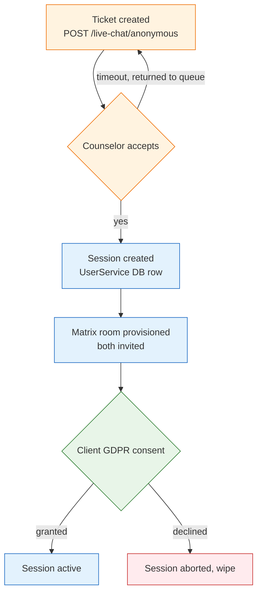
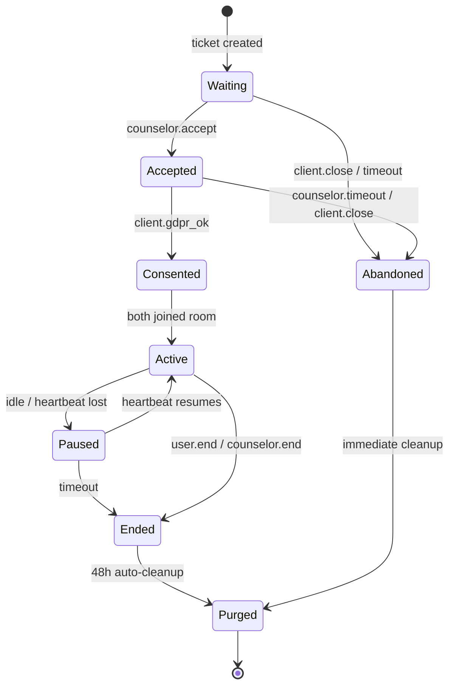

<Info>
A **session** in ORISO is the lifespan of a single counselor-client conversation. It is anchored by a Matrix room, owns a UserService database record, and has strict creation and teardown rules.
</Info>

## 4.4.1 What a Session Is

| Property | Value |
|---|---|
| **Identity** | A `session_id` (UUID) issued by UserService |
| **Anchor** | A Matrix room id (E2EE) created at acceptance |
| **Members** | Exactly two seats: one counselor (Keycloak `consultant`), one client (Keycloak `anonymous`); optionally a supervisor (read-only) |
| **Topic** | Inherited from the live-chat link or the enquiry |
| **Owning agency** | Set at creation; immutable |
| **Lifetime** | Seconds to ~hours; never longer than 48 h |

Sessions are not "user history". They are ephemeral conversation containers.

## 4.4.2 How a Session Is Created

A session is **always** created from a ticket:



Trigger sequence:

1. **Counselor clicks "Accept"** in the live-chat queue.
2. UserService transactionally:
   - Atomically marks the ticket as `accepted` (row-lock; loses if a peer accepted first).
   - Creates a `session` row with `agency_id`, `consultant_id`, `client_pseudonym`, `topic`, `started_at`.
   - Calls Matrix admin API to create a private encrypted room.
   - Invites both members.
3. UserService pushes a **GDPR-consent prompt** to the client.
4. On consent, the session moves to `active`.

## 4.4.3 How Users Join

| Member | How they join |
|---|---|
| **Counselor** | Already in the admin app; the session opens automatically in the Live Chat tab. |
| **Client** | Already in the waiting room; on counselor acceptance the UI transitions to a "your counselor is connecting" state, then the consent popup, then the chat. |
| **Supervisor (function)** | A `supervisor-consultant` can be invited to the room **on demand and audited**, never silently. Joining sends a system message: *"Supervisor X has joined for QA review"*. |

A client cannot rejoin a previous session — sessions are one-shot conversations.

## 4.4.4 Session State Machine



### State definitions

| State | Meaning |
|---|---|
| `Waiting` | Ticket exists, no counselor accepted yet. Client is in the waiting room. |
| `Accepted` | Counselor clicked Accept, but client GDPR not yet given. |
| `Consented` | Client confirmed GDPR; room being finalized. |
| `Active` | Both members in the encrypted room, exchanging messages. |
| `Paused` | A heartbeat was lost; UI shows "reconnecting"; data preserved. |
| `Ended` | Either party closed cleanly. Room exists for ≤ 48 h. |
| `Abandoned` | Client gave up before counselor pickup, or pickup timed out. |
| `Purged` | All ciphertext deleted, all PII (= pseudonym) wiped, only opaque session_id remains. |

## 4.4.5 Retention Rules

The single most important table in this product:

| Data | Where | Retention |
|---|---|---|
| Anonymous user (Keycloak) | Keycloak realm | Wiped within seconds-to-minutes of disconnect |
| Session row | UserService MariaDB | Until `Purged`; then anonymized (pseudonym blanked, `session_id` retained) |
| Matrix room metadata | Synapse PostgreSQL | Until `Purged`; deleted on tombstone |
| Matrix encrypted message bodies | Synapse PostgreSQL | ≤ 48 h after `Ended`, then purged |
| Megolm session keys | Browser (counselor + client) | Cleared on tab close / explicit logout |
| Counselor case notes (planned) | UserService MariaDB | Counselor-owned; not linked to client identity post-purge |
| Audit log of "session happened" | Append-only log | 1 year, opaque session id only |

**Cardinal rule from the huddle**: *no archiving, only wiping.* A "soft delete" / archive of a client's pseudonym is **not allowed**.

## 4.4.6 The Wipe-on-Disconnect Mechanism

How ORISO ensures a client cannot pile up indefinitely:

1. Frontend sends a periodic heartbeat to UserService (e.g. every 30 s) for every active waiting-room or session participant.
2. UserService maintains a per-user `last_seen_at`.
3. A **scheduled job** (RabbitMQ-driven, runs every ~15 s) finds anonymous users whose `last_seen_at` is older than the threshold:
   - If state = `Waiting`: state → `Abandoned`; Keycloak user deleted; ticket row deleted.
   - If state = `Active`: state → `Paused`; if still stale after a longer threshold, state → `Ended`.
4. Cleanup is idempotent and logs only opaque session ids.

<Tip>
The thresholds are tunable. Sane defaults: heartbeat = 30 s, abandon-after = 90 s, paused-to-ended = 5 min, room-purge = 48 h.
</Tip>

## 4.4.7 Backend Logic Touchpoints

```
POST /live-chat/anonymous           creates Waiting ticket + anonymous user
POST /live-chat/accept              Waiting → Accepted (row-lock!)
POST /live-chat/consent             Accepted → Consented (then Active)
POST /sessions/{id}/heartbeat       updates last_seen_at
POST /sessions/{id}/end             Active → Ended
POST /sessions/{id}/supervisor      invite supervisor (audited)
DELETE /sessions/{id}               admin-only forced teardown
```

Concurrency-critical operations (`accept`, `end`, `purge`) use either a row-level DB lock or an idempotent state-machine guard so two clicks cannot corrupt state.

## 4.4.8 Special Flows

### Promote chat → video

A counselor can offer "switch to video" mid-chat. UserService issues a LiveKit JWT for both members; a LiveKit room is created (separate from the Matrix room) and joined inside the same session container. The Matrix room remains the source of truth for text history.

### Supervisor review

A `supervisor-consultant` requests access to a session. UserService:
1. Verifies the supervisor belongs to the same agency.
2. Records an audit row: `supervisor_join { session_id, supervisor_id, started_at }`.
3. Invites the supervisor as a third Matrix room member; system message announces it.
4. On supervisor leave, audit row is closed.

### Session cancellation

The client can close at any time (top-right ✕). The counselor can end with "End session". Both feed the same `Ended` state.

## 4.4.9 Edge Cases

- **Counselor's laptop dies mid-active** → Session pauses; client sees "Counselor reconnecting…"; if no resume in 5 min, session ends.
- **Client refreshes the tab** → New cookie, new pseudonym; old session orphaned and purged. Client cannot rejoin (privacy by design).
- **Two counselors race to accept** → First wins via row-lock; second sees "ticket already taken".
- **Network split mid-message** → Message in flight retried by Matrix client; once reconnected, message arrives in order.
- **Purge job lags** → Backlog visible in metrics; alerts at >5 min lag. Purges are idempotent; safe to retry.

## 4.4.10 Related

- [Live Chat (4.2)](/product/features/live-chat)
- [Pincode-Based Chat (4.3)](/product/features/pincode-chat)
- [Data Model](/product/data-model)
- [Edge Cases](/product/edge-cases)
