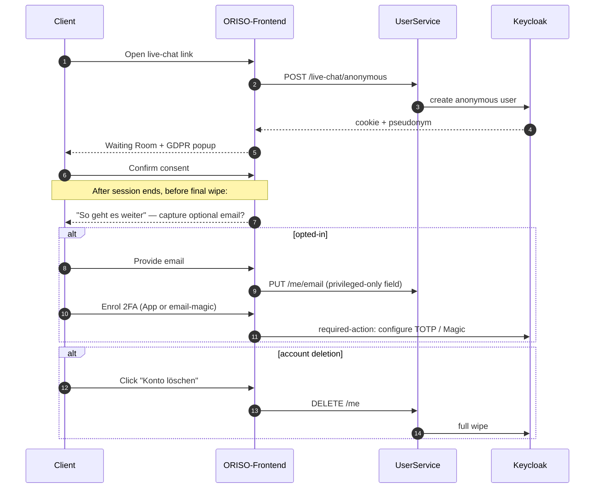
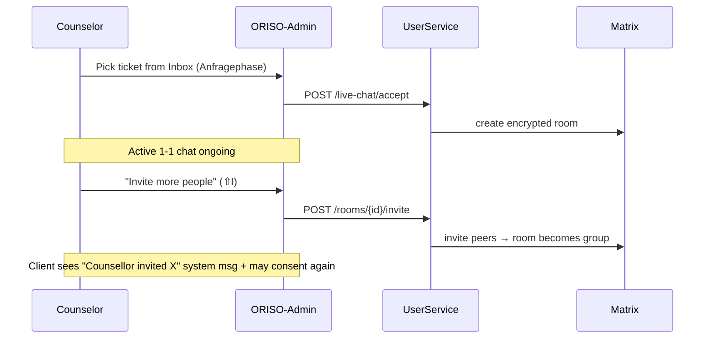
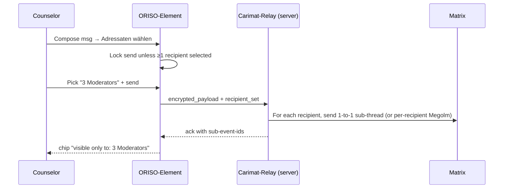
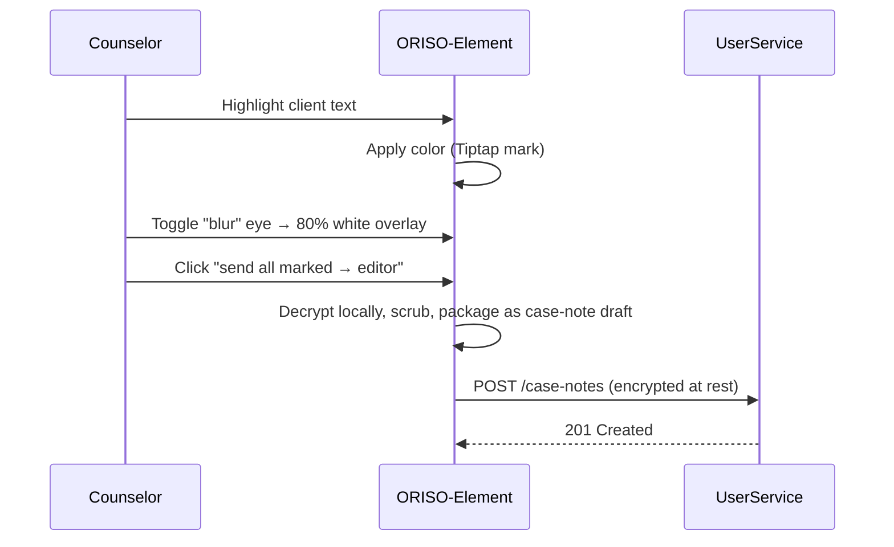
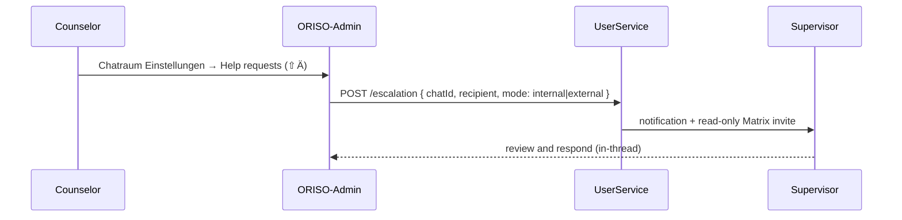
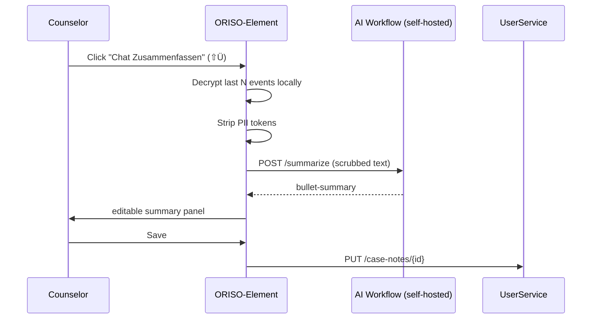

<Info>
This page is the **single source of truth** for what changed in the product after the May-2026 Figma drop. It feeds the new pages in [Core Features](/product/features) and the targeted updates to [Roles & Permissions](/product/roles-permissions), [Data Model](/product/data-model), [UI/UX](/product/ui-ux), and [Edge Cases](/product/edge-cases).
</Info>

## 1. Image Analysis Summary

The Figma file contains roughly twelve distinct screen families. We group them below; each entry follows the requested template.

### 1.1 Group Chat Room (counselor view)

| Aspect | Detail |
|---|---|
| **Screen** | Group / team / family / addiction chat room — counselor side |
| **Examples** | "Teamberatung", "Familienberatung", "Suchtprobleme", "Teamgruppe 17", "Supportgruppe Alkohol" |
| **Purpose** | Multi-party encrypted chat for groups (peer-support, team consult, family, supervision pool). |
| **Key UI** | Header with group name + "Supervision On/Off" badge; E2EE banner *"Ihre Nachrichten sind Ende-zu-Ende verschlüsselt … niemand außerhalb dieses Chats kann die Nachrichten lesen. Nicht einmal die Online-Beratungs-Plattform."*; participant initials row; composer; tools row (Reply directly / Reply in Thread / Mark Text / Forward / Delete / Add). |
| **User actions** | Send, reply in thread, mark text, blur PII, forward, delete, invite people, archive, mute, request help, summarize, toggle supervision. |
| **System behaviour (inferred)** | Each group is a Matrix room with E2EE; tools are gated by chat-type permissions (anonymous / 1-1 / group / supervision); supervision flag toggles a system message and audit trail. |

### 1.2 Group Chat Room (client view)

| Aspect | Detail |
|---|---|
| **Screen** | Same group chat seen by an advice-seeker |
| **Purpose** | Keep group features but **hide counselor-only tools** (multi-recipient send, blur, summarize, supervision controls). |
| **Key UI** | E2EE banner; only the message composer; reply-in-thread for clients only allowed *if admin permits*. |
| **User actions** | Send/receive; (optionally) reply in thread; leave group → wipe of pseudonym. |
| **System behaviour** | Permission engine returns a different toolset based on `role=client`. |

### 1.3 Active Video Call (Inside Chat)

| Aspect | Detail |
|---|---|
| **Screen** | Active call notice in chat: *"Currently Active Call → Join Video Call"* |
| **Purpose** | Embed a live LiveKit call into the existing chat thread; anyone in the room can join. |
| **Key UI** | "Currently Active Call" pill, "Join Video Call" CTA. |
| **System behaviour** | UserService issues a short-lived LiveKit JWT per joiner; WebRTC handshake direct to LiveKit. |
| **Open product question** | *"What happens when a user deletes himself during a video call (if he's the initiator)? What happens if a client deletes himself from a group chat?"* — see [Edge Cases](/product/edge-cases#9-1-7-client-deletes-self-during-active-video-call) for the resolution we propose. |

### 1.4 Inquiry Acknowledgement / "So geht es weiter"

| Aspect | Detail |
|---|---|
| **Screen** | Post-inquiry waiting screen for the client (1-on-1 async track) |
| **Purpose** | Confirm submission, set expectations, capture optional email. |
| **Key UI** | *"Wir haben Ihre Nachricht erhalten."* / *"Ihr_e Berater_in antwortet innerhalb von 2 Werktagen"*; optional email input; 2FA enrollment CTA *"Konto schützen"*; account deletion link *"Konto löschen"*. |
| **User actions** | Submit email (optional), enable 2FA, delete account. |
| **System behaviour** | If email given → server stores it **invisibly to counselors**, used only for password reset & inbound notification. 2FA via App or Email link. Account deletion = full wipe. |
| **Status** | **[NEW FEATURE]** — Optional email + 2FA for clients. |

### 1.5 Notifications Page

| Aspect | Detail |
|---|---|
| **Screen** | Standalone Notifications inbox |
| **Purpose** | Asynchronous messages addressed to a user (e.g. *"Your inquiry has been accepted by a consultant"*). |
| **Key UI** | List item with type, title, body, date, "Reply" button; "View Chats" CTA. |
| **System behaviour** | Backend pushes notification rows; mobile push / email mirror (optional, only if email captured). |
| **Status** | **[NEW FEATURE]**. |

### 1.6 Chat List with Filters & Phases

| Aspect | Detail |
|---|---|
| **Screen** | Counselor inbox / chat list |
| **Tabs** | "Ungelesen", "1-1 Beratung", "Live-Chat", "Gruppen", "Aktiv", "Termine", "Archiv", "Anfragen". |
| **Filter chips** | Personen / Type / Beratungsstelle / Archived; "Verfeinere deine Suche durch Filter weiter". |
| **Phases shown on each row** | "Anfragephase" (request stage), "Vermittlungsphase" (routing stage), then active. |
| **Side rail** | Anfragen, Gespräche, Reports, Mein Profil, Logs. |
| **Empty state** | *"Bitte wählen Sie eine Nachricht aus dem linken Panel"* / *"Zurzeit gibt es keine unbeantworteten Anfragen"*. |
| **Status** | **[UPDATE REQUIRED]** — extends existing chat list; new phase model + filter chips. |

### 1.7 Multi-Recipient Send Tool

| Aspect | Detail |
|---|---|
| **Screen** | Composer with "Wähle wer diese Nachricht sehen soll" / "Adressaten wählen" |
| **Purpose** | Let a counselor send a message to a **subset** of room members (e.g. "only the moderators"). |
| **Key UI** | "Send to" dropdown; participant list with selectable rows; "Select All Counsellors" / "Select All Moderators" / "Select All"; result pill *"visible only to: Ich"* / *"3 Moderators"* / *"+23"*; "Reply directly" vs "Reply in Thread". |
| **Send-button states** | A) hide entirely in 1-1 chat; B) grey when 2 + participants; B2) AAA touch zones; C) icon = chat-type symbol; D) remember last selection per chat; E) **always hidden for clients**. |
| **System behaviour** | Matrix `m.room.message` with a custom relation/restriction; receivers list enforced server-side **and** client-side (defense-in-depth). |
| **Status** | **[NEW FEATURE]**. |

### 1.8 Mark Text + PII Blur Tool

| Aspect | Detail |
|---|---|
| **Screen** | Tiptap-style highlighter overlaid on a message |
| **Purpose** | Counselor can mark / annotate / **blur** sensible parts of an incoming message; send marked notes to a thread or to a private editor (case-note draft). |
| **Key UI** | Highlight palette (color picker), "Selects color, now tool works like text mark tool in tiptap"; eye toggle (show/hide blurred text); marked excerpts grouped under labels (Great Aspects, Dangerous Behaviors, …); CTAs *"sends it to thread"* / *"sends it to editor"* / *"send all to editor"* / *"send all to thread"*. |
| **System behaviour** | Marks are message-overlay metadata stored client-side (and synced via E2EE); blur applies a uniform 80% white overlay (`fff 80% Overlay Blur (uniform) 4`); a receiver sees *"Counsellor blurred some personal please be aware in future"*. |
| **Status** | **[NEW FEATURE]**. |

### 1.9 Chat Room Settings ("Chatraum Einstellungen")

| Aspect | Detail |
|---|---|
| **Screen** | Per-room settings menu (right-click / kebab) |
| **Items** | Archive (⇧A), Mute (⇧Ö), Help requests (⇧Ä), Invite more people (⇧I), Supervision On/Off, Summarise chat (⇧Ü). |
| **Copy** | "Archivierte Benachrichtigungen sind inaktiv. Der Chat wird in 12 Monaten gelöscht." |
| **System behaviour** | Most actions are room-level Matrix state events; Summarise calls the AI workflow (see 1.10); Help requests opens an escalation flow. |
| **Status** | **[NEW FEATURE]** for the menu shell; individual items expand existing concepts. |

### 1.10 AI Chat Summary

| Aspect | Detail |
|---|---|
| **Screen** | "Chat Zusammenfassen" / "Summarise chat" button + side panel |
| **Copy** | *"Spare Zeit, mit Hilfe unseres vollends Datenschutzkonformen KI Workflows."* |
| **Purpose** | Counselor-side automatic summarization of an existing chat into a case note. |
| **System behaviour** | Decryption + scrubbing in browser (per existing privacy rules), summary returned, counselor edits, save. |
| **Status** | **[NEW FEATURE]** — confirms the previously-planned AI tools track ([4.1 Transcripts](/product/features/transcription) → now [AI Tools](/product/features/ai-tools)). |

### 1.11 Help Requests / Internal Escalation

| Aspect | Detail |
|---|---|
| **Screen** | Modal: *"Eskaliere den Fall intern oder extern ohne den Datenschutz zu vernachlässigen."* |
| **Picker** | "Wähle intern von einer Person ohne den Datenschutz zu vernachlässigen" — choose another counselor / supervisor inside the agency. |
| **Status** | **[NEW FEATURE]**. |

### 1.12 Case Handover

| Aspect | Detail |
|---|---|
| **Screen** | Counselor-side handover modal + client-side system message |
| **Counselor copy** | "Handover Case" with reasons: Holiday, Sickness, Emergency, Law Violation, Employees fired, **Custom**. |
| **Client copy** | *"Deine vorherige Beratin ist leider krank. Deshalb wurde dein Fall an {Beraterin} übergeben von der {Beratungstelle}."* |
| **Permissions** | Different reasons require different consent: *"Client Permission needed"*, *"Counsellor Permission needed"*, *"Client and Counsellor Permission needed"*, *"Supervisor Permission needed"*, *"Law Enforcement Representative"*. |
| **Status** | **[NEW FEATURE]**. |

### 1.13 Admin Settings — "Berechtigungen" (Permissions Matrix)

| Aspect | Detail |
|---|---|
| **Screen** | Tenant / Agency admin panel section |
| **Tabs** | Profil, Erscheinungsbild, Rechtliches, Berechtigungen, Mandanten, Logs. |
| **Permission columns** | Anonyme Chats / 1-zu-1 Chats / Gruppenchats / Supervision. |
| **Permission rows** | Anonyme Beratung erlauben, Anrufe erlauben, Audio-Anrufe erlauben, Video-Anrufe erlauben, Threads erlauben, Sprachnachrichten erlauben, Supervision erlauben. |
| **System behaviour** | A central feature-flag matrix evaluated at runtime; client + server both consult it. |
| **Status** | **[NEW FEATURE]**. |

### 1.14 Agency / Tenant Display ("Beratungsstelle Caritas Mainz")

| Aspect | Detail |
|---|---|
| **Screen** | Counselor avatar with agency context: *"Beratende Person Kim G. — Kim Gerlander — 54222 Caritas Mainz"* |
| **Purpose** | Show clients which agency / tenant a counselor is talking from. *"It should be possible to show the agency the counsellor is talking from."* |
| **Status** | **[UPDATE REQUIRED]** — extend the user / display name model to include agency context. |

### 1.15 File Upload Drop-Zone

| Aspect | Detail |
|---|---|
| **Copy** | *"Ziehen Sie die Datei in das Feld, um sie hochzuladen. .jpg, .png, .pdf, .docx, .xlsx bis maximal 10 MB"* |
| **Status** | **[NEW FEATURE]**. |

### 1.16 Tags / Topic Chips

| Aspect | Detail |
|---|---|
| **Screen** | Tag picker: search, list, *"Cant find Matching Tag?"* |
| **Status** | **[NEW FEATURE]**. |

### 1.17 Welcome / Inbox Empty States

| Aspect | Detail |
|---|---|
| **States** | "All active chats are displayed here", "Please select a message from the panel first.", "No Conversations archived yet", "There are no request at the moment", "Wählen Sie zuerst bitte eine Nachricht aus der Liste aus." |
| **Animation rule** | *"Animations should only play once each time you click on a section, not in loop, playback speed not more than 0.7×"*. |
| **Status** | **[UPDATE REQUIRED]** — adopt as standard empty-state copy. |

## 2. Feature Mapping

| # | Feature | Related Screens (from §1) | Status |
|---|---|---|---|
| F1 | **Group Chats** (Team / Family / Addiction / Peer-support / Internal) | 1.1, 1.2, 1.6 | **[NEW FEATURE]** |
| F2 | **Multi-Recipient Send** (`Wähle wer diese Nachricht sehen soll`) | 1.7 | **[NEW FEATURE]** |
| F3 | **Mark-Text + PII Blur** | 1.8 | **[NEW FEATURE]** |
| F4 | **AI Chat Summarisation** | 1.10 | **[NEW FEATURE]** (replaces planned-only status of [4.1](/product/features/transcription)) |
| F5 | **Reply in Thread / Reply Directly / Forward / Delete** | 1.1, 1.7 | **[NEW FEATURE]** |
| F6 | **Help Requests / Internal Escalation** | 1.11 | **[NEW FEATURE]** |
| F7 | **Case Handover** with reason taxonomy | 1.12 | **[NEW FEATURE]** |
| F8 | **Per-chat-type Permissions Matrix** | 1.13 | **[NEW FEATURE]** |
| F9 | **Notifications Inbox** + push/email mirror | 1.5 | **[NEW FEATURE]** |
| F10 | **Optional Client Email** for password reset & alerts | 1.4 | **[NEW FEATURE]** |
| F11 | **Two-Factor Auth for Clients** (App / Email) | 1.4 | **[NEW FEATURE]** |
| F12 | **Account Deletion (client-initiated)** | 1.4 | **[NEW FEATURE]** |
| F13 | **Video-Call Embed in Chat** + bus events | 1.3 | **[UPDATE REQUIRED]** (was implicit only) |
| F14 | **Phase model** (`Anfragephase` / `Vermittlungsphase` / Active) | 1.6 | **[NEW FEATURE]** |
| F15 | **Chat-list filter chips & tabs** | 1.6 | **[UPDATE REQUIRED]** |
| F16 | **Activity / Timeline / Drafts / Pinned / Scheduled** | 1.6 | **[NEW FEATURE]** |
| F17 | **Tags on chats and messages** | 1.16 | **[NEW FEATURE]** |
| F18 | **Agency context on counselor identity** | 1.14 | **[UPDATE REQUIRED]** |
| F19 | **File upload (10 MB)** | 1.15 | **[NEW FEATURE]** |
| F20 | **Empty / loading / animation rules** | 1.17 | **[UPDATE REQUIRED]** |
| F21 | **Chat Room Settings menu** (Archive / Mute / Help / Invite / Supervision / Summarise) | 1.9 | **[NEW FEATURE]** |
| F22 | **Voice messages** (allow/deny per chat type) | 1.13 | **[NEW FEATURE]** |
| F23 | **Multi-language UI** (DE / EN / TR / FR) | 1.6 etc. | **[UPDATE REQUIRED]** — earlier doc said EN/DE; FR + TR are now confirmed first-class. |

## 3. Documentation Updates

The following pages were touched (or newly created) to reflect §2:

| Section | File | What changed |
|---|---|---|
| Live Chat | `product/features/live-chat.mdx` | Added "Live Chat ≠ only 1-1" caveat, cross-link to Group Chats, multi-recipient note. |
| Core Features index | `product/features/index.mdx` | Added cards for Group Chats, AI Tools, Handover, Notifications, Help Requests. |
| AI Tools (renamed track) | `product/features/ai-tools.mdx` | **NEW** — supersedes "Transcripts only" with: Chat Summary, PII Blur, Mark Text, Smart Forward. |
| Group Chats | `product/features/group-chats.mdx` | **NEW** — group types, multi-recipient send, supervision-flag, member lifecycle, group-leave wipe rules. |
| Case Handover | `product/features/handover.mdx` | **NEW** — reason taxonomy, consent matrix, client/counselor system messages. |
| Notifications & Escalation | `product/features/notifications.mdx` | **NEW** — Notifications inbox + Help Requests. |
| Roles & Permissions | `product/roles-permissions.mdx` | Added per-chat-type permission matrix (F8). |
| Data Model | `product/data-model.mdx` | Added: `GroupChat`, `ChatType`, `Notification`, `MessageAddressing`, `MarkAnnotation`, `BlurAnnotation`, `HandoverEvent`, `EscalationRequest`, `ChatTag`, `ClientEmail`, `MFAFactor`, `FeaturePermission`. |
| UI / UX | `product/ui-ux.mdx` | Added new screen tables: Group chat, Notifications, Handover modal, Permissions admin, Multi-recipient picker, Mark/Blur tool. |
| Edge Cases | `product/edge-cases.mdx` | Added the explicit Figma-question scenarios + new edge cases for handover, multi-recipient, blur, group-chat leave. |
| Assumptions | `product/assumptions.mdx` | Added new "Confirmed by Figma May-2026" section + remaining open items. |
| `docs.json` | navigation | Added new pages under "Core Features" and a new group "Collaboration & Tools". |

## 4. Missing or Incomplete Logic

The Figma exposes several gaps where backend or product behaviour is not yet defined.

### 4.1 Video-Call Self-Delete (Figma question)

> *"What happens when a user deletes himself during a video call (if he's the initiator)?"*

- **[MISSING FLOW]** — there is no UI for "promote initiator" or "end-call-on-initiator-leave" decision.
- **Proposed**: see [Edge Cases §9.1.7](/product/edge-cases#9-1-7-client-deletes-self-during-active-video-call). When a client deletes themselves mid-call, the LiveKit room continues for remaining counselors. The originator role transfers to the next counselor by `joined_at` ASC; if no counselor remains, the room ends.

### 4.2 Group-Chat Self-Delete (Figma question)

> *"What happens if a client deletes himself from a group chat?"*

- **[MISSING FLOW]** — group chats so far were assumed to be all-counselor.
- **Proposed**: see [Edge Cases §9.1.8](/product/edge-cases#9-1-8-client-deletes-self-from-group-chat). Client's pseudonym is wiped immediately; their messages stay (E2EE bodies are not personal data) but their authorship label becomes *"Ehemaliger Teilnehmer"*. If the client was the only advice-seeker, the group is auto-archived.

### 4.3 Multi-Recipient Send — server-side enforcement

- **[UNCLEAR BEHAVIOR]** — Matrix has no native "visible only to" message-level restriction.
- **Proposed implementation**: a server-side bot ("Carimat-relay") is the only sender for restricted messages — it forwards each addressed copy as a 1-to-1 sub-thread, OR uses Matrix `m.room.encrypted` with per-recipient Megolm sessions. Decision needed.

### 4.4 PII Blur — durability of marks

- **[UNCLEAR BEHAVIOR]** — when message bodies are E2EE in Matrix, where do blur ranges live? Options:
  - (a) inside the same encrypted event payload as a structured field;
  - (b) as a separate "annotation" event tied by `event_id`. (b) is more durable across re-key but requires the receiver client to fetch annotations.

### 4.5 Phase Model

- **[MISSING FLOW]** — `Anfragephase` and `Vermittlungsphase` are visible in the inbox but the transition rules are not specified. Likely:
  - Anfragephase: ticket created, no counselor assigned.
  - Vermittlungsphase: counselor accepted but client has not yet consented (GDPR #2) **or** waiting for handover acceptance.
  - Active: both consents given, room finalised.

### 4.6 Handover Reasons & Consent

- **[UNCLEAR BEHAVIOR]** — for a "Law Violation" handover, the figma annotation says "Law Enforcement Representative" — meaning a regulator may need access. The legal mechanics (warrant, disclosure scope, encryption-key access) are out of scope for the UI but **must** be defined before this code path is enabled. Today the platform has no escrow of E2EE keys, so even with a warrant the message bodies remain unreadable.

### 4.7 Notification Channels

- **[UNCLEAR BEHAVIOR]** — Notifications can include email mirror (if email captured). What about push? Matrix has push gateways; do we use them for clients with no email? Decision needed.

### 4.8 Optional Email — privacy

- **[UNCLEAR BEHAVIOR]** — "Email is not visible to counselors" — is it visible to *Counselor Admin*? The default should be **no** (treated as privileged auth field, only readable by Platform Admin for legal/auth purposes).

### 4.9 Voice Messages

- **[NEW FEATURE]** — flagged as a permission row but not yet detailed: format, duration cap, transcription? Voice-message E2EE is non-trivial in Matrix.

## 5. User Flow Reconstruction

### 5.1 Client Joins via Link → Optional Email + 2FA



### 5.2 Counselor Picks a Live-Chat Ticket → Optional Group Promotion



### 5.3 Counselor Sends Restricted Message ("visible only to: Moderators")



### 5.4 Counselor Marks & Blurs PII, Then Sends to Editor



### 5.5 Case Handover Flow

```mermaid
sequenceDiagram
  autonumber
  participant Co1 as Counselor A (going off)
  participant Co2 as Counselor B (taking over)
  participant FE as ORISO-Admin
  participant US as UserService
  participant Cl as Client
  Co1->>FE: Open Handover modal
  Co1->>FE: Pick reason (Sickness)
  Co1->>FE: Select Co2 from same agency
  FE->>US: POST /handover { from, to, reason }
  US->>US: check consent rules for reason
  US->>Co2: invite to room
  US->>Cl: System msg "Deine vorherige Beraterin ist leider krank…"
  alt reason needs client consent
    US->>Cl: ask consent
    Cl-->>US: accept / reject
  end
  Co2->>FE: accept
  US->>MX: rotate room ownership; remove Co1
```

### 5.6 Help Request / Internal Escalation



### 5.7 AI Summary



## 6. Role-Based Insights

### 6.1 Platform Admin

- Adds: edits the **per-chat-type Permissions Matrix** (F8) at the platform default level.
- Adds: chooses which **handover reasons** are available globally and which require which consent.
- Adds: turns AI Summary, Blur tool, Multi-Recipient Send on/off platform-wide.
- Restriction: still cannot read message contents.

### 6.2 Tenant Admin

- Adds: overrides the Permissions Matrix for the whole tenant (subject to platform allowance).
- Adds: enables/disables Voice Messages, Threads, Calls per chat-type.
- Adds: maintains the agency context label that shows on counselors' avatars.

### 6.3 Counselor Admin

- Adds: per-agency override of Permissions Matrix.
- Adds: invites for **group chats** (round-tables, peer support).
- Adds: chooses which counselors have the **Supervisor function** for a given group.

### 6.4 Counselor

- Adds: full toolset in 1-1 / group / supervision chats — multi-recipient send, mark/blur, AI summary, handover, help-request, file upload.
- Restriction: every tool is gated by the Permissions Matrix for the chat type they are in.

### 6.5 Client (Anonymous or with Optional Email)

- Adds: optional email + 2FA + account deletion.
- Adds: notifications inbox (only their own).
- Adds: may participate in group chats (peer support) but **multi-recipient send, mark/blur, AI summary, handover, help-request are hidden**.
- Adds: may leave a group chat at any time → wipe of pseudonym, messages remain in others' history under "Ehemaliger Teilnehmer".

### 6.6 Supervisor (Function on Counselor)

- Adds: receives Help-Request invites.
- Adds: read-only or full participation depending on configuration.
- Adds: visible to the room with a system message *"Supervision Enabled!"*.

## 7. Assumptions

These are **explicit** and remain to be validated against code / Frank.

- **A1 — Group chat = generalized Matrix room.** No new chat protocol; group chats use the same Synapse, just with multiple counselor / client members and chat-type metadata.
- **A2 — Multi-Recipient Send is implemented via a server-side relay bot or per-recipient Megolm sessions.** Not native to Matrix; needs decision.
- **A3 — Mark/Blur lives as message-overlay annotations**, separate from message body, synced as encrypted events.
- **A4 — AI Summary runs in browser (decrypt+scrub) → self-hosted summarizer.** Server never sees ciphertext or PII.
- **A5 — Phase model uses three states**: `Anfragephase`, `Vermittlungsphase`, `Aktiv`. The Vermittlungsphase covers GDPR-#2-pending and handover-pending. Needs validation.
- **A6 — "Email not visible to counselors" means visible only to Platform Admin** for legal / auth purposes; never to Counselor Admin or Counselor.
- **A7 — 2FA via App or Email** for clients is opt-in and only available if they captured an email.
- **A8 — Account deletion** triggers the same wipe pipeline as client-leaves-room, plus removal of the optional email and any notifications.
- **A9 — Tenant-level permission overrides cascade**: Platform → Tenant → Agency → Chat-type. Final effective permission = AND of all applicable layers (a parent disabling a feature beats a child enabling it).
- **A10 — Voice messages**: Megolm-encrypted Opus blobs uploaded to Matrix media repo; stored ≤ 48 h like text.
- **A11 — Tags** are agency-scoped vocabularies; "Cant find Matching Tag?" CTA opens an "ask the admin" inquiry.
- **A12 — Animations rule**: each animation plays once per click; ≤ 0.7× speed; never loops. Adopted as a global UX constant.
- **A13 — Languages**: DE / EN / TR / FR are confirmed first-class. Default = browser language with EN fallback (not DE).
- **A14 — File upload limit** is 10 MB per file; mime allow-list is `jpg, png, pdf, docx, xlsx`. Server rejects others.
- **A15 — Inviter rule**: when a counselor invites someone to an active 1-1 room, the room becomes a group; the client gets a system message and may see a re-consent prompt depending on tenant policy.
- **A16 — Handover reasons** that touch external authority ("Law Violation") still cannot break E2EE; the system only delivers metadata access. Legal escalation is documented but not implemented in v3.
- **A17 — Carimat / Chatbot scripted onboarding** is the planned name for the on-rails first-message bot that asks topic / language; not yet implemented.

If any of A1-A17 is wrong, please update this page first and let the rest of the docs cascade.
