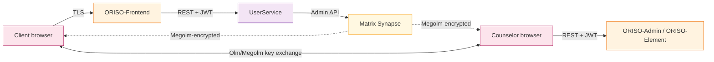
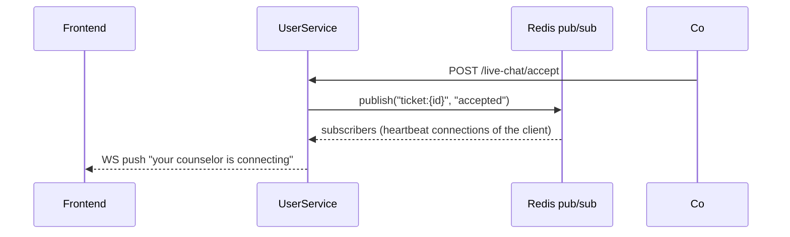

<Info>
This page is the developer's deep-dive. Cross-references back to the architecture page ([Section 2](/product/architecture)) and the data model ([Section 7](/product/data-model)) are heavy on purpose — they are the same system seen from different angles.
</Info>

## 6.1 The Chat / Transcription Pipeline

ORISO's "chat pipeline" is shorter than most chat platforms because the platform deliberately **does not see message contents**. The pipeline is:



What each leg does:

1. **Client → ORISO-Frontend (TLS)** — UI traffic, no message bodies.
2. **Frontend → UserService (REST + Keycloak JWT)** — control-plane calls only: create ticket, accept ticket, send heartbeat, end session.
3. **UserService → Matrix Synapse (admin API)** — UserService is a privileged Matrix admin: it provisions rooms, invites users, but **never** reads message bodies.
4. **Browser ↔ Browser (Megolm)** — actual message content flows as ciphertext through Synapse; only the participating browsers hold the decryption keys.
5. **Element / ORISO-Element** — the chat UI; manages the Megolm session in browser memory.

### Why this matters

The server (and therefore any rogue admin or compromised database) sees:

- That session X exists between consultant A and pseudonym Y.
- That N messages were exchanged at timestamps T1…Tn.
- Nothing else.

This is a deliberate design constraint and it gates **every** future feature, including AI note-taking — which must remain client-side.

### LiveKit (video) leg

Optional. UserService issues a short-lived LiveKit JWT with the room name and member identity; the browser connects to LiveKit directly over WebRTC. Audio/video is **not recorded** on the server.

## 6.2 Data Storage Model (How It's Persisted)

Three logical clusters:

### 6.2.1 Relational truth — MariaDB

| Database | Owns |
|---|---|
| `tenantservice` | Tenants, tenant-level legal templates (Imprint, Data Policy, GDPR), data-policy signatures |
| `userservice` | Users, sessions, live-chat tickets, consultants, supervisor functions, magic-link issuance log, audit log |
| `agencyservice` | Agencies (counseling centers), live-chat links, postcode ranges, agency↔consultant↔topic bindings, agency settings |
| `consultingtypeservice` | Topics, basic config |

All databases live in the same MariaDB ClusterIP service but are **logically isolated**. Cross-database joins are forbidden — services call each other over REST.

### 6.2.2 Document truth — MongoDB

| Collection | Purpose |
|---|---|
| `consulting_types` | Topic configuration: title, description, default GDPR text snippets, multi-language labels, optional dynamic UI metadata |

The split (relational vs document) is historical: the rich JSON config of a topic was easier to keep in MongoDB.

### 6.2.3 Encrypted message truth — PostgreSQL (Synapse)

| Table | Owns |
|---|---|
| `events` | Raw Matrix events (encrypted bodies as ciphertext) |
| `rooms` | Room id, members, tombstone state |
| `e2e_*` | Megolm session metadata |

Synapse is intentionally **read-only** to backend services. Even the audit code doesn't read this DB directly; it uses the Synapse admin API.

### 6.2.4 Caches & queues

- **Redis** — session caches, queue counters (so the waiting room can compute "23 ahead of you" without hammering the DB), ingress rate-limit counters, login attempt counters.
- **RabbitMQ** — async tasks: cleanup of stale anonymous users, scheduled room purge, magic-link expiration.

## 6.3 Event Flow (Real-Time)

Two real-time channels run in parallel:

### 6.3.1 Control plane (UserService ↔ Frontend)

WebSocket / SSE channel for ticket-state updates, queue position, "your counselor is connecting" prompts. Implemented as either WebSocket or long-poll fallback.



Redis Pub/Sub fans out events to multiple UserService pods, so a client connected to pod A still gets the event when a counselor on pod B accepts the ticket.

### 6.3.2 Chat plane (Matrix ↔ Browser)

Pure Matrix sync: clients open a `/_matrix/client/r0/sync` long-poll to Synapse and receive events. The chat plane is **independent** of UserService.

### 6.3.3 Real-time guarantees

- **At-least-once delivery** of control events (idempotent state machine handles duplicates).
- **In-order delivery** of chat messages (Matrix guarantees).
- **No global ordering** between control and chat planes — UI must tolerate either arriving first.

## 6.4 Authentication & Authorization

### 6.4.1 AuthN — Keycloak OIDC

Every user is a Keycloak user. There are five token shapes:

| Token type | Issued for | Realm role |
|---|---|---|
| Anonymous client token | Waiting-room visitor | `anonymous` |
| User token (planned) | Future registered client | `user` |
| Consultant token | Counselor | `consultant` (+ `supervisor-consultant`, `group-chat-consultant` flags) |
| Admin tokens | Counselor Admin / Tenant Admin / Platform Admin | `agency-admin`, `tenant-admin`, `user-admin`, … |
| Service-account token | Service-to-service calls | `technical`, `notifications-technical` |

MFA is enforced at the Keycloak login flow for `tenant-admin` and `user-admin` roles. Recommended (but not enforced) for `agency-admin` and `consultant`.

### 6.4.2 AuthZ — Spring Security

Each backend service uses Spring Security with a JWT decoder pointed at Keycloak. Realm roles are mapped to **granted authorities** via `Authority.java`:

```java
USER_ADMIN(UserRole.USER_ADMIN, List.of(USER_ADMIN, CONSULTANT_UPDATE, CONSULTANT_CREATE)),
TENANT_ADMIN(UserRole.TENANT_ADMIN, singletonList(AuthorityValue.TENANT_ADMIN)),
AGENCY_ADMIN(UserRole.AGENCY_ADMIN, singletonList(AuthorityValue.RESTRICTED_AGENCY_ADMIN)),
CONSULTANT(UserRole.CONSULTANT, List.of(CONSULTANT_DEFAULT, ASSIGN_CONSULTANT_TO_SESSION, VIEW_AGENCY_CONSULTANTS, CREATE_NEW_CHAT, START_CHAT, STOP_CHAT, UPDATE_CHAT)),
ANONYMOUS(UserRole.ANONYMOUS, singletonList(ANONYMOUS_DEFAULT)),
```

Every controller endpoint is gated by `@PreAuthorize("hasAuthority('AUTHORIZATION_xyz')")`. The most security-critical authorities:

- `ASSIGN_CONSULTANT_TO_SESSION` — the live-chat accept path.
- `CREATE_NEW_CHAT`, `START_CHAT`, `STOP_CHAT`, `UPDATE_CHAT` — counselor chat lifecycle.
- `RESTRICTED_AGENCY_ADMIN` — Counselor Admin.
- `TENANT_ADMIN` / `SINGLE_TENANT_ADMIN` — Tenant Admin.
- `USER_ADMIN` — Platform Admin.

### 6.4.3 Tenant scoping

Every request is **tenant-scoped** by an attribute on the JWT (e.g. `tenant_id`). Services apply a tenant filter at the persistence layer; cross-tenant queries are physically impossible to issue from the API surface.

### 6.4.4 MFA

Keycloak's *required actions* are configured for `tenant-admin` and `user-admin` roles to **CONFIGURE_TOTP** or **WEBAUTHN_REGISTER**. After first login, MFA is mandatory on every subsequent login.

## 6.5 How Links and Pseudonyms Are Generated and Validated

### 6.5.1 Pseudonyms (animal-adjective pairs)

Pseudonyms are deterministic-on-randomness, like *"geschmeidiges Kanninchen Kim"*:

1. Pick a random adjective from a curated, neutral German list (~500 entries).
2. Pick a random animal from a curated list (~200 entries).
3. Pick a random first name from a curated list (~3000 entries).
4. Combine: `{adjective} {animal} {name}`.
5. Salt with a 4-byte random suffix only if collision detected within the agency's active sessions.

Properties:
- ~500 × 200 × 3000 ≈ **300 million** unique base pseudonyms — collision probability is negligible at any realistic concurrency.
- The pseudonym is **not a secret**; it's just a friendly label.
- The pseudonym is **never reused** across sessions for the same person, because the system has no "person" concept for clients.

### 6.5.2 Live-chat links

Format:

```
https://app.oriso-dev.site/live-chat/{agencySlug}?topic={topicSlug}
```

Generation:

1. Counselor Admin clicks **Generate**.
2. AgencyService validates the agency is in the admin's scope, creates an `AgencyLiveChatLink` row, computes the URL.
3. The link is **not signed** — it's a public route. The auth happens after the click via the anonymous-token issuance.

Validation on click:

1. Frontend resolves `agencySlug` and `topicSlug` against AgencyService.
2. Confirms `agency.live_chat_enabled = true` and `agency_live_chat_link.enabled = true`.
3. Optionally enforces tenant routing rules (live-chat may be tenant-restricted).
4. Issues an anonymous Keycloak user.

### 6.5.3 Magic invite links (staff onboarding)

Format:

```
https://admin.oriso-dev.site/invite#token={JWT}
```

The token is a short-lived JWT with claims:

- `sub` — the prospective user id.
- `email` — required to match login.
- `role` — the realm role to assign on first login (e.g. `tenant-admin`).
- `agency_id` (optional) — for counselor / counselor-admin invites.
- `iat`, `exp` (24 h), `jti` (single-use).

Validation:

1. UserService verifies HMAC.
2. Checks `jti` against a "used-tokens" Redis set; rejects if seen.
3. Forwards to Keycloak which lets the user pick a password and configure MFA.
4. On successful registration, UserService records `magic_link.consumed_at` and assigns the role.

Magic links **never** appear in URLs after consumption (the post-registration session is a normal Keycloak token).

### 6.5.4 LiveKit JWTs (video promotion)

Issued by UserService when a counselor offers video:

- `sub` — the LiveKit identity (= the user's pseudonym/display name).
- `room` — the LiveKit room id.
- `grants` — `canPublish`, `canSubscribe` set to `true`.
- `exp` — 5 min (then refreshed).

Both members get distinct JWTs; LiveKit validates them at WebSocket handshake.

## 6.6 Cleanup & Wipe Mechanism (How Data Is Deleted Reliably)

A single shared scheduled job — implemented in UserService, triggered by RabbitMQ delayed messages — handles all wipe scenarios:

| Scenario | Trigger | Action |
|---|---|---|
| Anonymous heartbeat lost while waiting | `last_seen_at` older than threshold | Delete Keycloak user; delete ticket row; release queue slot |
| Session ended cleanly | `POST /sessions/{id}/end` | Schedule room tombstone in 48 h; anonymize pseudonym immediately |
| Active session heartbeat lost | `last_seen_at` older than 5 min | Move state to `Ended` |
| Magic link expired | `exp` reached | Mark consumed; revoke role assignment if not yet used |

The cleanup job emits **only opaque session ids** to logs — no pseudonyms, no IPs.

## 6.7 Configuration & Feature Flags

- **Live chat enabled (per agency)** — boolean on `agency`.
- **Live chat enabled (global)** — boolean on tenant; if false, no agency in this tenant can offer live chat.
- **MFA enforcement** — Keycloak required-action; on/off per realm role.
- **Default browser language** — frontend reads `navigator.language`; falls back to **English** (not German).
- **48 h message retention** — configurable; should never exceed 48 h in production.
- **Heartbeat threshold** — environment variable; defaults: 30 s heartbeat, 90 s abandon, 5 min pause-to-end.

## 6.8 Observability

| Layer | Tool | What's emitted |
|---|---|---|
| Distributed tracing | SignOZ / OpenTelemetry | Spans across services (every request id-tagged) |
| Application logs | SignOZ logs | Structured JSON; **no** PII, no IPs, no message bodies |
| Health | Health Dashboard | Per-pod actuator probes |
| Metrics | Prometheus → SignOZ | Queue size, active sessions, cleanup-job lag, MFA-failure rate, magic-link consumption rate |

## 6.9 Encryption Summary

| Layer | Mechanism |
|---|---|
| TLS at edge | Cert-Manager + Let's Encrypt; HSTS enabled |
| Service-to-service | TLS via Kubernetes service mesh (or plain HTTPS depending on cluster setup) |
| Database at rest | Standard MariaDB / PostgreSQL encryption-at-rest options + column-level encryption for personal fields |
| Chat messages | Megolm E2EE (Matrix) |
| Pseudonyms in DB | Plain text — they're not personal data, just labels |
| Magic-link tokens | HMAC-SHA-256 |
| LiveKit grants | JWT signed by LiveKit shared secret |

## 6.10 Hard Operational Rules (Non-Negotiable)

- ❌ No `dev` mode in production. Ever. (Reinstated after 2026 incident.)
- ❌ No client IPs persisted to the database or to logs.
- ❌ No message bodies in any backend log.
- ❌ No archive of an anonymous client's pseudonym.
- ❌ No AI service that receives raw ciphertext server-side.
- ✅ Yearly external security audit on production.
- ✅ Encrypted-at-rest backups stored in a separate region.
- ✅ Disaster recovery: realm.json checked into Git so Keycloak can be rebuilt from scratch with no data loss for staff (clients, by design, have nothing to lose).
