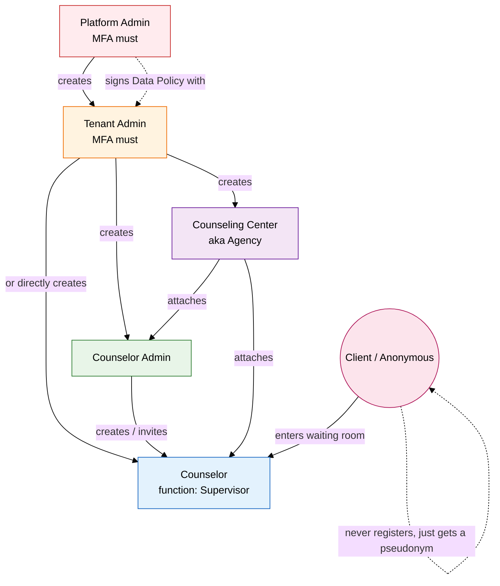
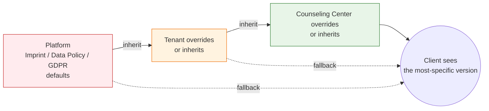

<Info>
The product describes **four staff tiers** (Platform / Tenant / Counselor Admin / Counselor) plus the anonymous **Client**. Internally these map onto **fourteen Keycloak realm roles** that gate fine-grained API actions.
</Info>

## 3.1 The Hierarchy at a Glance



**Two unbreakable rules**:

1. **Hierarchical isolation** — a tenant cannot see another tenant. A counseling center cannot see another counseling center's clients or counselors.
2. **Inheritance for legal text** — Imprint, Data Policy and GDPR Agreement always exist; if a center does not override them, it inherits from its tenant; if a tenant does not override them, it inherits from the platform.

## 3.2 Role Mapping (Business → Keycloak)

| Business role (huddle term) | Keycloak realm role(s) | Notes |
|---|---|---|
| **Platform Admin / Super Admin** | `user-admin` | Top of the hierarchy. Owns templates and tenants. MFA mandatory. |
| **Tenant Admin** | `tenant-admin` and / or `single-tenant-admin` | One per tenant; `single-tenant-admin` is the more restricted variant. MFA mandatory. |
| **Counselor Admin** | `agency-admin`, `restricted-agency-admin`, `restricted-consultant-admin` | Manages a counseling center, its consultants and consultant accounts. |
| **Counselor** | `consultant`, `group-chat-consultant` | The actual chat-handler. `group-chat-consultant` is a chat-specific variant. |
| **Counselor (Supervisor function)** | `supervisor-consultant` | A function flag on a counselor — not a separate person. |
| **Topic Admin** | `topic-admin` | Manages the global list of topics / consulting types. |
| **Client (anonymous)** | `anonymous` | Auto-created. Wiped on disconnect. |
| **Client (registered, planned)** | `user` | Reserved for future registered-user flow. |
| **System / service accounts** | `technical`, `notifications-technical` | Internal callers (e.g. service-to-service, notification worker). |

The full enumeration lives in:

- `ORISO-UserService/src/main/java/de/caritas/cob/userservice/api/config/auth/UserRole.java`
- `ORISO-UserService/src/main/java/de/caritas/cob/userservice/api/config/auth/Authority.java`
- `ORISO-Keycloak/realm.json`

## 3.3 The Four Staff Roles in Detail

### 3.3.1 Platform Admin (a.k.a. Super Admin / Server Admin)

**Description** — The owner of the ORISO platform. There are typically **one or two** Platform Admins per deployment. They never sit inside a tenant; they sit *above* tenants.

**Responsibilities**

- Onboard tenants and sign the Data Policy Agreement with each tenant.
- Maintain the platform-level **Imprint**, **Data Policy** and **GDPR Agreement** templates that every other layer can inherit.
- Configure global topics (or delegate to a Topic Admin).
- Run security operations (key rotations, audit responses, MFA recovery).
- Approve / disable tenants.

**Permissions — Can**

- ✅ Create, read, update, delete **tenants**.
- ✅ Read every tenant's high-level metadata.
- ✅ Edit platform-level Imprint, Data Policy, GDPR templates.
- ✅ Trigger system-wide operations (e.g., wipe of stale anonymous users).
- ✅ Read audit logs across tenants.

**Permissions — Cannot (or should not)**

- ❌ Read **chat content** of any session (E2EE prevents this even technically).
- ❌ Bypass MFA — the system enforces MFA on login.
- ❌ Run anything in `dev` mode in production.

**Real-world use case** — *"After a rogue developer left Keycloak in dev mode, the Platform Admin logs in (with MFA), regenerates Keycloak from the realm.json, and re-issues Tenant Admin invites. No client data was ever at risk because the platform stores no real client identifiers."* (Direct echo of the Frank↔Nikunj huddle, 2026-05-05.)

---

### 3.3.2 Tenant Admin

**Description** — A regional or organizational umbrella owner. In the German Caritas analogy, "Caritas Berlin" is a tenant, "Caritas Hamburg" is another tenant. They are completely isolated from each other.

**Responsibilities**

- Create and manage the **counseling centers** (agencies) under this tenant.
- Sign the platform-tenant **Data Policy Agreement** (mandatory before any counseling-center activity).
- Maintain the **tenant-level** Imprint, Data Policy and GDPR templates that all centers inherit by default.
- Optionally invite Counselor Admins or Counselors directly.

**Permissions — Can**

- ✅ Create / edit / disable **counseling centers** within this tenant.
- ✅ Create Counselor Admins and attach them to one or more counseling centers.
- ✅ Create Counselors and attach them to a counseling center.
- ✅ Edit tenant-level Imprint / Data Policy / GDPR.
- ✅ Read tenant-level metrics (number of agencies, number of active counselors, queue size aggregated).

**Permissions — Cannot**

- ❌ See **other tenants** at all.
- ❌ Read chat contents.
- ❌ Edit the platform-level Data Policy.
- ❌ Operate without an active, signed Data Policy Agreement with the platform.

**MFA** — **Mandatory** (per huddle: *"NFA Must"*).

**Real-world use case** — *"A Caritas Berlin Tenant Admin opens the admin panel, creates a new counseling center 'Schuldnerberatung Mitte', invites a Counselor Admin (Klaus), and Klaus then invites two debt counselors. The Tenant Admin's tenant-level GDPR text auto-applies to the new center until Klaus customizes it."*

---

### 3.3.3 Counselor Admin

**Description** — The lead at a single counseling center. They run the day-to-day operations of that center — counselor management, settings, live-chat configuration. In Keycloak this is the `agency-admin` family of roles.

**Responsibilities**

- Invite / remove counselors at this counseling center.
- Configure the center's **live-chat link**, **topics**, postcode bindings.
- Override the inherited Imprint / Data Policy / GDPR text **for this center only** (optional).
- Toggle live chat on/off at the agency level.
- Activate/configure the supervisor function on counselors.

**Permissions — Can**

- ✅ See and manage counselors **inside their counseling center only**.
- ✅ Generate live-chat links scoped to this center (with an optional topic).
- ✅ Override the center's Imprint, Data Policy, GDPR (with full inheritance fall-back).
- ✅ Read the live-chat ticket queue scoped to this center.

**Permissions — Cannot**

- ❌ See counselors of another counseling center.
- ❌ Create or modify counseling centers (only the Tenant Admin can).
- ❌ Read chat contents (E2EE).
- ❌ Modify tenant-level legal text.

**Real-world use case** — *"Klaus (Counselor Admin at Schuldnerberatung Mitte) notices the live-chat link is broken. He opens the admin panel, regenerates the link with topic=`debt`, posts it on the agency's public page. Five minutes later three live-chat tickets appear in his counselors' queue."*

---

### 3.3.4 Counselor

**Description** — The actual person who handles chat sessions with clients. Maps to Keycloak `consultant`.

**Responsibilities**

- Pick up tickets from the live-chat waiting room.
- Run the counseling chat, in writing or via video (LiveKit) inside the encrypted room.
- Mark sessions as completed or escalate.
- (Function) **Supervisor** — if flagged, can review other counselors' sessions for QA.

**Permissions — Can**

- ✅ See live-chat **tickets at counseling centers they belong to**, ordered oldest-first.
- ✅ Pick (accept) any visible ticket.
- ✅ Send and receive messages in their own chat rooms.
- ✅ Toggle their personal "live chat on / live chat off" availability flag.
- ✅ Set their personal language and notification preferences.

**Permissions — Cannot**

- ❌ See tickets from other counseling centers.
- ❌ Create or modify other counselors / centers.
- ❌ Edit any legal text.
- ❌ See raw client identity (there is none — client is a pseudonym).

**The Supervisor function** — A counselor can additionally have the `supervisor-consultant` flag. Per the huddle, this is **not a separate role** but a *function* on a counselor that grants `VIEW_AGENCY_CONSULTANTS` so they can review their peers.

**The Trainee function (planned)** — Frank flagged a future Trainee function (a counselor under guided supervision). Backlog item, no code yet.

**Real-world use case** — *"Anja, a debt counselor at 'Schuldnerberatung Mitte', logs in. She sees three waiting clients (oldest 12 min). She clicks the oldest. The client gets a GDPR consent popup. After the client confirms, an encrypted Matrix room opens and Anja begins the chat."*

---

### 3.3.5 Client (Anonymous)

**Description** — A person seeking counseling. **Always anonymous in v3.** Maps to Keycloak `anonymous`. A `user` role exists for a future registered flow but is not used in the live-chat flow.

**Responsibilities**

- Provide informed GDPR consent (twice — once at platform default, once at counseling-center level).
- Engage in the chat session.

**Permissions — Can**

- ✅ Enter the waiting room without registration.
- ✅ See their own queue position, system messages and the GDPR/imprint text.
- ✅ Send and receive messages in their own E2EE chat room.
- ✅ Leave at any time, which triggers wipe.

**Permissions — Cannot**

- ❌ Create durable account data.
- ❌ Pick or be picked by anyone outside the topic/zip-code routing.
- ❌ See the counselor's real identity (they see the counselor's display name only).
- ❌ Re-enter the same room after disconnect (rooms are tombstoned and purged).

**What we collect about a Client (and only this)**:

- A server-generated **pseudonym** (e.g., *"geschmeidiges Kanninchen Kim"*).
- A short-lived session **cookie**.
- A **queue position counter**.
- Their chosen **topic** (from the live-chat link).
- (Optional, future) **zip code** they typed.

Everything else — IPs, device IDs, real names — must **never** be persisted in production.

**Real-world use case** — *"A 19-year-old student is overwhelmed by debt. He clicks a 'Schuldnerberatung Mitte' link he saw on Instagram, lands directly on the waiting room as 'geschmeidiges Kanninchen Kim', signals consent, talks to Anja for 20 minutes, closes the tab. Within ~30 seconds the system has deleted his pseudonym, tombstoned his room and his presence on the system is gone."*

## 3.4 The Permission Matrix

| Capability | Platform Admin | Tenant Admin | Counselor Admin | Counselor | Client |
|---|---|---|---|---|---|
| Create tenants | ✅ | ❌ | ❌ | ❌ | ❌ |
| Create counseling centers | ❌ | ✅ | ❌ | ❌ | ❌ |
| Create counselors | ✅ | ✅ | ✅ | ❌ | ❌ |
| See own tenant's data | n/a | ✅ | ✅ (only own center) | ✅ (only own center) | ❌ |
| See other tenants' data | ❌ | ❌ | ❌ | ❌ | ❌ |
| Edit platform legal templates | ✅ | ❌ | ❌ | ❌ | ❌ |
| Edit tenant legal templates | ❌ | ✅ | ❌ | ❌ | ❌ |
| Edit center legal templates | ❌ | ✅ | ✅ | ❌ | ❌ |
| Generate live-chat links | ❌ | ✅ | ✅ | ❌ | ❌ |
| Pick a live-chat ticket | ❌ | ❌ | ❌ | ✅ | ❌ |
| Toggle live chat on/off (personal) | ❌ | ❌ | ❌ | ✅ | ❌ |
| Read chat **content** | ❌ (E2EE) | ❌ (E2EE) | ❌ (E2EE) | ✅ (in own session) | ✅ (in own session) |
| Be wiped on disconnect | ❌ | ❌ | ❌ | ❌ | ✅ |
| MFA enforced | ✅ | ✅ | recommended | recommended | n/a |

## 3.5 Inheritance of Legal Text



**Why inheritance matters**: ORISO must always be able to display *some* legal text to a client. If a Counseling Center forgot to set their Imprint, the client must still see the Tenant's; if the Tenant didn't set one, the Platform's must show. This is what the huddle calls "the dumb but safe fallback layer".

## 3.7 Per-Chat-Type Permissions Matrix

The May-2026 Figma confirms a dedicated **Berechtigungen** admin page — a 2-D matrix that controls which capabilities are available per chat type. It is the cleanest abstraction in the product: every other tool, button or menu in this docs set is gated by it.

### 3.7.1 The matrix shape

| Capability (rows) | Anonyme Chats | 1-zu-1 Chats | Gruppenchats | Supervision |
|---|:-:|:-:|:-:|:-:|
| **Anonyme Beratung erlauben** | ✅ | – | – | – |
| **Anrufe erlauben** (master switch for calls) | ✅ | ✅ | ✅ | ✅ |
| **Audio-Anrufe erlauben** | ✅ | ✅ | ✅ | ✅ |
| **Video-Anrufe erlauben** | ✅ | ✅ | ✅ | ✅ |
| **Threads erlauben** (Reply in Thread) | ✅ | ✅ | ✅ | ✅ |
| **Sprachnachrichten erlauben** | ✅ | ✅ | ✅ | ✅ |
| **Supervision erlauben** | – | ✅ | ✅ | ✅ |
| **Multi-Recipient Send** ([4.5.4](/product/features/group-chats#4-5-4-multi-recipient-send-w%C3%A4hle-wer-diese-nachricht-sehen-soll)) | – | – | ✅ | ✅ |
| **Mark Text + PII Blur** ([4.6](/product/features/ai-tools)) | ✅ counselors only | ✅ counselors only | ✅ counselors only | ✅ counselors only |
| **AI Chat Summary** ([4.6.2](/product/features/ai-tools#4-6-2-chat-summary)) | ✅ counselors only | ✅ counselors only | ✅ counselors only | ✅ counselors only |
| **Help Requests / Escalation** ([4.8.3](/product/features/notifications#4-8-3-help-requests-internal-escalation)) | ✅ counselors only | ✅ counselors only | ✅ counselors only | ✅ counselors only |
| **Forward / Delete message** | ✅ counselors only | ✅ counselors only | ✅ counselors only | ✅ counselors only |
| **File upload** ([4.5.7](/product/features/group-chats#4-5-7-file-upload)) | configurable | configurable | configurable | configurable |
| **Tags** ([4.5.9](/product/features/group-chats#4-5-9-filters-phases-list-views)) | configurable | configurable | configurable | configurable |

✅ = on by default · – = not applicable · "configurable" = admin can switch on or off.

### 3.7.2 Inheritance of the matrix

Permissions cascade from **Platform → Tenant → Agency → Chat-Type**:

```mermaid
flowchart LR
  P[Platform Default<br/>(Berechtigungen)]:::p --> T[Tenant Override]:::t --> A[Agency Override]:::a --> R[Effective per Chat-Type]:::r

  classDef p fill:#ffebee,stroke:#c62828
  classDef t fill:#fff3e0,stroke:#ef6c00
  classDef a fill:#e8f5e8,stroke:#2e7d32
  classDef r fill:#e3f2fd,stroke:#1565c0
```

- The effective permission is the **AND** of every level above it: a parent disabling a feature beats a child enabling it.
- A tenant cannot **enable** a feature its platform has disabled.
- An agency cannot **enable** a feature its tenant has disabled.
- This is enforced both client-side (UI hides disabled tools) and server-side (API rejects with HTTP 403).

### 3.7.3 Who can edit the matrix

| Layer | Who edits |
|---|---|
| **Platform default** | Platform Admin only |
| **Tenant override** | Tenant Admin |
| **Agency override** | Counselor Admin |
| **Per chat-type** | Same as the agency layer; cannot escalate. |

### 3.7.4 Special permission: tools that are counselor-only by design

Even when a feature is "enabled" for Anonyme/1-zu-1/Gruppen chats, certain tools are **always counselor-only**, irrespective of the matrix:

- Multi-Recipient Send (always hidden from clients)
- Mark Text + PII Blur (clients cannot mark their counselor's text)
- AI Chat Summary (counselor case-note generation)
- Help Requests / Escalation
- Forward Message / Delete Message
- Handover Case
- Invite more people
- Supervision controls

This is enforced regardless of the matrix; the matrix only controls whether the feature is available **at all** in that chat type.

### 3.7.5 The Optional Icons set (admin-toggleable)

The Figma's *"Optional icons should be activated or deactivated in the admin panel"* note refers to a sub-set of features that are visually present **only** if the admin explicitly turns them on:

- Voice messages icon
- Audio call icon
- Video call icon
- File upload icon
- Tag picker icon

These appear in the composer / room header for any chat type where the matrix permits them.

## 3.8 Edge Behaviors of Roles

- **A counselor with no counseling center** is invisible on the app layer. The counselor's profile exists in Keycloak but cannot receive tickets until attached to a center.
- **A counseling center with zero counselors** cannot be activated. The system rejects activation with a clear error (this is enforced at the AgencyService).
- **A tenant that hasn't signed the Data Policy** cannot create counseling centers. The "Create center" button is disabled in the admin UI.
- **A platform admin without all three documents** (Imprint, Data Policy, GDPR) cannot access the management panel — gated at the route level.
- **An anonymous client** has only `ANONYMOUS_DEFAULT` granted authority — enough to send/receive messages in their own room, nothing else.
