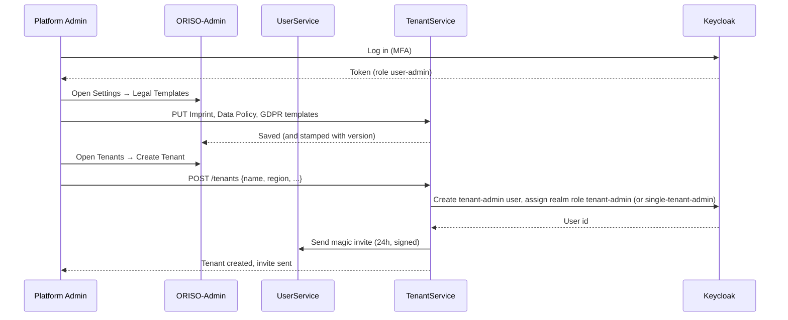
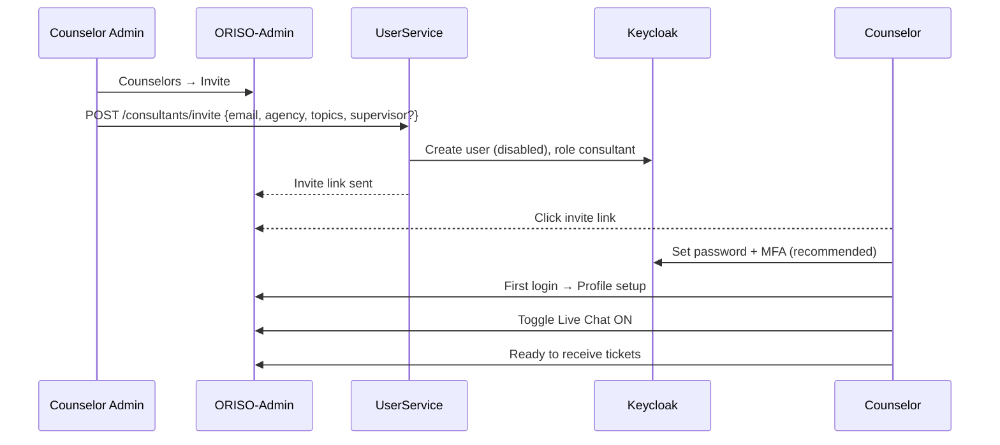
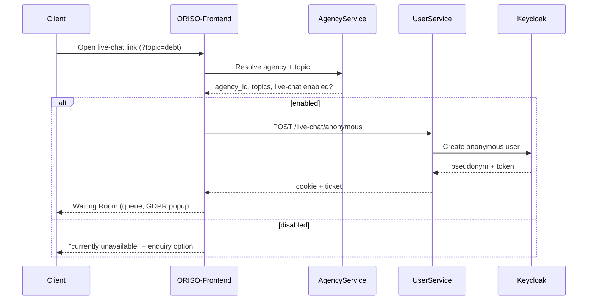

<Info>
Each flow is written as **(a) what the user does** and **(b) what the system does**, so a developer can implement it and a PM can pitch it.
</Info>

## 5.1 Admin Creates the System

**Actor**: Platform Admin. **Goal**: bring up a new ORISO deployment to a state where tenants can be onboarded.



**Steps (user view)**

1. Log into the admin panel using a Keycloak-issued credential **with MFA**.
2. Open **Settings → Legal Templates** and fill in:
   - Platform **Imprint**.
   - Platform **Data Policy** (the contract the tenant signs).
   - Platform **GDPR Agreement** (the default text shown to clients in the waiting room when no tenant/center has overridden it).
3. Until all three are filled, the rest of the admin panel is gated.
4. Open **Tenants → Create Tenant** with a name, region and contact email.
5. The system sends the prospective Tenant Admin a one-time magic invite link.
6. The Tenant Admin clicks it, signs the Data Policy, sets up MFA and lands inside their tenant.

**System view**

- TenantService stamps a version row each time a legal template changes.
- UserService validates `Authority.user-admin` on every legal-template route.
- Magic invite is HMAC-signed, single-use, and bound to the email + role.

## 5.2 Tenant Admin Setup (a.k.a. "Supervisor Setup" in the brief)

<Note>
The brief uses the word "Supervisor", but in ORISO terminology the closest equivalent at the **organizational** level is the **Tenant Admin**, who supervises a whole region. The word "Supervisor" inside ORISO refers instead to a *function* on a counselor (`supervisor-consultant`) — covered in 5.3.
</Note>

**Actor**: Tenant Admin. **Goal**: have at least one counseling center, one Counselor Admin, and a signed Data Policy.

**Steps**

1. Receive the magic invite from the Platform Admin.
2. Click the link → land on a **Sign Data Policy** screen showing the platform's contract text.
3. Confirm; the system records `tenant_data_policy_signed_at`.
4. Set up an MFA factor (TOTP or WebAuthn — MFA is mandatory for Tenant Admin).
5. Open **Counseling Centers → Create**.
6. Fill in name, postal-code ranges, default topics offered.
7. Optionally override the tenant-level **Imprint / Data Policy / GDPR** for this center.
8. Invite a **Counselor Admin** for that center via email.
9. Optionally invite **counselors** directly.

**System view**

- The Data Policy signature is enforced as a feature gate: AgencyService refuses to create centers if `tenant_data_policy_signed_at` is null.
- A center cannot be activated until at least one counselor exists (per huddle, hard rule).
- The Counselor Admin invite is again a one-time magic link.

## 5.3 Counselor Creation & Usage

**Actor**: Counselor Admin (or Tenant Admin in shortcut mode). **Goal**: have a counselor able to handle live-chat tickets.



**Steps (Counselor Admin)**

1. Open **Counselors → Invite**.
2. Enter the counselor's email, choose **agency** and **topics**, optionally enable the **Supervisor function**.
3. The system sends a magic invite.

**Steps (Counselor)**

4. Click invite link.
5. Set a password (Keycloak), set up MFA (recommended).
6. Land in the staff console; complete profile (display name, language, photo).
7. Toggle **Live Chat: ON**.
8. The counselor now appears in the agency's pool and can pick tickets.

**System view**

- Keycloak roles assigned: `consultant`, plus `supervisor-consultant` if flagged, plus `group-chat-consultant` if applicable.
- AgencyService records the consultant↔agency↔topic binding.
- UserService creates a Matrix account for the counselor.

## 5.4 Client Joining via Link

**Actor**: anonymous Client. **Goal**: enter the waiting room and reach a counselor.



**Steps**

1. Client opens the link (no signup).
2. Sees a **language selector** that defaults to their **browser language** (fallback English, **not** German — explicit huddle requirement).
3. Sees an animated "we're matching you" screen.
4. Sees a **GDPR popup #1** (platform default) — "Bestätigen" (Confirm).
5. Lands in the waiting room with: queue position, animated breathing-game distraction, and a banner saying "messages are end-to-end encrypted and auto-deleted after 48 h".
6. Optionally types a zip code and topic to refine matching (Path B, see [Pincode Chat](/product/features/pincode-chat)).
7. Once a counselor accepts, sees **GDPR popup #2** (counseling-center text).
8. On confirm, chat opens.

**System view**

- Pseudonym is issued server-side (random animal-adjective combination).
- Cookie is short-lived and unique to this session.
- IPs are **never** persisted — used only for in-memory rate-limiting at the ingress.

## 5.5 Live Chat Activation

**Actor**: Counselor Admin and Counselor. **Goal**: turn the live chat on for a center, and for a counselor.

### 5.5.1 Activate at the agency level (Counselor Admin)

1. Open the agency's **Live Chat Settings** in the admin panel.
2. Toggle **Live Chat: enabled**.
3. Generate a **live-chat link** with optional topic.
4. Optionally publish the link to the agency's external channels.

### 5.5.2 Activate per-counselor (Counselor)

1. Open the **Live Chat tab** in the admin panel.
2. Toggle **Live Chat: ON** in the personal settings.
3. The counselor now appears in the agency's pool.

<Note>
**UX rule**: a counselor who has live chat OFF must still see the section (in a deactivated state) with a clear hint *"How to activate live chat"*. The section must **not** disappear from navigation.
</Note>

### 5.5.3 The first ticket

1. Counselor sees a ticket appear (oldest-first in the list).
2. Picks the oldest.
3. Sees a system message *"Awaiting client GDPR consent"*.
4. On client confirmation, the encrypted chat begins.

## 5.6 Note / Transcript Generation

<Warning>
**Reality check** (also see [4.1](/product/features/transcription)): there is **no AI-driven transcript pipeline** in production today. This flow describes (a) the chat-history flow that exists today via Matrix, and (b) the planned AI-assisted case-note feature.
</Warning>

### 5.6.1 Today (chat history only)

1. During an active session, the counselor (and client) see the message history rendered in Element/ORISO-Element.
2. After session end, the counselor can re-open the room for ≤ 48 h to refresh memory before writing a manual case note.
3. The counselor saves the note in the admin panel, against the **counselor**, not the client (because the client is being purged).

### 5.6.2 Planned (AI-assisted)

1. Counselor clicks **"Generate case note"** in the chat UI after the session ends.
2. The browser **decrypts** the last N messages locally (Megolm).
3. The browser **PII-scrubs** the text (names, emails, account numbers).
4. The browser sends the scrubbed text to a **self-hosted AI summarizer**.
5. AI returns a bullet-point summary.
6. Counselor edits and saves.
7. The note is stored against the counselor, encrypted at rest, with only an opaque session_id linking it.

```mermaid
flowchart LR
  S[Session ends]:::end --> Op{Counselor opts in?}
  Op -->|no| Hand[Manual note]:::manual
  Op -->|yes| Dec[Decrypt locally]:::ai
  Dec --> Scrub[PII scrub locally]:::ai
  Scrub --> AI[Self-hosted summarizer]:::ai
  AI --> Edit[Counselor edits]:::ai
  Edit --> Save[Save case note<br/>opaque session_id]:::save

  classDef end fill:#ffebee,stroke:#c62828
  classDef manual fill:#eeeeee,stroke:#616161
  classDef ai fill:#e8f5e8,stroke:#2e7d32
  classDef save fill:#e3f2fd,stroke:#1565c0
```
