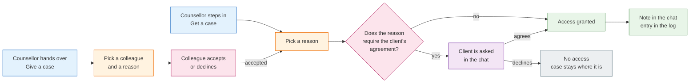

Counselling does not stop when one person is away. Case handover is the controlled way for a
case to move between counsellors of the same Beratungsstelle — with a stated reason, with the
client's agreement where the reason requires it, and with a record of what happened.

This page describes **what** the feature does. It is written for counsellors, agency
administrators and data protection officers.

## 4.9.1 One case access, two directions

Everything runs on one mechanism, entered from two sides:

| | **Getting a case (pull)** | **Giving a case (push)** |
|---|---|---|
| Who starts | the colleague who steps in | the counsellor who currently holds the case |
| Typical situation | a colleague is unexpectedly away and their cases need cover | a planned absence, or asking a colleague for advice |
| Extra step | none — the reason decides what happens next | the colleague chosen has to accept the offer |
| What follows | identical for both: reason check, client's agreement where required, note in the chat, entry in the log | |

## 4.9.2 Look-in or takeover

Two outcomes, and the reason decides which one applies:

- **Einsichtnahme (look-in).** A colleague reads along for a limited time to give advice. The
  case stays with the original counsellor, who keeps full sight of it. The look-in ends by
  itself when its time runs out.
- **Übernahme (takeover).** The case moves. The new counsellor is the one the client talks to;
  the previous counsellor no longer sees the case in their list but stays a member of the
  conversation, so a case can be handed back when they return. For a reason that is final —
  the assignment has ended — there is nothing to hand back.

<Callout>
Nobody is ever removed from a conversation by a handover, and nobody joins it late. The
counsellors of a Beratungsstelle are already quiet members of their department's conversations;
a handover only changes who sees the case and who is responsible for it. That is what makes a
handover keep the full history for the client instead of starting an empty chat.
</Callout>

## 4.9.3 Reasons

| Reason | What it means | What it usually leads to |
|---|---|---|
| **Planned absence** | the counsellor is away as planned | takeover, handed back on return |
| **Unplanned absence** | the counsellor is unexpectedly unavailable | takeover, handed back on return |
| **Assignment ended** | the counsellor no longer handles this case | takeover, final |
| **Advice requested** | a colleague is asked to look at the case | look-in, time-limited |

Reasons deliberately say **that** somebody is unavailable, never **why**. A counsellor's illness
is health data about that counsellor; it does not belong in a client's chat, in a notification or
in an administrative log. The message the client sees therefore names neither a cause nor a
duration:

> Your previous counsellor is currently unavailable. *Name* will continue to support you.

Each Träger can decide per reason whether the client has to agree and how long a look-in may
last. The reasons themselves and their wording are set for the whole platform, so that no
Beratungsstelle can reintroduce a reason that discloses health information.

## 4.9.4 Who does what

| Role | Can do |
|---|---|
| **Counsellor** | get a colleague's case with a reason; offer their own case to a colleague of the same Beratungsstelle; withdraw an offer that is still open; accept or decline an offer addressed to them |
| **Client** | agree or refuse where the reason requires it; sees only the counsellor currently responsible |
| **Supervisor** | keeps accompanying a case across a handover — a handover does not end supervision |
| **Agency administrator** | configures per reason whether the client has to agree and how long a look-in lasts; reads the handover log for their own Träger |

A case can only move within the same Beratungsstelle. Handover across Träger does not exist.

## 4.9.5 What the client experiences

- The client is told in the chat, in their own language, that their counselling continues with a
  named colleague — never why the previous counsellor is unavailable.
- Where the reason requires agreement, the client answers in the chat before anything changes. If
  they refuse, nothing changes: the case stays with the counsellor who had it.
- The conversation itself continues. Same chat, same history, same anonymous identity — only the
  counsellor is a different person.
- The client always sees exactly one responsible counsellor, never the other members of the
  department.

## 4.9.6 An offer that is not answered

An offered case stays with the counsellor who offered it until the colleague accepts. An offer
can be withdrawn, declined, or left unanswered — after a few days it lapses. In every one of
those cases the case simply stays where it was, and the client sees nothing at all.

## 4.9.7 What is recorded

Every handover writes one entry: which case, which direction, who asked, who received it, the
reason, whether the client agreed, and when. The entry is visible to the administrators and the
data protection officer of the Träger the case belongs to — not to other Träger and not to the
platform operator. Message content is never part of it.

## 4.9.8 Related

- [Session Management](/product/features/session-management) — how cases are assigned in the first place.
- [Roles & Permissions](/product/roles-permissions) — what each role may see.
- [Notifications](/product/features/notifications) — how counsellors learn about an offer.
