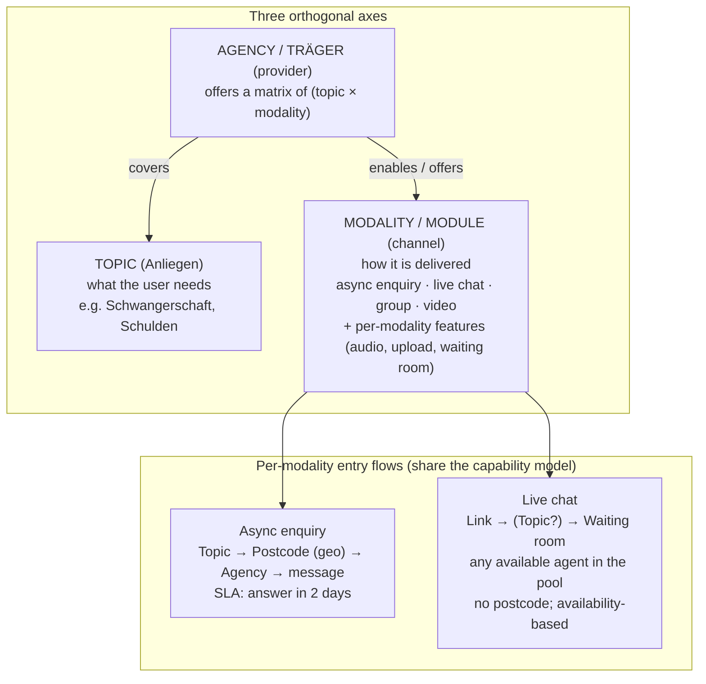

# ADR-001: Counselling modalities as toggleable modules (/decisions/adr-001)

* **Status:** Proposed — needs a team decision (esp. how registration filters on `consulting_type`)
* **Date:** 2026-06-23
* **Deciders:** Frank + backend/frontend leads
* **Related:** OpenResilienceInitiative/ORISO-Frontend#245, ORISO-AgencyService#39 (wipe fix), ORISO-Frontend#246 (hide empty topics), ORISO-AgencyService#40 (data cleanup), `agency-registration-visibility-bug-report.md`

***

## Context [#context]

`consulting_type` is the most overloaded concept in the platform. Today it simultaneously is:

1. **the modality / channel identity** — live/proximity chat, 1:1, internal chat, soon self-help-group chat, future video (confirmed: `/service/consultingtypes/basic` carries `groupChat.isGroupChat`, `isVideoCallAllowed`, `isAnonymousConversationAllowed`, `isSubsequentRegistrationAllowed`, …);
2. **a hard filter in registration** — `AgencyRepository.search*` enforces `a.consulting_type = :type`, and the frontend hardcodes `consultingType: consultingType?.id || 1` (`useAgenciesForRegistration.ts`). Any agency whose modality ≠ the hardcoded value is silently dropped;
3. **a carrier of per-type feature settings** (group chat rules, video allowed, anonymous, mandatory registration fields, white-spot, …).

On top of that:

* **Topics** carry the subject ("Anliegen"); they live in ConsultingTypeService, are **tenant-scoped** (`tenant_id`), were seeded into prod manually (no changelog), and are referenced from `agency_topic` in **AgencyService with no cross-service FK**.
* **User journeys diverge sharply.** The async "enquiry/letter" flow needs **postcode (geo) routing + topic + a 2-day SLA**. The **live-chat** flow is a **link**, no postcode, a **waiting room**, real-time **agent availability**, and many organisations sharing a pool. Forcing both through one `getAgencies(consultingType, postcode, topicId)` filter is the source of recurring, silent failures.

A false in-code comment ("consulting types are not used anymore") has already produced fragile logic (`getConsultingType4Tenant` assigning a modality via `consultingTypeResponse[0].id`).

### Requirement (product) [#requirement-product]

Be able to **enable/disable modules** per tenant and per agency — "this Träger only does live chat, not 1:1" — and to toggle **per-chat features** (audio messages, file upload, …), like the existing admin toggles. This is a core component and must be hardened so it stops generating errors.

## Decision drivers [#decision-drivers]

* Modules must be **toggleable** per tenant and per agency (and feature-flaggable per modality).
* Different flows have **different routing and availability** semantics (geo+SLA vs link+waiting-room).
* **No silent registration failures** (no hidden hard filter that drops valid agencies).
* **Data integrity** across services (no dangling topic/modality references; versioned seeds).

## Decision (proposed) [#decision-proposed]

Model three **orthogonal axes** explicitly and stop conflating them.

1. **Topic** = subject. &#x2A;*Modality (module)** = delivery channel, owning its own feature flags. **Agency** = provider declaring a capability matrix of `(topic × modality, enabled?)`.
2. **Capabilities are explicit, toggleable flags** — *not* a single overloaded enum used as a filter. A tenant enables which modalities exist; an agency declares which it offers; each modality carries its feature toggles. (Consistent with the project's "disable, don't hide" rule and the planned ADV-module concept.)
3. **Each modality gets its own entry flow**, sharing the capability model but not the same filter query:
   * *Async enquiry*: topic → postcode (geo routing) → agency → message; SLA-driven.
   * *Live chat*: link → optional topic → waiting room; availability/queue-driven; no geo routing; many orgs share the pool.
4. **Registration must not hardcode or secretly filter modality.** The async flow filters by **topic + postcode + availability**; the modality is implied by the flow (or chosen). The live-chat flow passes its own modality. Never `consultingType = 1` as a constant.
5. **Harden the data model:** version-controlled seeds (no manual prod seeding); referential integrity or an integrity check across services (no `agency_topic.topic_id` / modality id without a matching definition); reachability validation before an agency can be "visible in registration" (online + ≥1 consultant + has the relevant capability); availability/waiting-room modelled as a modality concern.
6. **Credential invariant:** managed human accounts (platform admins, tenant admins, agency admins, counsellors) must not receive silent/generated random passwords as a hidden fallback. They need an explicit password at creation or a secure reset/invite flow. The exception is registrationless anonymous live chat: that flow intentionally creates a hidden unique technical username plus generated credentials while the visible display name remains non-unique. Those technical credentials are required for the anonymous login/session bridge and must not be removed under the "no silent random password" rule.

## Consequences [#consequences]

**Positive:** modules are independently toggleable; flows match their real requirements; no silent drops; new modalities (video, self-help group) become additive instead of breaking the registration filter; data integrity stops the recurring "agency missing" class of bug.

**Negative / cost:** this is a refactor of a core component. `consulting_type` semantics must be migrated deliberately (it currently carries modality), schema + admin UX work is needed, and the two flows must be split. Coordination across ConsultingTypeService / AgencyService / TenantService / UserService / Frontend.

## Migration plan (incremental, no big bang) [#migration-plan-incremental-no-big-bang]

* **Phase 0 — stop the bleeding (in progress):** fix the destructive topic-link wipe (ORISO-AgencyService#39 ✅), hide empty topics in registration (ORISO-Frontend#246 ✅), clean up broken test agencies (ORISO-AgencyService#40), and **decide the registration `consultingType` handling** (see open question).
* **Phase 1 — model capabilities explicitly:** introduce per-tenant/per-agency modality toggles + per-modality feature flags; remove the `[0].id` modality assignment and the false "deprecated" comment; make modality an explicit, validated field in the agency form.
* **Phase 2 — split flows:** give live chat its own entry/flow (link + waiting room + availability) distinct from the async enquiry flow; stop sharing the single agency filter.
* **Phase 3 — data integrity:** version-control topic/modality seeds; add cross-service integrity checks; reachability validation on "visible in registration".

## Open questions (need a decision) [#open-questions-need-a-decision]

1. **Registration filter:** for the async flow, send the real modality, or send none and filter by topic + availability only (backend already supports `:type IS NULL`)? Since the type now carries modality, this is a product decision, not a pure code one.
2. **Where does modality config live** — ConsultingTypeService (today), TenantService, or a dedicated capability model?
3. **Availability model for live chat** — queue/waiting-room + agent presence: new component or extend an existing service?

## Alternatives considered [#alternatives-considered]

* **Keep `consulting_type` as-is, just stop hardcoding `=1`.** Cheapest, but leaves the overload (identity + filter + features) and the divergent-flows problem; the silent-failure class will recur as modalities grow.
* **Drop modality filtering entirely in registration.** Simpler, but then registration can offer modalities a Träger doesn't actually provide — wrong for the toggle requirement.
* **Proposed (three axes + capabilities + per-flow):** highest upfront cost, but the only option that satisfies the toggle requirement and the divergent flows without recurring breakage.
