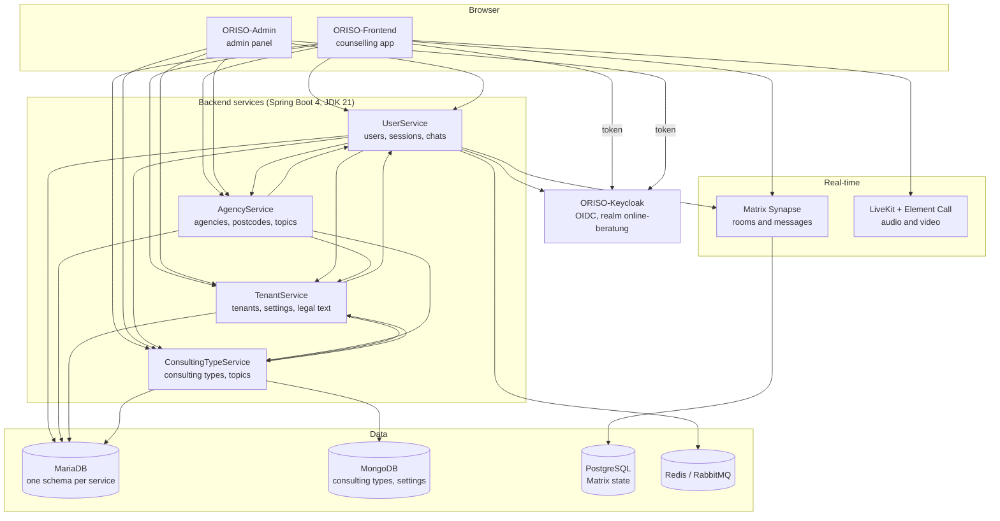

# ORISO-Gesamtarchitektur

Zwei Browseranwendungen, vier Spring-Boot-Services, ein Identitätsanbieter, ein Matrix-Homeserver für Echtzeitkommunikation und ein Helm-Chart, das alles bereitstellt. Diese Seite ist die Übersicht. Jeder Bereich verlinkt auf sein Repository; die Abschnitte darunter nennen die erste Datei für Änderungen an der jeweiligen Verbindung.

## Die Services im Überblick

Pfeile zeigen in Aufrufrichtung. Die Richtungen stammen aus dem serviceübergreifenden Graphen, beschrieben unter
[wie wir die Dokumentation verlässlich halten](./understand-anything.md); die Zahlen beruhen auf Übereinstimmungen wörtlicher Pfade zwischen Aufrufern und OpenAPI-/Spring-Endpunkten.

Zwei Eigenschaften dieser Übersicht solltest du früh verstehen.

**Das Backend ist ein Netz, keine Folge von Schichten.** Alle vier Services rufen sich gegenseitig auf. Eine Änderung der Antwortstruktur von TenantService kann einen Fehler in UserService auslösen. Der Graph zählt 19 solche Abhängigkeiten zwischen Services. Prüfe vor jeder Antwortänderung, wer sie verwendet.

**Keine Oberfläche verwaltet eigene Daten.** Frontend und Admin verwenden ausschließlich APIs mit einem Keycloak-Token. Was im Browser wie gespeicherter Zustand aussieht, ist ein Cache von Daten, für die ein Service zuständig ist.

## Schichten und Zuständigkeiten

| Schicht | Repositories | Inhalt |
| --- | --- | --- |
| UI | [ORISO-Frontend](https://github.com/OpenResilienceInitiative/ORISO-Frontend), [ORISO-Admin](https://github.com/OpenResilienceInitiative/ORISO-Admin) | React-Anwendungen, Routing, API-Clients, Storybook |
| Identität | [ORISO-Keycloak](https://github.com/OpenResilienceInitiative/ORISO-Keycloak) | Realm, Clients, Rollen, Token-Ausgabe |
| Services | [UserService](https://github.com/OpenResilienceInitiative/ORISO-UserService), [AgencyService](https://github.com/OpenResilienceInitiative/ORISO-AgencyService), [TenantService](https://github.com/OpenResilienceInitiative/ORISO-TenantService), [ConsultingTypeService](https://github.com/OpenResilienceInitiative/ORISO-ConsultingTypeService) | OpenAPI-Verträge, Controller, Fachlogik, Persistenz |
| Daten | [ORISO-Database](https://github.com/OpenResilienceInitiative/ORISO-Database), und die mit dem Chart ausgelieferten Schemas | MariaDB-Schemas, MongoDB-Dokumente, Matrix-PostgreSQL |
| Laufzeit | [ORISO-Helm](https://github.com/OpenResilienceInitiative/ORISO-Helm) | Umbrella-Chart, Ingress, Secrets und alle Subcharts |

## Wo setze ich an?

| Ich möchte … ändern | Zuerst öffnen |
| --- | --- |
| Eine Ansicht oder Komponente | die Routentabelle — [`ORISO-Frontend/src/components/app/RouterConfig.tsx`](https://github.com/OpenResilienceInitiative/ORISO-Frontend/blob/dev/src/components/app/RouterConfig.tsx) oder [`ORISO-Admin/src/App.tsx`](https://github.com/OpenResilienceInitiative/ORISO-Admin/blob/dev/src/App.tsx) |
| Wie der Browser eine API aufruft | den Fetch-Wrapper — [`ORISO-Frontend/src/api/fetchData.ts`](https://github.com/OpenResilienceInitiative/ORISO-Frontend/blob/dev/src/api/fetchData.ts), [`ORISO-Admin/src/api/fetchData.ts`](https://github.com/OpenResilienceInitiative/ORISO-Admin/blob/dev/src/api/fetchData.ts) |
| Die Struktur eines Backend-Endpunkts | den OpenAPI-Vertrag im Ordner `api/` des Services, danach den Controller |
| Wer einen Endpunkt aufrufen darf | die Sicherheitskonfiguration des Services — siehe [Authentifizierung und Keycloak](./authentication-and-keycloak.md) |
| Zu welchem Mandanten eine Anfrage gehört | die Mandanten-Resolver — [`TenantResolverService`](https://github.com/OpenResilienceInitiative/ORISO-TenantService/blob/dev/src/main/java/com/vi/tenantservice/api/tenant/TenantResolverService.java#L23-L30) |
| Eine Tabelle oder Spalte | den zuständigen Service, niemals das Schema eines anderen Services — siehe [Datenbank und Datenmodell](./database-and-data-model.md) |
| Routing, Hostnamen, Secrets, Ressourcen | das Chart — [`ORISO-Helm`](https://github.com/OpenResilienceInitiative/ORISO-Helm), siehe [Kubernetes-Deployment](./kubernetes-deployment.md) |

## Regeln, die auch nach Refactorings gelten

- **Service-Zuständigkeiten sind verbindlich.** Schreibe niemals direkt in das Schema eines anderen Services, auch wenn die Verbindung funktionieren würde. Serviceübergreifende Kennungen haben gerade deshalb keine Fremdschlüssel auf Datenbankebene, weil die API die Grenze bildet.
- **Vertrag vor Code.** Die OpenAPI-Datei in `api/` beschreibt zuerst die Struktur des Endpunkts; der Controller zeigt das dahinterliegende Verhalten.
- **Eine Keycloak-Rolle ist erforderlich, reicht aber nicht aus.** Zusätzlich zur Rolle im Token gelten die Mandantenauflösung und die Berechtigungsregeln des jeweiligen Services.
- **Umgebungsdateien im UI-Repository sind kein Beleg für die Produktionskonfiguration.** Maßgeblich sind die Chart-Werte.
- **Eine Domain, Routing über Pfade.** Alles wird über einen Host mit Pfadregeln bereitgestellt; Matrix ist die bewusst gewählte Ausnahme. Siehe
  [ADR-011](/decisions/adr-011) und [ADR-005](/decisions/adr-005).

## Weiterführendes

- [Installieren und lokal starten](./install-and-run-locally.md)
- [Backend-Services](./backend-services.md)
- [Authentifizierung und Keycloak](./authentication-and-keycloak.md)
- [Datenbank und Datenmodell](./database-and-data-model.md)
- [Kubernetes-Deployment](./kubernetes-deployment.md)
