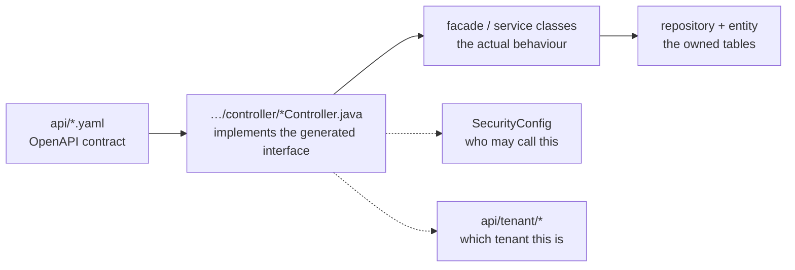

# Backend-Services

Vier Spring-Boot-Services mit gleichem Aufbau: Maven-Wrapper, JDK 21, ein OpenAPI-Vertrag in `api/`, aus dem die API-Schnittstellen erzeugt werden, Controller als Implementierung dieser Schnittstellen und ein MariaDB-Schema, in das ausschließlich der jeweilige Service schreibt.

## Auf einen Blick

| Service | Zuständig für | Eigene Endpunkte | Tabellen | Ruft auf |
| --- | --- | --- | --- | --- |
| [UserService](#userservice) | Benutzer, Berater, Sitzungen, Gespräche, Chats, Termine, Benachrichtigungen | 186 | 54 | Agency, ConsultingType, Tenant, Keycloak |
| [AgencyService](#agencyservice) | Beratungsstellen, Postleitzahlbereiche, Themen der Beratungsstellen, Diözesen | 40 | 7 | Tenant, ConsultingType, User |
| [TenantService](#tenantservice) | Mandanten, Einstellungen, Gestaltung, Rechtstexte | 43 | 12 | ConsultingType, User |
| [ConsultingTypeService](#consultingtypeservice) | Beratungsarten, Themen, Themengruppen, Anwendungseinstellungen | 23 | 5 | Tenant |

Die Anzahl der Endpunkte und Tabellen stammt aus dem serviceübergreifenden Graphen — siehe
[wie wir die Dokumentation verlässlich halten](./understand-anything.md). „Eigene Endpunkte“ zählt nur die Routen des Services, nicht die zusätzlich in `api/` gespeicherten Verträge anderer Services.

## Wie du einen Service liest

Dieselben vier Schritte funktionieren bei allen Services. Diese Reihenfolge erspart viel Rätselraten:

1. **Der Vertrag** beschreibt die Struktur: Pfad, HTTP-Methode sowie Anfrage- und Antwortmodelle.
2. **Der Controller** zeigt die Berechtigungsannotation und die Klasse, an die er weiterleitet.
3. **Die Fassade oder der Service** enthält das Verhalten einschließlich der Aufrufe anderer Services.
4. **Repository und Entity** zeigen, was in welchem Schema gespeichert wird.

## UserService

[Repository](https://github.com/OpenResilienceInitiative/ORISO-UserService) · der mit Abstand größte Service: Benutzer- und Beraterkonten, Anfragen, Beratungssitzungen, Sitzungslisten, Gruppenchats, Termine, Benachrichtigungen, Kontolöschung und der anwendungsseitige Lebenszyklus von Matrix-Räumen.

**Verträge**
[`api/userservice.yaml`](https://github.com/OpenResilienceInitiative/ORISO-UserService/blob/dev/api/userservice.yaml) ·
[`api/useradminservice.yaml`](https://github.com/OpenResilienceInitiative/ORISO-UserService/blob/dev/api/useradminservice.yaml) ·
[`api/conversationservice.yaml`](https://github.com/OpenResilienceInitiative/ORISO-UserService/blob/dev/api/conversationservice.yaml) ·
[`api/appointmentservice.yaml`](https://github.com/OpenResilienceInitiative/ORISO-UserService/blob/dev/api/appointmentservice.yaml) ·
[`api/userstatisticsservice.yaml`](https://github.com/OpenResilienceInitiative/ORISO-UserService/blob/dev/api/userstatisticsservice.yaml)

**Einstiegspunkte**
Die Controller liegen unter
[`adapters/web/controller/`](https://github.com/OpenResilienceInitiative/ORISO-UserService/blob/dev/src/main/java/de/caritas/cob/userservice/api/adapters/web/controller/UserController.java);
die Schnittstelle ist umfangreich: von `UserController` und `ConversationController` über `AppointmentController` bis zu `CaseHandoverController` und `EventNotificationController`.

**Sicherheit**
[`SecurityConfig#L98-L112`](https://github.com/OpenResilienceInitiative/ORISO-UserService/blob/dev/src/main/java/de/caritas/cob/userservice/api/config/auth/SecurityConfig.java#L98-L112) ·
[`RoleAuthorizationAuthorityMapper`](https://github.com/OpenResilienceInitiative/ORISO-UserService/blob/dev/src/main/java/de/caritas/cob/userservice/api/config/auth/RoleAuthorizationAuthorityMapper.java) ·
Mandantenauflösung unter
[`api/tenant/`](https://github.com/OpenResilienceInitiative/ORISO-UserService/blob/dev/src/main/java/de/caritas/cob/userservice/api/tenant/TenantResolverService.java)

**Beachte**: Der Service verwaltet 54 Tabellen und 186 Endpunkte. Für 70 davon findet der Graph einen bestätigten Aufrufer. Bevor du einen Endpunkt für ungenutzt hältst, bedenke: zur Laufzeit zusammengesetzte Pfade erzeugen keine `calls`-Kante.

## AgencyService

[Repository](https://github.com/OpenResilienceInitiative/ORISO-AgencyService) · öffentliche Suche nach Beratungsstellen, deren Verwaltung, Postleitzahlbereiche, Ergänzung von Themen- und demografischen Daten sowie die benötigten Matrix-Servicekonten.

**Verträge**
[`api/agencyservice.yaml`](https://github.com/OpenResilienceInitiative/ORISO-AgencyService/blob/dev/api/agencyservice.yaml) ·
[`api/agencyadminservice.yaml`](https://github.com/OpenResilienceInitiative/ORISO-AgencyService/blob/dev/api/agencyadminservice.yaml)

**Sicherheit**
[`SecurityConfig`](https://github.com/OpenResilienceInitiative/ORISO-AgencyService/blob/dev/src/main/java/de/caritas/cob/agencyservice/config/SecurityConfig.java) ·
[`JwtAuthConverter`](https://github.com/OpenResilienceInitiative/ORISO-AgencyService/blob/dev/src/main/java/de/caritas/cob/agencyservice/config/security/JwtAuthConverter.java)

**Beachte**: Das Anlegen einer Beratungsstelle benötigt einen Verschlüsselungsschlüssel aus dem Chart (`agencyService.serviceEncryptionAppkey`). Bei einem leeren Schlüssel entsteht kein deutlich erkennbarer Fehler — siehe
[Kubernetes-Deployment](./kubernetes-deployment.md).

## TenantService

[Repository](https://github.com/OpenResilienceInitiative/ORISO-TenantService) · das Mandantenverzeichnis: Identität, Subdomain, Lizenzgrenzen, Gestaltung, Funktionseinstellungen, mehrsprachige Rechtstexte und deren Aktivierungsdaten. Außerdem bietet es eine eingeschränkte öffentliche Ansicht für Aufrufer, die noch keinen authentifizierten Mandantenkontext haben.

**Vertrag**
[`api/tenantservice.yaml`](https://github.com/OpenResilienceInitiative/ORISO-TenantService/blob/dev/api/tenantservice.yaml)

**Schichten** — das deutlichste Beispiel für das oben beschriebene Muster:
`api/tenantservice.yaml` → `TenantController` →
`TenantServiceFacade` → `TenantService` / `TenantRepository` / `TenantEntity`, ergänzt durch
[`WebSecurityConfig#L30-L56`](https://github.com/OpenResilienceInitiative/ORISO-TenantService/blob/dev/src/main/java/com/vi/tenantservice/config/security/WebSecurityConfig.java#L30-L56)
und
[`JwtAuthConverter#L34-L51`](https://github.com/OpenResilienceInitiative/ORISO-TenantService/blob/dev/src/main/java/com/vi/tenantservice/config/security/JwtAuthConverter.java#L34-L51)
als ergänzende Komponenten.

**Die Mandantenauflösung** ist hier in ihrer maßgeblichen Form implementiert:
[`TenantResolverService#L23-L49`](https://github.com/OpenResilienceInitiative/ORISO-TenantService/blob/dev/src/main/java/com/vi/tenantservice/api/tenant/TenantResolverService.java#L23-L49).

**Beachte**: `/tenant/public/**` benötigt bewusst keine Anmeldung. Alles unter diesem Präfix ist öffentlich lesbar.

## ConsultingTypeService

[Repository](https://github.com/OpenResilienceInitiative/ORISO-ConsultingTypeService) ·
Einstellungen für Beratungsarten, Themen, Themengruppen und Anwendungseinstellungen mit mandantenbezogenem Zugriff. Nur dieser Service speichert einen wesentlichen Teil seiner Daten in MongoDB statt in MariaDB.

**Verträge**
[`api/consultingtypeservice.yml`](https://github.com/OpenResilienceInitiative/ORISO-ConsultingTypeService/blob/dev/api/consultingtypeservice.yml) ·
[`api/topicservice.yml`](https://github.com/OpenResilienceInitiative/ORISO-ConsultingTypeService/blob/dev/api/topicservice.yml) ·
[`api/applicationsettingsservice.yml`](https://github.com/OpenResilienceInitiative/ORISO-ConsultingTypeService/blob/dev/api/applicationsettingsservice.yml)

**Sicherheit**
[`SecurityConfig`](https://github.com/OpenResilienceInitiative/ORISO-ConsultingTypeService/blob/dev/src/main/java/de/caritas/cob/consultingtypeservice/config/SecurityConfig.java)

## Aufrufe zwischen Services

Jeder Service enthält die Verträge anderer Services unter `api/` oder `services/` und ruft sie über erzeugte Clients auf. Deshalb gibt es in einem Repository deutlich mehr Endpunktbeschreibungen als eigene Endpunkte: Das UserService-Checkout enthält zusätzlich zu seinen 186 eigenen Endpunkten 109 verwendete und 58 externe Endpunkte.

Folgen für Änderungen:

- **Die Änderung eines Antwortmodells betrifft mehrere Repositories.** Suche im serviceübergreifenden Graphen nach den Verbrauchern, bevor du den Vertrag bearbeitest.
- **Aufrufe anderer Services erfolgen als technischer Benutzer**, nicht als Endbenutzer. Die empfangende Seite prüft die technische Rolle; dahinter kann sich ein Berechtigungsfehler verbergen.
- **Ein Service muss unabhängig ausfallen können.** Ergänze keinen synchronen Aufruf eines anderen Services in einem Ablauf, der auch bei dessen Ausfall funktionieren muss.

## Weiterführendes

- [Architektur](./architecture.md) — der Aufrufgraph
- [Authentifizierung und Keycloak](./authentication-and-keycloak.md) — die Sicherheitskomponenten
- [Datenbank und Datenmodell](./database-and-data-model.md) — die zugehörigen Schemas
- [Installieren und lokal starten](./install-and-run-locally.md) — wie du einen Service startest
