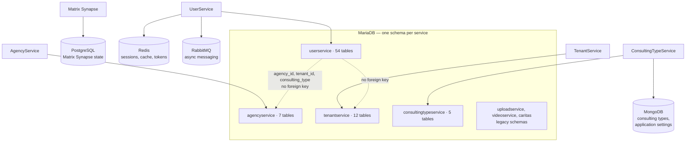

# Datenbank und Datenmodell

Fünf Datenspeicher, eine Zuständigkeitsregel. Entscheidend ist: **Eine Tabelle gehört genau einem Service, und nur dieser Service schreibt darin.**

## Zuständigkeit

| Schema | Zuständiger Service | Wichtige Tabellen |
| --- | --- | --- |
| `userservice` | UserService | `user`, `consultant`, `session`, `session_data`, `session_topic`, `session_supervisor`, `chat`, `group_chat_participant`, `appointment`, `draft_message`, `event_notification`, `agency_invite_link`, `identity_tombstone` |
| `agencyservice` | AgencyService | `agency`, `agency_postcode_range`, `agency_topic`, `diocese` |
| `tenantservice` | TenantService | `tenant` |
| `consultingtypeservice` | ConsultingTypeService | `topic`, `topic_group`, `topic_group_x_topic` |
| `uploadservice`, `videoservice`, `caritas` | — | historische Schemas; die zuständigen Repositories gehören nicht zu dieser Plattform |

Die mit dem Deployment ausgelieferten Schemas liegen im Chart, beispielsweise
[`charts/mariadb/sql-schemas/userservice-schema.sql`](https://github.com/OpenResilienceInitiative/ORISO-Helm/blob/dev/charts/mariadb/sql-schemas/userservice-schema.sql).
[ORISO-Database](https://github.com/OpenResilienceInitiative/ORISO-Database) enthält zusätzlich Schema-Exporte, MongoDB-Dumps und Betriebsdokumentation für Redis, RabbitMQ und Matrix-PostgreSQL.

Jedes Schema enthält die Liquibase-Tabellen `DATABASECHANGELOG` und `DATABASECHANGELOGLOCK`. Ob Liquibase tatsächlich ausgeführt wird, hängt vom Service und der Umgebung ab. Prüfe die laufende Umgebung; die vorhandenen Tabellen allein belegen das nicht.

## Der Fallstrick: Kennungen ohne Fremdschlüssel

`agency_id`, `user_id`, `session_id`, `consulting_type` und `tenant_id` kommen in mehreren Schemas vor. Da sie Service- und Datenbankgrenzen überschreiten, **prüft MariaDB ihre Beziehungen nicht**. Daraus ergeben sich drei praktische Folgen:

1. **Das Löschen über die API ist etwas anderes als das Löschen einer Zeile.** Eine Zeile kann auf eine nicht mehr vorhandene Beratungsstelle verweisen, ohne dass die Datenbank dies verhindert.
2. **Der gewünschte Join steht nicht zur Verfügung.** Daten zweier Services zusammenzuführen erfordert zwei API-Aufrufe statt einer Abfrage.
3. **Testdaten können täuschen.** Direkt eingefügte Zeilen können einen Zustand erzeugen, den die echte API ablehnen würde.

## Wo setze ich an?

| Ich möchte … | Vorgehen |
| --- | --- |
| Eine Spalte hinzufügen | die Entity und Migration des zuständigen Services ändern; niemals das Schema eines anderen Services direkt anpassen |
| Daten eines anderen Services lesen | dessen API aufrufen; fehlt ein Endpunkt, muss dieser ergänzt werden |
| Eine Tabelle verstehen | die Entity-Klasse im zuständigen Service suchen, danach das Repository, das sie abfragt |
| Den tatsächlichen Produktionsstand prüfen | das laufende Schema prüfen; die exportierten Dateien sind Momentaufnahmen und keine Migrationshistorie |

## Risiken vor einer Skalierung prüfen

- Außerhalb von `userservice` gibt es nur wenige Indizes. Prüfe sie vor Lasttests mit vielen Mandanten oder Sitzungen.
- Dump- und Sicherungsdateien können personenbezogene Daten enthalten. Behandle sie entsprechend.
- Bei serviceübergreifenden Kennungen muss die Anwendung eine zusammenhängende Bereinigung durchführen; die Datenbank übernimmt das nicht.

## Weiterführendes

- [Backend-Services](./backend-services.md) — die zuständigen Services
- [Architektur](./architecture.md) — warum die Grenze dort verläuft
- [Mandantenlebenszyklus](./tenant-lifecycle.md)
- [Kubernetes-Deployment](./kubernetes-deployment.md) — wo die Schemas angewendet werden
