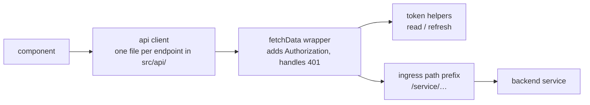

# Frontend und Admin

Zwei React-Anwendungen ohne eigene Persistenz. Beide holen ein Keycloak-Token, hängen es an jeden Aufruf an und zeigen die Antworten der Services an.

| | [ORISO-Frontend](https://github.com/OpenResilienceInitiative/ORISO-Frontend) | [ORISO-Admin](https://github.com/OpenResilienceInitiative/ORISO-Admin) |
| --- | --- | --- |
| Zweck | die öffentliche Beratungsanwendung | die Verwaltungsoberfläche für den Betrieb |
| Build | Skripte im CRA-Stil und Vite-Werkzeuge | Vite |
| Entwicklungsserver | `npm run dev` | `npm start` (Port 9000, Pfad `/admin`) |
| Node | 22.12.0 | 22.12.0 |
| Routentabelle | [`src/components/app/RouterConfig.tsx`](https://github.com/OpenResilienceInitiative/ORISO-Frontend/blob/dev/src/components/app/RouterConfig.tsx) | [`src/App.tsx`](https://github.com/OpenResilienceInitiative/ORISO-Admin/blob/dev/src/App.tsx) |
| API-Schicht | [`src/api/`](https://github.com/OpenResilienceInitiative/ORISO-Frontend/blob/dev/src/api/fetchData.ts) | [`src/api/`](https://github.com/OpenResilienceInitiative/ORISO-Admin/blob/dev/src/api/fetchData.ts) |
| Routenschutz | in der Routerkonfiguration | [`src/router/ProtectedRoute.tsx`](https://github.com/OpenResilienceInitiative/ORISO-Admin/blob/dev/src/router/ProtectedRoute.tsx#L19-L40) |
| Laufzeitkonfiguration | [`.env.example`](https://github.com/OpenResilienceInitiative/ORISO-Frontend/blob/dev/.env.example) | [`.env.example`](https://github.com/OpenResilienceInitiative/ORISO-Admin/blob/dev/.env.example) und eine erzeugte Datei, siehe unten |
| Ruft auf | User, Agency, Tenant, ConsultingType, Matrix, LiveKit | User, Agency, Tenant, ConsultingType |

## Wie eine Anfrage den Browser verlässt



Jeder Aufruf läuft durch einen Wrapper. Dort wird das Bearer-Token angehängt und ein 401 behandelt. Wenn einzelne Anfragen nicht autorisiert sind, ist dies daher die zentrale Stelle für die Fehlersuche. Die darüberliegenden API-Client-Module sind schlank: eine nach der Operation benannte Datei pro Endpunkt.

Das Pfadpräfix ist entscheidend. Da alles über einen Host mit pfadbasiertem Routing bereitgestellt wird ([ADR-011](/decisions/adr-011)), ist die API-Basis-URL ein Pfad statt einer separaten Origin. Deshalb müssen hier auch keine CORS-Probleme untersucht werden.

## Admin: die erzeugte Laufzeitkonfiguration

`npm start` führt einen `prestart`-Schritt aus, der eine Laufzeitkonfigurationsdatei schreibt:
[`scripts/generate-runtime-env.js`](https://github.com/OpenResilienceInitiative/ORISO-Admin/blob/dev/scripts/generate-runtime-env.js).
Die Anwendung liest diese Datei beim Start; **ihre Werte überschreiben `.env`**. Das ist fast immer die Ursache, wenn eine Einstellung ignoriert zu werden scheint. Das Verhalten des Entwicklungsservers und des Proxys steht in
[`vite.config.ts`](https://github.com/OpenResilienceInitiative/ORISO-Admin/blob/dev/vite.config.ts).

## Arbeiten ohne Backend

Beide Repositories verwenden Storybook. Ihre Stories werden in CI als Komponententests ausgeführt. Für visuelle Arbeit ist das der schnelle Weg — ohne Services, Datenbank oder Anmeldung:

```bash
npm run storybook        # http://localhost:6006
npm run test:storybook   # the same stories, as tests
npm run test:unit        # frontend
npm run test             # admin
npm run lint
```

Eine Story ist zugleich ein Test. Eine Story für eine neue Komponente anzulegen ist daher bereits Teil des Testens.

## Mandantenbezogene Darstellung

Beide Anwendungen passen Darstellung und verfügbare Funktionen an den Mandanten an. Gestaltung, Rechtstexte, sichtbare Themen und aktivierte Funktionen kommen zur Laufzeit aus TenantService und ConsultingTypeService. Daraus folgen zwei Regeln:

- **Hinterlege keine festen Annahmen über einen Mandanten in einer Komponente.** Lies sie aus den geladenen Einstellungen.
- **Eine für einen Mandanten ausgeschaltete Funktion muss deaktiviert statt versteckt sein**, sofern das Design nicht ausdrücklich etwas anderes vorgibt. Eine konsistente Oberfläche ist wichtiger als eine aufgeräumte Ansicht.

## Weiterführendes

- [Installieren und lokal starten](./install-and-run-locally.md)
- [Authentifizierung und Keycloak](./authentication-and-keycloak.md)
- [Backend-Services](./backend-services.md) — die APIs hinter den Clients
- [Architektur](./architecture.md)
