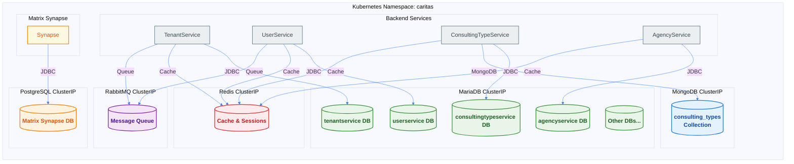

## Überblick über die Datenarchitektur

Die ORISO-Plattform verwendet mehrere Datenbanktypen, die alle zentral über das Repository ORISO-Database verwaltet werden. **Liquibase ist in allen Diensten DEAKTIVIERT** – Schemata werden getrennt verwaltet.



## Datenbanktypen

### MariaDB (primäre Datenbank)
- **Zweck:** Zentrale relationale Datenbank für Backend-Dienste
- **Gesamtzahl der Datenbanken:** 7
- **Dienstname:** `oriso-platform-mariadb.caritas.svc.cluster.local:3306`
- **Verbindungstyp:** ClusterIP (nur intern)
- **Datenbanken:**
  1. `tenantservice` – Mandantenverwaltung
  2. `userservice` – Benutzerverwaltung
  3. `consultingtypeservice` – Beratungsarten
  4. `agencyservice` – Beratungsstellenverwaltung
  5. Weitere Dienstdatenbanken nach Bedarf

### MongoDB
- **Zweck:** NoSQL-Speicher für Beratungsarten
- **Datenbank:** `consulting_types`
- **Dienstname:** `oriso-platform-mongodb.caritas.svc.cluster.local:27017`
- **Verbindungstyp:** ClusterIP (nur intern)
- **Verwendet von:** ConsultingTypeService

### PostgreSQL
- **Zweck:** Ausschließlich Datenbank für Matrix Synapse
- **Datenbank:** `synapse`
- **Dienstname:** `oriso-platform-postgresql.caritas.svc.cluster.local:5432`
- **Verbindungstyp:** ClusterIP (nur intern)
- **Verwendet von:** Matrix Synapse (nicht von Backend-Diensten)

### Redis
- **Zweck:** Caching und Sitzungsspeicherung
- **Dienstname:** `oriso-platform-redis.caritas.svc.cluster.local:6379`
- **Verbindungstyp:** ClusterIP (nur intern)
- **Funktionen:**
  - Sitzungsspeicherung
  - Cache für häufig abgerufene Daten
  - Begrenzung der Anfragerate
  - Temporäre Datenspeicherung

### RabbitMQ
- **Zweck:** Nachrichtenwarteschlange für asynchrone Verarbeitung
- **Dienstname:** `oriso-platform-rabbitmq.caritas.svc.cluster.local:5672`
- **Verwaltungsoberfläche:** Port 15672 (ClusterIP)
- **Verbindungstyp:** ClusterIP (nur intern)
- **Funktionen:**
  - Asynchrone Aufgabenverarbeitung
  - Veröffentlichung von Ereignissen
  - Arbeitswarteschlangen

## Grundsätze der Schemaverwaltung

### Zentrale Schemaverwaltung
**Alle Datenbankschemata werden im Repository ORISO-Database verwaltet**, nicht durch einzelne Dienste.

### Liquibase-Status
**Liquibase ist in allen Backend-Diensten DEAKTIVIERT.** Das bedeutet:
- Dienste führen beim Start KEINE automatische Migration aus.
- Schemata müssen manuell verwaltet werden.
- Schemaänderungen werden in ORISO-Database versionsverwaltet.
- Migrationsskripte werden getrennt ausgeführt.

### Speicherort der Schemata
```
caritas-workspace/ORISO-Database/
├── mariadb/
│   ├── tenantservice/
│   │   └── schema.sql
│   ├── userservice/
│   │   └── schema.sql
│   ├── consultingtypeservice/
│   │   └── schema.sql
│   └── agencyservice/
│       └── schema.sql
├── mongodb/
│   └── consulting_types/
│       └── schema.json
└── scripts/
    └── setup/
        └── 00-master-setup.sh
```

## Datenbankeinrichtung

### Zentrales Einrichtungsskript
**Speicherort:** `caritas-workspace/ORISO-Database/scripts/setup/00-master-setup.sh`

**Aufgaben:**
1. Erstellt alle MariaDB-Datenbanken
2. Importiert alle Schemadateien
3. Erstellt Systembenutzer
4. Richtet MongoDB-Collections ein
5. Initialisiert PostgreSQL (falls erforderlich)

**Verwendung:**
```bash
cd caritas-workspace/ORISO-Database
./scripts/setup/00-master-setup.sh
```

### Einrichtung einzelner Datenbanken
Jede Datenbank hat ihr eigenes Einrichtungsskript in `ORISO-Database/mariadb/<service>/setup.sh`.

## Verbindungszeichenfolgen

### MariaDB-Verbindung
```properties
# application.properties
spring.datasource.url=jdbc:mariadb://oriso-platform-mariadb.caritas.svc.cluster.local:3306/userservice
spring.datasource.username=${MYSQL_USER}
spring.datasource.password=${MYSQL_PASSWORD}
```

### MongoDB-Verbindung
```properties
spring.data.mongodb.uri=mongodb://oriso-platform-mongodb.caritas.svc.cluster.local:27017/consulting_types
```

### Redis-Verbindung
```properties
spring.redis.host=oriso-platform-redis.caritas.svc.cluster.local
spring.redis.port=6379
spring.redis.password=${REDIS_PASSWORD}
```

### RabbitMQ-Verbindung
```properties
spring.rabbitmq.host=oriso-platform-rabbitmq.caritas.svc.cluster.local
spring.rabbitmq.port=5672
spring.rabbitmq.username=${RABBITMQ_USER}
spring.rabbitmq.password=${RABBITMQ_PASSWORD}
```

## Systembenutzer

### MariaDB-Systembenutzer
Erstellung über `system-users-job.yaml`:
- `caritas_admin` – Admin-Benutzer für Caritas-Vorgänge
- `oriso_call_admin` – Admin für die Anrufverwaltung
- `group-chat-system` – Systembenutzer für Gruppenchats

**Erstellung:**
```bash
cd caritas-workspace/ORISO-Database/scripts
kubectl apply -f system-users-job.yaml
```

## Sicherung und Wiederherstellung

### Sicherungsskripte
**Speicherort:** `caritas-workspace/ORISO-Database/scripts/backup/`

**Verfügbare Skripte:**
- `backup-all.sh` – Alle Datenbanken sichern
- `backup-mariadb.sh` – Nur MariaDB sichern
- `backup-mongodb.sh` – Nur MongoDB sichern

**Verwendung:**
```bash
cd caritas-workspace/ORISO-Database/scripts/backup
./backup-all.sh
```

### Wiederherstellungsskripte
**Speicherort:** `caritas-workspace/ORISO-Database/scripts/restore/`

**Verfügbare Skripte:**
- `restore-mariadb.sh` – MariaDB aus einer Sicherung wiederherstellen
- `restore-mongodb.sh` – MongoDB aus einer Sicherung wiederherstellen

**Verwendung:**
```bash
cd caritas-workspace/ORISO-Database/scripts/restore
./restore-mariadb.sh <backup-file>
```

### Automatische Sicherungen
Matrix PostgreSQL hat automatische Sicherungen über einen CronJob:
```yaml
# matrix-cronjobs.yaml
apiVersion: batch/v1
kind: CronJob
metadata:
  name: matrix-postgres-backup
spec:
  schedule: "0 2 * * *"  # Daily at 2 AM
  jobTemplate:
    spec:
      template:
        spec:
          containers:
          - name: backup
            image: postgres:13
            command: ["pg_dump", "-U", "synapse_user", "synapse"]
```

## Datenpersistenz

### Persistente Volumes
Alle Datenbanken verwenden Kubernetes PersistentVolumeClaims (PVCs):
- **MariaDB:** `mariadb-data` (20Gi)
- **MongoDB:** `mongodb-data` (10Gi)
- **PostgreSQL:** `matrix-postgres-data` (10Gi)
- **Redis:** `redis-data` (5Gi)
- **RabbitMQ:** `rabbitmq-data` (5Gi)

### Aufbewahrung der Volumes
PVCs bleiben bei der Deinstallation mit Helm erhalten (Daten werden bewahrt):
```yaml
# Helm values.yaml
persistence:
  enabled: true
  storageClass: local-path  # k3s default
  size: 20Gi
```

## Sicherheit

### Ausschließlich interner Zugriff
Alle Datenbanken sind ClusterIP-Dienste (nicht extern erreichbar):
- Kein direkter externer Zugriff
- Nur innerhalb des Kubernetes-Clusters erreichbar
- Dienste verbinden sich über Kubernetes-DNS.

### Verwaltung von Zugangsdaten
Alle Datenbankzugangsdaten werden in Kubernetes Secrets gespeichert:
```bash
# MariaDB secrets
kubectl get secret mariadb-secrets -n caritas

# Redis secrets
kubectl get secret redis-secret -n caritas

# RabbitMQ secrets
kubectl get secret rabbitmq-secrets -n caritas
```

## Überwachung

### Datenbank-Zustandsprüfungen
Dienste stellen den Datenbankzustand über Actuator bereit:
```bash
curl http://oriso-platform-userservice.caritas.svc.cluster.local:8082/actuator/health
```

**Antwort:**
```json
{
  "status": "UP",
  "components": {
    "db": {
      "status": "UP",
      "details": {
        "database": "MariaDB",
        "validationQuery": "isValid()"
      }
    }
  }
}
```

## Fehlerbehebung

### Probleme mit Datenbankverbindungen
```bash
# Test MariaDB connection
kubectl exec -n caritas deployment/oriso-platform-userservice -- \
  mysql -h oriso-platform-mariadb.caritas.svc.cluster.local -u user -p

# Check database pod
kubectl get pods -n caritas | grep mariadb

# Check database logs
kubectl logs -n caritas deployment/oriso-platform-mariadb
```

### Schemaprobleme
```bash
# Verify schema exists
kubectl exec -n caritas deployment/oriso-platform-mariadb -- \
  mysql -u root -p -e "SHOW DATABASES;"

# Check table structure
kubectl exec -n caritas deployment/oriso-platform-mariadb -- \
  mysql -u root -p userservice -e "SHOW TABLES;"
```

### Probleme bei Sicherung/Wiederherstellung
```bash
# Verify backup file
ls -lh caritas-workspace/ORISO-Database/backups/

# Test restore on test database first
kubectl exec -i matrix-postgres-0 -n caritas -- \
  psql -U synapse_user test_db < backup.sql
```


