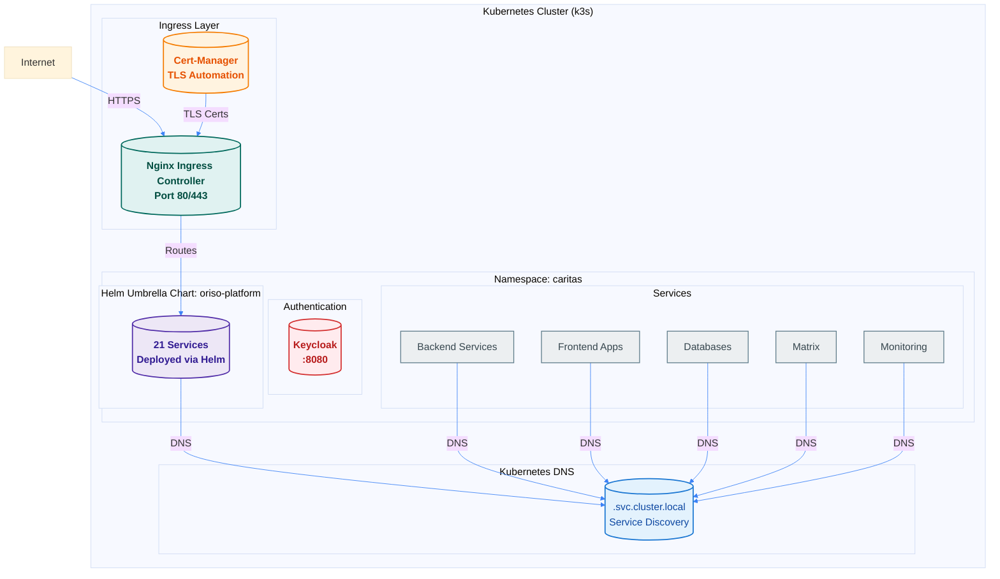

## Infrastrukturüberblick

Die ORISO-Plattform v3.0.0 wird auf Kubernetes mit Helm-Charts bereitgestellt, mit automatisiertem TLS über cert-manager und Routing über Ingress.



## Kubernetes-Plattform

### Clustertyp
- **Plattform:** k3s (leichtgewichtiges Kubernetes)
- **Version:** Kubernetes 1.24+
- **Namespace:** `caritas`
- **Bereitstellungsverfahren:** Helm 3.x

### Warum k3s?
- Leichtgewichtig und einfach zu installieren
- Eine einzelne Binärdatei, keine komplexe Einrichtung
- Ideal für einzelne Knoten oder kleine Cluster
- Vollständige Kompatibilität mit der Kubernetes API

## Helm-Architektur

### Muster des übergeordneten Charts
Alle Dienste werden über ein einzelnes übergeordnetes Helm-Chart bereitgestellt:

```
caritas-workspace/ORISO-Kubernetes/helm/
├── oriso-platform/          # Umbrella chart
│   ├── Chart.yaml
│   ├── values.yaml
│   └── charts/              # Sub-charts
│       ├── userservice/
│       ├── agencyservice/
│       ├── mariadb/
│       └── ...
└── values.yaml              # Global values
```

### Bereitstellungsbefehl
```bash
cd caritas-workspace/ORISO-Kubernetes/helm
helm dependency update oriso-platform
helm install oriso-platform ./oriso-platform \
  --namespace caritas \
  --create-namespace \
  -f values.yaml
```

### Chart-Abhängigkeiten
Das übergeordnete Chart verwaltet die Abhängigkeiten aller 21 Dienste:
- Infrastruktur (Datenbanken, Cache, Warteschlange)
- Authentifizierung (Keycloak)
- Backend-Dienste (4 Dienste)
- Frontend (2 Anwendungen)
- Kommunikation (Matrix, Element)
- Überwachung (SignOZ, Health Dashboard)

## Ingress-Architektur

### Nginx Ingress Controller
- **Zweck:** Externer Zugriff auf alle Dienste
- **Ports:** 80 (HTTP), 443 (HTTPS)
- **Bereitstellung:** Über Helm
- **Namespace:** `ingress-nginx`

### Ingress-Ressourcen
**Speicherort:** `caritas-workspace/ORISO-Kubernetes/ingress/`

**Statistik:**
- **Dateien insgesamt:** 22 YAML-Dateien
- **Ingress-Ressourcen insgesamt:** 33
- **Funktionen:**
  - Umschreiben von Pfaden
  - CORS-Unterstützung
  - TLS-Automatisierung
  - Routing zu Diensten

### Ingress-Bereitstellung
```bash
cd caritas-workspace/ORISO-Kubernetes/ingress
kubectl apply -f .
```

### Beispiel einer Ingress-Ressource
```yaml
apiVersion: networking.k8s.io/v1
kind: Ingress
metadata:
  name: frontend-ingress
  namespace: caritas
  annotations:
    cert-manager.io/cluster-issuer: letsencrypt-prod
    nginx.ingress.kubernetes.io/rewrite-target: /
spec:
  tls:
  - hosts:
    - app.example.org
    secretName: frontend-tls
  rules:
  - host: app.example.org
    http:
      paths:
      - path: /
        pathType: Prefix
        backend:
          service:
            name: oriso-platform-frontend
            port:
              number: 80
```

## TLS-/SSL-Verwaltung

### Cert-Manager
- **Zweck:** Automatische Verwaltung von TLS-Zertifikaten
- **Aussteller:** Let's Encrypt
- **Typ:** ClusterIssuer (clusterweit)
- **Automatisierung:** Automatische Zertifikatsausstellung und -erneuerung

### ClusterIssuer-Konfiguration
```yaml
apiVersion: cert-manager.io/v1
kind: ClusterIssuer
metadata:
  name: letsencrypt-prod
spec:
  acme:
    server: https://acme-v02.api.letsencrypt.org/directory
    email: your-email@example.com
    privateKeySecretRef:
      name: letsencrypt-prod
    solvers:
    - http01:
        ingress:
          class: nginx
```

### Zertifikatsverwaltung
Zertifikate werden automatisch erstellt, wenn Ingress-Ressourcen erstellt werden:
```bash
# Check certificates
kubectl get certificate -n caritas

# Check certificate status
kubectl describe certificate frontend-tls -n caritas
```

## Diensterkennung

### Kubernetes-DNS
Alle Dienste verwenden Kubernetes-DNS zur Erkennung:
- **Muster:** `<service-name>.<namespace>.svc.cluster.local`
- **Beispiel:** `oriso-platform-userservice.caritas.svc.cluster.local:8082`

### Diensttypen
- **ClusterIP:** Interne Dienste (Datenbanken, Backend-Dienste)
- **NodePort:** Nicht verwendet (Ingress übernimmt externen Zugriff)
- **LoadBalancer:** Nicht verwendet (Ingress übernimmt externen Zugriff)

### Namenskonvention für Dienste
Alle Dienste verwenden das Präfix `oriso-platform-*`:
- `oriso-platform-userservice`
- `oriso-platform-mariadb`
- `oriso-platform-keycloak`
- `oriso-platform-frontend`

## Netzwerkarchitektur

### Interne Kommunikation
Die gesamte interne Kommunikation verwendet ClusterIP-Dienste:
- Keine externen IPs erforderlich
- Automatische Lastverteilung
- DNS-basierte Diensterkennung
- Innerhalb des Clusters sicher

### Externer Zugriff
Der gesamte externe Zugriff erfolgt über Ingress:
- Ein einzelner Einstiegspunkt (Ports 80/443)
- TLS-Terminierung am Ingress
- Pfadbasiertes Routing
- Hostbasiertes Routing

### Erforderliche Ports
**Extern (Firewall):**
- `80` – HTTP (Weiterleitung auf HTTPS)
- `443` - HTTPS
- `6443` – Kubernetes API (optional für kubectl)

**Intern (Cluster):**
- Alle Dienstports sind über ClusterIP erreichbar.
- Kein direkter externer Zugriff auf Dienste

## Namespace-Struktur

### Haupt-Namespace: `caritas`
Alle ORISO-Dienste werden im Namespace `caritas` bereitgestellt:
```bash
kubectl get all -n caritas
```

### Weitere Namespaces
- `ingress-nginx` - Ingress Controller
- `cert-manager` - Cert-Manager
- `platform` – SignOZ (optional)

## Authentifizierungsinfrastruktur

### Keycloak
- **Zweck:** OIDC-/OAuth2-Authentifizierung
- **Dienst:** `oriso-platform-keycloak.caritas.svc.cluster.local:8080`
- **Externe URL:** https://auth.example.org
- **Realm:** `online-beratung`
- **Client:** `app`

### Keycloak-Konfiguration
- **Realm-Import:** Aus `ORISO-Keycloak/realm.json`
- **HTTP-Zugriff:** Über `configure-http-access.sh` konfiguriert
- **Token-Lebensdauer:** 5 Stunden Zugriff, 30 Minuten SSO-Inaktivität

## Überwachungsinfrastruktur

### SignOZ
- **Zweck:** Observability und APM
- **Namespace:** `platform`
- **Zugriff:** http://YOUR_SERVER_IP:3001
- **Komponenten:**
  - SignOZ Backend
  - ClickHouse (Zeitreihendatenbank)
  - OTEL Collector

### Health Dashboard
- **Zweck:** Überwachung des Dienstzustands
- **Dienst:** `oriso-platform-health-dashboard`
- **Zugriff:** http://YOUR_SERVER_IP:9001
- **Prüfungen:** Alle `/actuator/health`-Endpunkte

### Statusseite
- **Zweck:** Öffentliche Statusseite
- **URL:** http://status.example.org

## Ressourcenverwaltung

### Ressourcenanforderungen/-limits
Alle Dienste haben Ressourcenbeschränkungen:
```yaml
resources:
  requests:
    cpu: 250m
    memory: 512Mi
  limits:
    cpu: 500m
    memory: 1Gi
```

### Persistenter Speicher
Alle Datenbanken verwenden PersistentVolumeClaims:
- **Speicherklasse:** `local-path` (k3s-Standard)
- **Aufbewahrung:** Bleibt bei Deinstallation mit Helm erhalten

## Bereitstellungsphasen

1. **Infrastruktur** – Datenbanken, Cache, Warteschlange
2. **Authentifizierung** – Keycloak
3. **Kommunikation** – Matrix, Element
4. **WebRTC** - LiveKit
5. **Backend** – 4 Microservices
6. **Frontend** – 2 Anwendungen
7. **Überwachung** – SignOZ, Health Dashboard

## Fehlerbehebung

### Ingress-Probleme
```bash
# Check Ingress Controller
kubectl get pods -n ingress-nginx

# Check Ingress resources
kubectl get ingress -n caritas

# Check Ingress logs
kubectl logs -n ingress-nginx -l app.kubernetes.io/component=controller
```

### Probleme mit TLS-Zertifikaten
```bash
# Check cert-manager
kubectl get pods -n cert-manager

# Check certificates
kubectl get certificate -n caritas
kubectl describe certificate <cert-name> -n caritas

# Check certificate requests
kubectl get certificaterequest -n caritas
```

### Probleme mit der Diensterkennung
```bash
# Test DNS resolution
kubectl run test-pod --rm -it --image=busybox --restart=Never -- \
  nslookup oriso-platform-userservice.caritas.svc.cluster.local

# Check service endpoints
kubectl get endpoints -n caritas
```

### Helm-Probleme
```bash
# Check Helm release
helm list -n caritas

# Check release status
helm status oriso-platform -n caritas

# View release values
helm get values oriso-platform -n caritas
```


