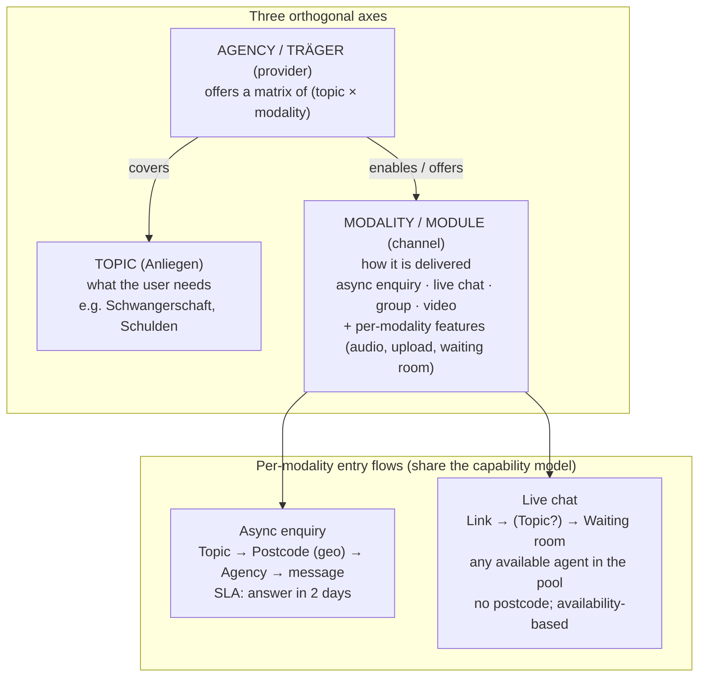

# ADR-001: Beratungsformen als schaltbare Module

- **Status:** Vorgeschlagen — Teamentscheidung erforderlich, besonders zum Registrierungsfilter `consulting_type`
- **Datum:** 2026-06-23
- **Entscheider:** Frank und Backend-/Frontend-Leads
- **Verwandt:** OpenResilienceInitiative/ORISO-Frontend#245, ORISO-AgencyService#39 (Korrektur unbeabsichtigter Löschung), ORISO-Frontend#246 (leere Themen ausblenden), ORISO-AgencyService#40 (Datenbereinigung), `agency-registration-visibility-bug-report.md`

---

## Kontext

`consulting_type` ist das am stärksten überladene Konzept der Plattform. Heute ist es gleichzeitig:

1. **Identität der Beratungsform / des Kanals:** Live-/Nähe-Chat, 1:1, interner Chat, bald Selbsthilfegruppenchat, künftig Video. Bestätigt: `/service/consultingtypes/basic` enthält `groupChat.isGroupChat`, `isVideoCallAllowed`, `isAnonymousConversationAllowed`, `isSubsequentRegistrationAllowed` und weitere Angaben.
2. **Fester Registrierungsfilter:** `AgencyRepository.search*` erzwingt `a.consulting_type = :type`; das Frontend setzt fest `consultingType: consultingType?.id || 1` (`useAgenciesForRegistration.ts`). Beratungsstellen mit einer anderen Beratungsform werden still ausgeschlossen.
3. **Träger funktionsbezogener Einstellungen je Typ:** Gruppenchatregeln, Video erlaubt, anonym, verpflichtende Registrierungsfelder, White-Spot und weitere.

Zusätzlich:

- **Themen** beschreiben das Anliegen. Sie liegen in ConsultingTypeService und sind **mandantenbezogen** (`tenant_id`). Sie wurden manuell ohne Änderungsprotokoll in Produktion angelegt. `agency_topic` in **AgencyService verweist ohne serviceübergreifenden Fremdschlüssel** darauf.
- **Benutzerabläufe unterscheiden sich deutlich.** Der asynchrone Anfrage-/Briefablauf benötigt **Postleitzahl-Routing, Thema und eine Antwortfrist von zwei Tagen**. **Live-Chat** beginnt mit einem **Link**, ohne Postleitzahl, mit **Warteraum**, **Beraterverfügbarkeit** in Echtzeit und mehreren Organisationen in einem gemeinsamen Pool. Beides durch `getAgencies(consultingType, postcode, topicId)` zu zwingen, verursacht wiederkehrende stille Fehler.

Ein falscher Codekommentar, Beratungsarten würden nicht mehr verwendet, hat bereits anfällige Logik erzeugt: `getConsultingType4Tenant` weist eine Beratungsform über `consultingTypeResponse[0].id` zu.

### Produktanforderung

**Module je Mandant und Beratungsstelle ein-/ausschalten** können: Dieser Träger bietet nur Live-Chat, keine 1:1-Beratung. Außerdem **Funktionen je Chat** wie Sprachnachrichten oder Upload schalten, wie bei vorhandenen Admin-Schaltern. Diese Kernkomponente muss gehärtet werden, damit sie keine weiteren Fehler erzeugt.

## Entscheidungsgründe

- Module müssen je Mandant und Beratungsstelle **schaltbar** sein, mit Funktionsflags je Beratungsform.
- Unterschiedliche Abläufe benötigen **unterschiedliches Routing und Verfügbarkeitsverhalten**: Geografie und Antwortfrist gegenüber Link und Warteraum.
- **Keine stillen Registrierungsfehler**, insbesondere keine versteckten festen Filter, die gültige Beratungsstellen ausschließen.
- **Datenintegrität** zwischen Services: keine ungültigen Themen-/Beratungsformverweise, versionierte Ausgangsdaten.

## Entscheidung (vorgeschlagen)

Drei **unabhängige Achsen** ausdrücklich modellieren und nicht länger vermischen.

1. **Thema** = Anliegen. **Beratungsform/Modul** = Kanal mit eigenen Funktionsflags. **Beratungsstelle** = Anbieter, der eine Fähigkeitsmatrix `(topic × modality, enabled?)` angibt.
2. **Fähigkeiten sind ausdrückliche schaltbare Flags**, kein einzelnes überladenes Enum als Filter. Der Mandant aktiviert die vorhandenen Beratungsformen; die Beratungsstelle erklärt ihr Angebot; jede Beratungsform enthält ihre Funktionsschalter. Konsistent mit der Regel „deaktivieren, nicht verstecken“ und dem geplanten ADV-Modulkonzept.
3. **Jede Beratungsform erhält ihren eigenen Einstieg**, mit gemeinsamem Fähigkeitsmodell, aber ohne gemeinsame Filterabfrage:
   - *Asynchrone Anfrage:* Thema → Postleitzahl → Beratungsstelle → Nachricht; durch Antwortfrist gesteuert.
   - *Live-Chat:* Link → optionales Thema → Warteraum; durch Verfügbarkeit/Warteschlange gesteuert; kein geografisches Routing; gemeinsamer Pool mehrerer Organisationen.
4. **Registrierung darf Beratungsform nicht fest vorgeben oder heimlich filtern.** Der asynchrone Ablauf filtert nach **Thema, Postleitzahl und Verfügbarkeit**; die Beratungsform ergibt sich aus dem Ablauf oder wird gewählt. Live-Chat übergibt seine eigene Beratungsform. Niemals `consultingType = 1` als Konstante.
5. **Datenmodell härten:** versionierte Ausgangsdaten statt manueller Produktionsanlage; referenzielle Integrität oder serviceübergreifende Prüfung, sodass `agency_topic.topic_id` und Beratungsform-IDs gültige Definitionen benötigen. Erreichbarkeit prüfen, bevor eine Beratungsstelle in der Registrierung sichtbar werden darf: online, mindestens ein Berater, passende Fähigkeit. Verfügbarkeit/Warteraum als Eigenschaft der Beratungsform modellieren.
6. **Verbindliche Zugangsdatenregel:** Verwaltete menschliche Konten für Plattform-, Mandanten- und Beratungsstellenadministratoren sowie Berater dürfen keine still erzeugten Zufallspasswörter als versteckten Ersatz erhalten. Sie brauchen ein ausdrückliches Passwort bei Anlage oder einen sicheren Zurücksetzungs-/Einladungsablauf. Ausnahme: anonymer Live-Chat ohne Registrierung erzeugt bewusst einen verborgenen eindeutigen technischen Benutzernamen und Zugangsdaten, während der sichtbare Anzeigename nicht eindeutig bleibt. Diese technischen Zugangsdaten sind für die anonyme Anmeldung/Sitzungsbrücke erforderlich und dürfen durch die Regel gegen stille Zufallspasswörter nicht entfernt werden.

## Folgen

**Positiv:** Module unabhängig schaltbar; Abläufe passen zu Anforderungen; keine still ausgeschlossenen Beratungsstellen; neue Beratungsformen wie Video/Selbsthilfegruppen werden Ergänzungen statt Risiken für den Registrierungsfilter. Datenintegrität verhindert wiederkehrende Fehler fehlender Beratungsstellen.

**Negativ / Aufwand:** Überarbeitung einer Kernkomponente. Die Bedeutung von `consulting_type`, derzeit Träger der Beratungsform, muss bewusst migriert werden. Schema und Admin-Oberfläche benötigen Änderungen; beide Abläufe müssen getrennt werden. Abstimmung zwischen ConsultingTypeService, AgencyService, TenantService, UserService und Frontend.

## Migrationsplan (schrittweise)

- **Phase 0 — akute Fehler stoppen (läuft):** Unbeabsichtigtes Löschen von Themenverknüpfungen beheben (ORISO-AgencyService#39 ✅), leere Themen bei Registrierung ausblenden (ORISO-Frontend#246 ✅), defekte Testberatungsstellen bereinigen (ORISO-AgencyService#40), **Umgang mit `consultingType` in Registrierung entscheiden** (offene Frage).
- **Phase 1 — Fähigkeiten ausdrücklich modellieren:** Beratungsformschalter je Mandant/Beratungsstelle und Funktionsflags je Beratungsform einführen. Zuweisung über `[0].id` und falschen Kommentar zur angeblichen Ablösung entfernen. Beratungsform als ausdrückliches geprüftes Feld im Beratungsstellenformular führen.
- **Phase 2 — Abläufe trennen:** Live-Chat eigener Einstieg mit Link/Warteraum/Verfügbarkeit, getrennt von asynchroner Anfrage. Gemeinsamen einzelnen Beratungsstellenfilter auflösen.
- **Phase 3 — Datenintegrität:** Themen-/Beratungsform-Ausgangsdaten versionieren; serviceübergreifende Prüfungen und Erreichbarkeitsprüfung für Registrierungssichtbarkeit ergänzen.

## Offene Fragen (Entscheidung nötig)

1. **Registrierungsfilter:** Im asynchronen Ablauf echte Beratungsform senden oder keine, nur Thema und Verfügbarkeit filtern? Das Backend unterstützt bereits `:type IS NULL`. Da Typ jetzt Beratungsform bedeutet, ist dies eine Produktentscheidung.
2. **Ort der Beratungsformkonfiguration:** ConsultingTypeService wie heute, TenantService oder eigenes Fähigkeitsmodell?
3. **Live-Chat-Verfügbarkeitsmodell:** Warteschlange/Warteraum und Beraterpräsenz als neue Komponente oder bestehender Service erweitern?

## Erwogene Alternativen

- **`consulting_type` behalten, nur feste Vorgabe `=1` entfernen.** Günstigste Lösung, behält aber Überladung und unterschiedliche Ablaufanforderungen. Stille Fehler kehren mit weiteren Beratungsformen zurück.
- **Beratungsformfilter bei Registrierung ganz entfernen.** Einfacher, kann aber nicht angebotene Beratungsformen eines Trägers anzeigen und verletzt die Schaltanforderung.
- **Vorschlag: drei Achsen, Fähigkeiten und eigene Abläufe.** Höchster Anfangsaufwand, aber einzige Option, die Schaltbarkeit und unterschiedliche Abläufe ohne wiederkehrende Fehler erfüllt.
