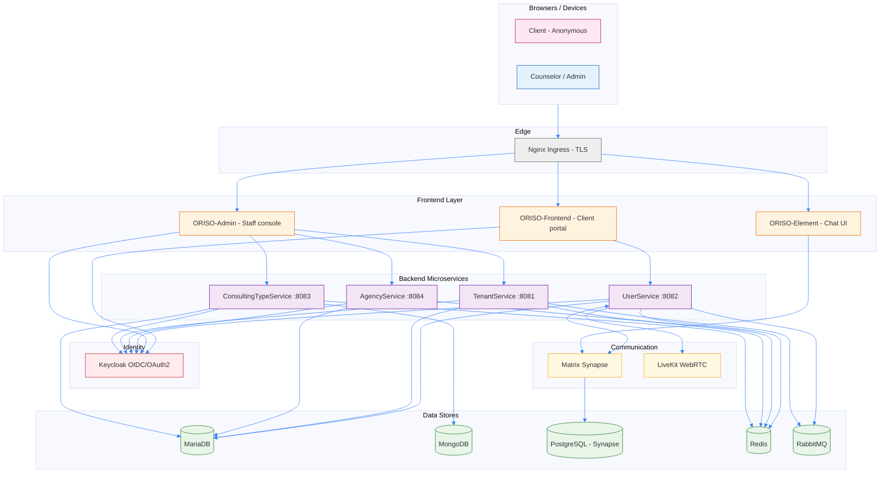
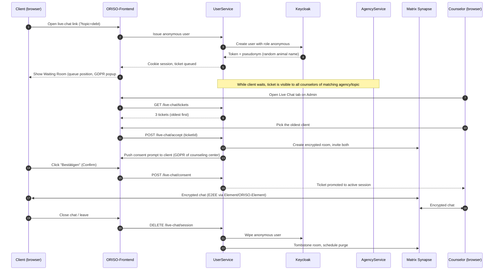

<Info>
Diese Seite zeigt die Architektur **auf Produktebene**. Tiefere Infrastrukturdetails (Helm-Chart, Kubernetes-Dienste, Ingress) stehen unter [Architektur: Backend](/oriso-platform/architecture/backend) und [Architektur: Infrastruktur](/oriso-platform/architecture/infra).
</Info>

## 2.1 Das Gesamtbild

ORISO ist eine **Microservice-Plattform** auf Kubernetes (k3s) mit einem gemeinsamen Helm-Dachchart. Es gibt fünf logische Ebenen:

1. **Frontend** — was Nutzende im Browser sehen.
2. **Identität** — Keycloak als maßgebliche Quelle, wer welche Person ist.
3. **Backend-Dienste** — Spring-Boot-Dienste mit Geschäftslogik und Datenverantwortung.
4. **Kommunikation** — Matrix Synapse für Chaträume; LiveKit für Video.
5. **Daten und Infrastruktur** — MariaDB, MongoDB, PostgreSQL, Redis, RabbitMQ.



## 2.2 Zentrale Komponenten

### Frontend-Ebene

| App | Zweck | Nutzende |
|---|---|---|
| **ORISO-Frontend** | Portal für Ratsuchende: PLZ-Suche, Beratungsstellensuche, **Warteraum**, DSGVO-Einwilligungsabfrage, Live-Chat-Oberfläche | Anonyme Ratsuchende, angemeldete Personen |
| **ORISO-Admin** | Mitarbeitendenkonsole: Trägerverwaltung, Beratungsstellenkonfiguration, Einladungen für Beratende, Live-Chat-Linkerstellung, Einstellungen | Plattform-, Träger- und Beratungsstellen-Admins |
| **ORISO-Element** | Angepasster Fork von Element.io als Chat-Oberfläche im Produkt (auf Matrix Synapse) | Beratende und Ratsuchende während Chat-Sitzung |
| **ORISO-ElementCall** | Angepasster Element-Call-Build für Video-/Sprachräume über LiveKit | Beratende und Ratsuchende während Videositzung |

Beide Kern-Apps verwenden React 18 und Vite 4. Sie nutzen Keycloak-Token für OIDC und kommunizieren über REST mit dem Backend.

### Identitätsebene

**Keycloak** ist der einzige OIDC/OAuth2-Anbieter. Jede Person (Plattform-, Träger-, Beratungsstellen-Admins, Beratende, anonyme Ratsuchende) ist eine Keycloak-Person mit einer oder mehreren **Realm-Rollen**, die API-Zugriff steuern.

Heute vorhandene Realm-Rollen (aus `ORISO-Keycloak/realm.json` und `UserRole.java`):

```
anonymous, user, consultant, technical, group-chat-consultant,
user-admin, single-tenant-admin, tenant-admin,
agency-admin, restricted-agency-admin,
restricted-consultant-admin, supervisor-consultant,
topic-admin, notifications-technical
```

Die vierstufige fachliche Hierarchie (Franks Definition im Gespräch) wird auf diese Realm-Rollen abgebildet — die vollständige Zuordnung steht unter [Rollen und Berechtigungen](/product/roles-permissions).

### Backend-Dienstebene

| Dienst | Port | Verantwortung |
|---|---|---|
| **TenantService** | 8081 | Träger, Vorlagen für Impressum/Datenrichtlinie/DSGVO auf Trägerebene, Trägereinstellungen |
| **UserService** | 8082 | Personen, Sitzungen, Anfragen, Live-Chat-Tickets, Matrix-Raumerstellung, LiveKit-JWTs |
| **ConsultingTypeService** | 8083 | Themen („Schuldnerberatung“, „Familie“, „Sucht“, …), Beratungsartenkonfiguration |
| **AgencyService** | 8084 | Beratungsstellen, Zuordnungen Beratungsstelle↔Beratende↔PLZ |

Alle Dienste verwenden Spring Boot 2.7.14 (Java 17), teilen eine MariaDB-Instanz mit getrennten logischen Datenbanken, kommunizieren per REST über Kubernetes-DNS und prüfen Keycloak-JWTs bei jeder Anfrage.

### Kommunikationsebene

| Komponente | Aufgabe |
|---|---|
| **Matrix Synapse** | Verschlüsseltes Chat-System. Jeder Beratungschat ist ein Matrix-Raum. Nachrichten sind Ende-zu-Ende-verschlüsselt (Olm/Megolm). Der Warteraum teilt Ratsuchenden ausdrücklich mit: *„Nachrichten sind Ende-zu-Ende-verschlüsselt und werden nach 48 Stunden automatisch gelöscht“*. |
| **LiveKit** | WebRTC-SFU. Videoanrufe zwischen Beratenden und Ratsuchenden erhalten einen eigenen Raum und kurzlebigen JWT von UserService. |
| **Matrix Discovery Service** | Federation/.well-known-Erkennung vor Synapse. |

### Daten- und Infrastrukturebene

- **MariaDB** — sieben logische Datenbanken (eine je Dienst plus gemeinsame Hilfsmittel). Maßgebliche relationale Daten für Personen, Sitzungen, Anfragen, Beratungsstellen und Träger.
- **MongoDB** — Sammlung `consulting_types` (umfangreiche JSON-Konfiguration je Thema).
- **PostgreSQL** — ausschließlich für Matrix Synapse.
- **Redis** — Sitzungscaches, Ratenbegrenzung, kurzlebige Zustände (Warteraumzähler usw.).
- **RabbitMQ** — asynchrone Aufgaben (z. B. Benachrichtigungen, geplante Bereinigung veralteter anonymer Personen).

<Note>
**Liquibase ist deaktiviert** in allen Backend-Diensten. Schemata werden zentral in `ORISO-Database` verwaltet. Siehe [Datenebene](/oriso-platform/architecture/data).
</Note>

## 2.3 Vollständiger Datenfluss: eine Live-Chat-Anfrage

Der wichtigste Produktablauf. Einmal lesen, um 80 % der ORISO-Funktionsweise zu verstehen.



Die vier entscheidenden Garantien dieses Ablaufs:

1. **Eine Identität Ratsuchender ist niemals erforderlich.** Ein Pseudonym entsteht auf dem Server.
2. **Zwei getrennte DSGVO-Einwilligungen** werden eingeholt: beim Warteraumeintritt (Plattformstandard) und eine zweite verpflichtende bei Chat-Annahme durch Beratende (DSGVO der **Beratungsstelle**).
3. **Beratende wählen** die ratsuchende Person — das System verzichtet bewusst auf „Nächste in Warteschlange automatisch zuweisen“, damit spätere PLZ-/Themenauswahl möglich bleibt.
4. **Löschung bei Verbindungsabbruch** ist unverhandelbar. Zurückgelassene anonyme Personen im Warteraum werden innerhalb von Sekunden bis Minuten gelöscht.

## 2.4 Integrationspunkte

### Extern (Dritte / systemübergreifend)

| Integration | Richtung | Zweck |
|---|---|---|
| **Keycloak (OIDC)** | Alle Apps → KC | Authentifizierung, Rollenprüfung, MFA für Admins |
| **Matrix Federation** | Synapse ↔ entferntes Matrix | Optionale Föderation; im Produktivbetrieb meist deaktiviert |
| **LiveKit** | UserService → LiveKit | JWTs für Videoräume ausstellen |
| **SignOZ / OpenTelemetry** | Dienste → OTel-Kollektor | Beobachtbarkeit, verteilte Ablaufverfolgung |
| **Cert-Manager / Let's Encrypt** | Cluster → ACME | Automatisches TLS für `*.oriso-dev.site` |
| **SMTP (geplant)** | Dienste → E-Mail-Anbieter | Transaktionsmails für Einladungen und Passwortzurücksetzung |

### Intern (Dienst zu Dienst)

- Alle dienstübergreifenden Aufrufe erfolgen als **REST** über Kubernetes-DNS (z. B. `oriso-platform-userservice.caritas.svc.cluster.local:8082`).
- Alle Aufrufe tragen einen **Keycloak-Dienstkonto-JWT** des aufrufenden Dienstes; der aufgerufene Dienst setzt Berechtigungsprüfungen durch.
- **Matrix-Integration** (UserService ↔ Synapse) nutzt Matrix Application Service / Admin-API zur Bereitstellung von Räumen und Personen.

## 2.5 Querschnittsthemen

| Thema | ORISOs Umgang damit |
|---|---|
| **AuthN** | Keycloak OIDC; Ratsuchende erhalten ein `anonymous`-Token, Mitarbeitende rollengebundene Token. MFA ist **verpflichtend** für Plattform- und Träger-Admins. |
| **AuthZ** | Spring Security schützt jeden Endpunkt über `Authority.java`-Zuordnungen. Realm-Rolle → gewährte Berechtigung steht in `Authority.java`. |
| **Verschlüsselung bei Übertragung** | TLS am Ingress, optional mTLS innerhalb des Clusters, Megolm E2EE im Chat. |
| **Verschlüsselung bei Speicherung** | Matrix-Nachrichteninhalte sind E2EE, die Datenbank sieht nur verschlüsselten Text. Persönliche MariaDB-Felder sind auf Spaltenebene verschlüsselt (laut Prüfpfad). IP-Adressen werden im Produktivbetrieb nie dauerhaft gespeichert (Entwicklungsmodus verboten). |
| **Datenschutz** | „Hacker-Plattform-Denkweise“: damit rechnen, dass externe Prüfende das System untersuchen; Datenminimierung als Standard. |
| **Beobachtbarkeit** | SignOZ (verteilte Ablaufspuren, Protokolle), Health Dashboard (Verfügbarkeit je Pod), Status Page (öffentlich). |

## 2.6 Wo die einzelnen Konzepte liegen

| Produktkonzept | Ort |
|---|---|
| **Träger** | `tenantservice`-Datenbank; `TenantService`-API; Keycloak-Attribut der Person |
| **Beratungsstelle (Agency)** | `agencyservice`-Datenbank; `AgencyService`-API; einem Träger zugeordnet |
| **Thema / Beratungsart** | `consultingtypeservice`-Datenbank und MongoDB; `ConsultingTypeService`-API |
| **Beratende / Nutzende / Admins** | `userservice`-Datenbank und Keycloak; `UserService`-API |
| **Chat-Sitzung, Anfrage, Live-Chat-Ticket** | `userservice`-Datenbank und Matrix-Raum; `UserService`-API |
| **DSGVO-/Impressums-/Datenrichtlinientext** | An der zugehörigen Einheit gespeichert (Plattform / Träger / Beratungsstelle); geerbt, sofern nicht überschrieben |
| **Live-Chat-Link / Pincode** | `agencyservice`-Datenbank; Beratungsstelle und Thema zugeordnet |
