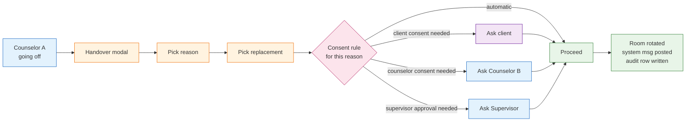

<Warning>
**Diese Seite dokumentiert den Figma-Vorschlag vom Mai 2026, nicht die gebaute Funktion.** Sie bleibt
als Entwurfshistorie erhalten. Was die Plattform tatsächlich tut — einen Fall holen und abgeben,
die aktuelle Systematik der Gründe und die erforderliche Zustimmung — steht unter
[Fallübergabe — einen Fall holen und abgeben](/product/features/case-handover).
Zwei Punkte unten wurden inzwischen anders entschieden: Die vorherige Beratungsperson wird **nicht**
aus dem Gespräch entfernt, und Gründe nennen keine Krankheit oder andere Gesundheitsinformationen mehr.
</Warning>

<Info>
Die Figma-Ausgabe vom Mai 2026 führt einen ausdrücklichen **Übergabeablauf** mit festen Gründen und grundabhängigen Einwilligungsregeln ein. Beispieltext: *„Deine Beratung wurde an Gudrun übergeben: Grund sie ist leider krank.“*
</Info>

## 4.7.1 Was Übergabe bedeutet

Manchmal kann die zugewiesene Beratungsperson nicht weitermachen: Urlaub, Krankheit, Notfall, Ausscheiden aus der Beratungsstelle oder ein zwingender rechtlicher bzw. organisatorischer Anlass. Übergabe ist der geregelte Ablauf, der **einen einzelnen Fall** an eine neue Beratungsperson **derselben Beratungsstelle** überträgt — ohne E2EE, DSGVO-Einwilligung oder Prüfpfade zu verletzen.



## 4.7.2 Systematik der Gründe

In Figma bestätigt:

| Grundschlüssel | Bezeichnung (DE) | Standard-Einwilligungsregel | Standard-Sichtbarkeit im Prüfprotokoll |
|---|---|---|---|
| `holiday` | Urlaub | Zustimmung von Beratenden und Ratsuchenden | Standard |
| `sickness` | Krankheit | Nur Zustimmung von Beratenden (Ratsuchende informiert) | Standard |
| `emergency` | Notfall | Automatisch (Ratsuchende nachträglich informiert) | Erhöht |
| `law_violation` | Rechtsverstoß | Supervision und Vertretung der Strafverfolgung | Gesperrt, eingeschränkte Sicht |
| `colleague_fired` | Mitarbeitende entlassen | Freigabe durch Supervision | Erhöht |
| `custom` | Eigene Erklärung | Zustimmung von Beratenden und Ratsuchenden | Standard |

<Note>
Jeder Träger kann die Standard-Einwilligungsregeln in der Matrix **Berechtigungen** überschreiben (siehe [Rollen und Berechtigungen §3.7](/product/roles-permissions#3-7-per-chat-type-permissions-matrix)).
</Note>

## 4.7.3 Einwilligungsmatrix

| Grund | Zustimmung Ratsuchende | Zustimmung Beratungsperson B | Freigabe Supervision | Für Ratsuchende sichtbarer Grundtext |
|---|:-:|:-:|:-:|---|
| Urlaub | ✅ | ✅ | ❌ | *„Deine vorherige Beraterin ist im Urlaub …“* |
| Krankheit | nur informiert | ✅ | ❌ | *„Deine vorherige Beraterin ist leider krank …“* |
| Notfall | nur informiert (nachträglich möglich) | ✅ (nach Möglichkeit) | optional | *„Aus dringenden Gründen wurde dein Fall übertragen …“* |
| Rechtsverstoß | eingeschränkte Benachrichtigung | ✅ | ✅ und Strafverfolgungsvertretung | gesperrter Text vom Rechtsteam |
| Mitarbeitende entlassen | nur informiert | ✅ | ✅ | *„Aus organisatorischen Gründen wurde dein Fall übertragen …“* |
| Eigener Grund | ✅ | ✅ | ❌ | durch Beratende eingegebener Grundtext |

Das System setzt diese Regeln **auf dem Server** durch, bevor die Raum-Mitgliedschaft geändert wird.

## 4.7.4 Detaillierte Abfolge

```mermaid
sequenceDiagram
  autonumber
  participant Co1 as Counselor A
  participant Co2 as Counselor B
  participant FE as ORISO-Admin
  participant US as UserService
  participant MX as Matrix
  participant Cl as Client

  Co1->>FE: Chatraum Einstellungen → Handover Case
  FE->>Co1: Modal with reason + replacement picker
  Co1->>FE: Pick reason (e.g. "Sickness") + Counselor B
  FE->>US: POST /handover { sessionId, from, to, reason, customText? }
  US->>US: load consent rule for reason

  alt requires Counselor B consent
    US->>Co2: Notification "Übernahme angefragt"
    Co2-->>US: accept
  end
  alt requires Supervisor approval
    US->>SU: Notification with locked context
    SU-->>US: approve
  end
  alt requires Client consent
    US->>Cl: Push consent prompt in chat
    Cl-->>US: accept
  end

  US->>MX: invite Co2; remove Co1
  US->>Cl: System message ("Deine Beratung wurde an Gudrun übergeben: Grund …")
  US->>US: write audit row { from, to, reason, consents, started_at, completed_at }
  US-->>FE: 200 OK
```

## 4.7.5 Was mit dem Raum geschieht

- **Derselbe Matrix-Raum** bleibt erhalten — der Gesprächsverlauf bleibt für Ratsuchende bestehen.
- **Beratungsperson A wird entfernt** aus der Mitgliederliste (empfängt keine Nachrichten mehr).
- **Beratungsperson B wird eingeladen** und tritt über Element/ORISO-Element bei.
- **Megolm-Schlüssel**: B erhält früheren Verlauf abhängig von `m.room.history_visibility` des Raums. ORISO-Standard ist `shared` (Mitglieder sehen Verlauf ab ihrer Einladung). Bei sensiblen Sitzungen kann der Träger zu `joined` wechseln (kein früherer Verlauf), damit neue Beratende ohne Vorgeschichte beginnen.
- **Identität der Ratsuchenden** bleibt unverändert — dasselbe Pseudonym, dasselbe Cookie. Ratsuchende werden nicht neu zugeordnet; nur der Platz der Beratungsperson wechselt.

## 4.7.6 Einschränkungen

- **Beratungsstellenübergreifende Übergabe ist verboten** — Vertretungen müssen derselben Beratungsstelle angehören. Gibt es dort keine weitere Beratungsperson, ist ein Eskalationsweg auf Trägerebene erforderlich (geplant, siehe [Figma-Analyse §4.6](/product/figma-analysis-2026-05#4-6-handover-reasons-consent)).
- **Trägerübergreifende Übergabe ist verboten** — ohne Ausnahme.
- **Übergabe während aktivem Videoanruf** — der Anruf wird kontrolliert beendet, dann erfolgt die Übergabe.
- **Übergabe bei ausstehender DSGVO-Einwilligung Nr. 2** — wird verweigert; das Ticket geht stattdessen in die Warteschlange zurück.
- **Keine automatische Neuzuordnung anonymer Ratsuchender**: Wer die Übergabe ablehnt, erhält eine verständliche Rückfallmeldung und die Sitzung wird gelöscht.

## 4.7.7 Erleben der Ratsuchenden

Ratsuchende sehen immer eine **Systemnachricht** des Typs `Handover` im Chat mit einem Vorlagentext:

> Deine vorherige Beraterin ist leider krank. Deshalb wurde dein Fall an **{Beraterin}** übergeben von der **{Beratungsstelle}**.

Schaltflächen (abhängig von der Einwilligungsregel):

- **Akzeptieren** — neue Beratungsperson akzeptieren, Gespräch geht weiter.
- **Ablehnen** — ablehnen; Fall wird geschlossen; ratsuchende Person gelöscht.
- **Mehr erfahren** — öffnet einen Dialog mit vollständigem Grundtext und Kontakt zur Beratungsstelle.

## 4.7.8 Prüfprotokoll und Regelkonformität

- Jede Übergabe schreibt eine `audit_log`-Zeile mit: `session_id` (nicht aussagekräftig), `from_counselor_id`, `to_counselor_id`, `reason`, `consents_collected`, `started_at`, `completed_at`.
- Bei `law_violation` wird zusätzlich ein Eintrag im Protokoll privilegierter Zugriffe erstellt, lesbar nur für Plattform-Admins und die bestellte Vertretung der Strafverfolgung.
- **Nachrichteninhalte werden niemals ins Prüfprotokoll geschrieben** (E2EE-Regel gewahrt).

## 4.7.9 Sonderfälle

Die vollständige Liste steht unter [Sonderfälle §9.10](/product/edge-cases). Wichtigste Fälle:

- **Beratungsperson B lehnt ab** → Ticket kehrt mit Kennzeichnung „Übergabe erforderlich“ in den Pool der Beratungsstelle zurück.
- **Ratsuchende lehnen ab** → Sitzung endet mit „keine Übergabe möglich“; ratsuchende Person gelöscht.
- **Grund `law_violation` versehentlich gewählt** → Für Beratende unumkehrbar; nur Plattform-Admins können zurückrufen (mit Protokolleintrag).
- **Aktiver Gruppenchat mit mehreren Beteiligten** → Übergabe ersetzt nur den Platz von A; andere Beratende und Ratsuchende bleiben.

## 4.7.10 Verwandte Seiten

- [Rollen und Berechtigungen](/product/roles-permissions) — Übergaberechte je Rolle.
- [Datenmodell](/product/data-model) — Entität `HandoverEvent`.
- [Sonderfälle](/product/edge-cases#9-10-handover-edge-cases).
- [Figma-Analyse](/product/figma-analysis-2026-05).
