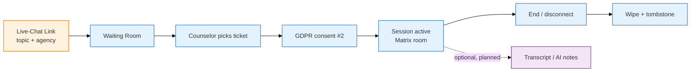

Die Produktoberfläche von ORISO wurde mit der Figma-Ausgabe vom Mai 2026 erweitert. Es gibt jetzt acht Funktionssäulen; alles Weitere (Adminbereich, Einstellungen, Bereitstellungen) unterstützt sie.

<CardGroup cols={2}>
<Card title="4.2 Live-Chat" icon="comments" href="/product/features/live-chat">
Die zentrale Funktion. Anonymer Warteraum, Übernahme durch Beratende, Einstieg nach DSGVO-Einwilligung, verschlüsselter Matrix-Raum.
</Card>

<Card title="4.5 Gruppenchats und Versand an mehrere Empfänger" icon="users" href="/product/features/group-chats">
**[NEU]** Team-, Familien-, Selbsthilfe- und interne Runden. Versand an mehrere Empfänger, Antworten im Thread, Datei-Upload, Gruppenlebenszyklus.
</Card>

<Card title="4.6 KI-Werkzeuge" icon="wand-magic-sparkles" href="/product/features/ai-tools">
**[NEU]** Chat-Zusammenfassung (`⇧Ü`), Textmarkierung, Unkenntlichmachung personenbezogener Informationen. Auf der Seite der Beratenden, im Browser entschlüsselt, selbst betriebene KI.
</Card>

<Card title="4.7 Fallübergabe" icon="user-doctor" href="/product/features/handover">
**[NEU]** Fälle zwischen Beratenden übergeben, mit einer Systematik der Gründe und Einwilligungsregeln.
</Card>

<Card title="4.8 Benachrichtigungen und Hilfsanfragen" icon="bell" href="/product/features/notifications">
**[NEU]** Benachrichtigungseingang, Systemnachrichten, interne/externe Eskalation, skriptgesteuerter Carimat-Bot.
</Card>

<Card title="4.3 Pincode-basierter Chat und Zugang" icon="hashtag" href="/product/features/pincode-chat">
Wie Ratsuchende über einen öffentlichen Live-Chat-Link mit Thema und optionaler Postleitzahl Beratende erreichen.
</Card>

<Card title="4.4 Sitzungsverwaltung" icon="clock-rotate-left" href="/product/features/session-management">
Der Lebenszyklus einer Beratungssitzung — Erstellung, Beitritt, Zustandswechsel, Löschung bei Verbindungsabbruch.
</Card>

<Card title="4.1 Transkripte (älterer Stand)" icon="microphone-lines" href="/product/features/transcription">
Die ursprüngliche Transkriptseite; durch [KI-Werkzeuge](/product/features/ai-tools) abgelöst — als historischer Kontext beibehalten.
</Card>
</CardGroup>

<Note>
Den vollständigen Hintergrund zu den Neuerungen vom Mai 2026 beschreibt die [Figma-Analyse (Mai 2026)](/product/figma-analysis-2026-05).
</Note>

## Wie die Funktionen zusammenspielen

