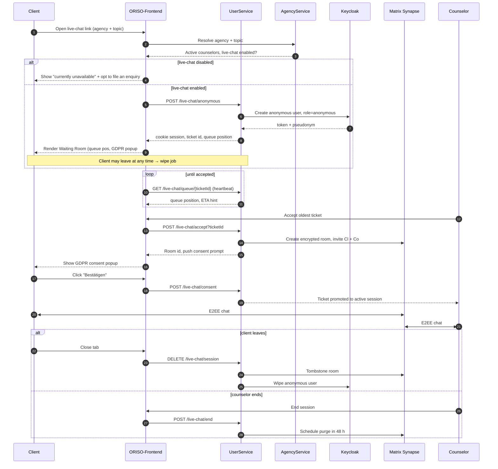
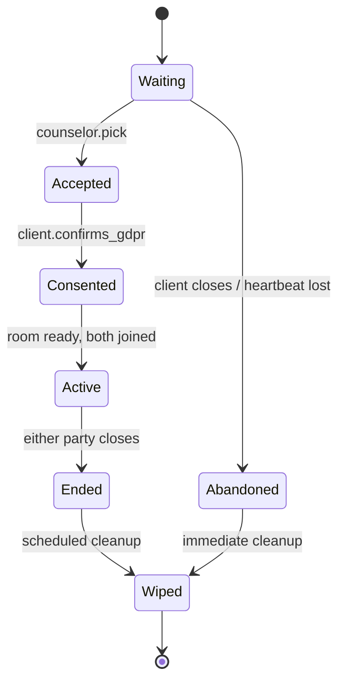

<Info>
Live-Chat ist die **zentrale Funktion** von ORISO. Der Großteil des Systems dient dazu, ihn sicher, anonym und in größerem Maßstab zu ermöglichen.
</Info>

## 4.2.1 Was Live-Chat ist

Ein anonymer Echtzeit-Textchat ohne Registrierung zwischen einer **ratsuchenden Person in Not** und **verfügbaren Beratenden** einer Beratungsstelle. Optional zu einem Videoanruf erweiterbar (LiveKit). Die Sitzung ist Ende-zu-Ende-verschlüsselt und wird unmittelbar nach Gesprächsende bereinigt.

Das Produkt unterscheidet Live-Chat vom älteren **Anfrage-Chat** (PLZ-basiert, registriert, asynchron) — beide Abläufe existieren im Code, Live-Chat ist jedoch der moderne Weg mit Vorrang für Anonymität.

<Note>
**Live-Chat ist der Einstieg als Einzelgespräch**, aber eine Sitzung bleibt nicht dauerhaft zu zweit. Beratende können im aktiven Raum **Weitere Personen einladen** (`⇧I`) anklicken, um Kolleginnen und Kollegen, Supervision oder weitere Ratsuchende hinzuzufügen — der Raum wird dann zum [Gruppenchat](/product/features/group-chats). Die Figma-Ausgabe vom Mai 2026 bestätigt außerdem, dass **Videoanrufe** (LiveKit) in denselben Raum eingebettet werden, statt eine getrennte Sitzung zu erzeugen.
</Note>

## 4.2.2 Aktivierung

Zwei Aktivierungen müssen vorliegen, damit Ratsuchende den Live-Chat mit echten Beratenden betreten können:

### A. **Aktivierung der Beratungsstelle** (Administration)

- Beratungsstellen-Admins (oder Träger-Admins) öffnen den Adminbereich.
- Erzeugen einen **Live-Chat-Link** für die Beratungsstelle mit optionalem **Themenparameter** (z. B. `?topic=debt`).
- Setzen den Schalter **Live-Chat aktiviert** der Beratungsstelle.

### B. **Aktivierung der Beratungsperson** (je Person)

- Die Beratungsperson meldet sich im Adminbereich an.
- Schaltet persönlich **Live-Chat: AN**.
- Ist nun in der Live-Chat-Ticketwarteschlange ihrer Beratungsstelle sichtbar.

<Note>
**Wichtige UX-Regel** (Gespräch vom 2026-05-05): Wenn Beratende auf **Live-Chat: AUS** schalten, muss der Live-Chat-Bereich **sichtbar, aber deaktiviert bleiben**, mit Hinweis zur erneuten Aktivierung. Er darf **nicht** aus der Navigation verschwinden. Dies verhindert die in früheren Versionen entstandene Verwirrung „Eine Funktion ist verschwunden“.
</Note>

## 4.2.3 Echtzeitablauf (Schritt für Schritt)



## 4.2.4 Interaktion nach Rolle

### Ratsuchende (anonym)

- Rufen den Live-Chat-Link auf.
- Erhalten automatisch ein **Pseudonym** (z. B. *„geschmeidiges Kanninchen Kim“* — eine deutsche Tier-Adjektiv-Kombination).
- Sehen den **Warteraum** mit Warteschlangenposition („23 Noch vor Ihnen“), einer animierten Atemspiel-Ablenkung und einem Banner: *„Nachrichten sind Ende-zu-Ende-verschlüsselt und werden nach 48 Stunden automatisch gelöscht“*.
- Erhalten das **erste DSGVO-Popup** („Bestätigen“) zur allgemeinen Datenrichtlinie der Plattform.
- Nach Übernahme durch Beratende sehen sie das **zweite DSGVO-Popup** mit den Bedingungen der jeweiligen Beratungsstelle.
- Nach Einwilligung öffnet sich der Chat.

### Beratende

- Sehen eine **Ticketwarteschlange** im Live-Chat-Tab, **älteste zuerst** (bewusst — priorisiert die am längsten wartende Person).
- Jedes Ticket zeigt Pseudonym, „Vor N Minuten beigetreten“, Thema.
- Wählen ein beliebiges sichtbares Ticket (bewusst keine automatische Zuweisung — um spätere PLZ-Berücksichtigung zu ermöglichen).
- Sehen den geöffneten Chatraum mit Systemnachricht „DSGVO-Einwilligung der ratsuchenden Person ausstehend“.
- Nach Bestätigung wird der vollständige Chat freigeschaltet.

### Beratungsstellen-Admins (Leitung)

- Beobachten gesamte Warteschlangengröße und aktive Beratende der Stelle.
- Können deren Live-Chat-Schalter umstellen.
- Konfigurieren den Live-Chat-Link (Thema und linkbezogene Überschreibung).

### Plattform-/Träger-Admins

- Können keine Ticketinhalte sehen.
- Sehen zusammengefasste Metriken (Anzahl Wartender, durchschnittliche Wartezeit).
- Legen Vorlagen für Rechtstexte fest, die entlang der Vererbungskette weitergegeben werden.

## 4.2.5 Die zwei DSGVO-Einwilligungen (warum zwei?)

Dies ist **das** Detail, das Frank im Gespräch betont hat. Es gibt **zwei** Einwilligungszeitpunkte, weil sie **zwei** unterschiedliche Datenbereiche abdecken:

| Zeitpunkt | Abdeckung | Verantwortlich | Umfang erhobener Daten |
|---|---|---|---|
| **Nr. 1 — beim Betreten des Warteraums** | Allgemeine Datenrichtlinie und Impressum der Plattform | Plattform-Admins | Pseudonym, Cookie, Warteschlangenzähler, optional Thema und PLZ |
| **Nr. 2 — bei Übernahme durch Beratende** | DSGVO-Vereinbarung der **Beratungsstelle** | Beratungsstellen-Admins / vom Träger / von der Plattform geerbt | Alles, was Ratsuchende und Beratende im Chat austauschen |

Lehnen Ratsuchende Nr. 2 ab, öffnet sich der Chat **niemals** — Beratende erhalten „Ratsuchende haben abgelehnt“ und das Pseudonym wird gelöscht.

## 4.2.6 Backend-Logik (aus Code und Gespräch abgeleitet)

Routen (UserService, REST):

```
POST   /live-chat/anonymous         create pseudonymous user + ticket
GET    /live-chat/queue/{ticketId}  long-poll / WS heartbeat
POST   /live-chat/accept            counselor accepts ticket
POST   /live-chat/consent           client confirms GDPR #2
POST   /live-chat/end               either side closes
DELETE /live-chat/session           explicit teardown + wipe
```

Zustandsautomat eines Tickets:



Nebenwirkungen bei Zustandswechsel:

- `Waiting → Abandoned`: Keycloak-Person gelöscht; Ticketzeile gelöscht; Cookie ungültig.
- `Active → Ended`: Matrix-Raum bleibt für ≤ 48 Stunden und wird dann gelöscht; Sitzungsmetadaten anonymisiert.
- Beliebig → `Wiped`: Pseudonym aus allen Speichern entfernt; nur eine nicht aussagekräftige, nicht identifizierende session_id darf für Prüfzwecke bleiben.

## 4.2.7 Sonderfälle (live-chatspezifisch)

- **Beratende gehen während Übernahme offline** → Ticket nach Heartbeat-Zeitüberschreitung automatisch zurück in Warteschlange.
- **Beratende nehmen an, aber Tab der Ratsuchenden ist weg** → System wiederholt Einwilligungsabfrage mit Zeitlimit; bei Ablauf kehrt Ticket in Warteschlange zurück und ratsuchende Person wird gelöscht.
- **Mehrere Beratende nehmen gleichzeitig an** → AgencyService verwendet Zeilensperre; zweiter Klick zeigt „bereits übernommen“.
- **Live-Chat-Link für deaktivierte Beratungsstelle erzeugt** → Freundliche Seite „derzeit nicht verfügbar“ mit alternativer Anfragemöglichkeit.
- **Thema im Link fehlt** → Rückfall auf allgemeine Warteschlange der Beratungsstelle (beliebiges Thema).
- **Browserspracherkennung** → Beim ersten Anzeigen lädt die Oberfläche die bevorzugte Browsersprache; Rückfall ist Englisch (nicht Deutsch). Franks ausdrückliche Anforderung.

Der vollständige Katalog steht unter [Sonderfälle](/product/edge-cases).

## 4.2.8 Fehlmuster (was ORISO nicht tun darf)

- ❌ Ratsuchende automatisch den nächsten Beratenden in der Warteschlange zuweisen (verliert PLZ-/Themenflexibilität).
- ❌ Live-Chat-Bereich bei Ausschalten ausblenden (stattdessen *deaktivierten Zustand* verwenden).
- ❌ IP-Adressen Ratsuchender in Protokolle oder Datenbank schreiben.
- ❌ Nicht angenommene Tickets unbegrenzt behalten (war ein echter Fehler — Ratsuchende sammelten sich dauerhaft an).
- ❌ Einwilligung Nr. 2 überspringen, weil Nr. 1 erteilt wurde.
- ❌ Live-Chat im Entwicklungsmodus wieder online bringen.

## 4.2.9 Verwandte Seiten

- [Gruppenchats und Versand an mehrere Empfänger (4.5)](/product/features/group-chats) — was aus einem Einzelchat nach `Invite more people` wird.
- [KI-Werkzeuge (4.6)](/product/features/ai-tools) — Markierung, Unkenntlichmachung, Zusammenfassung im Chat.
- [Fallübergabe (4.7)](/product/features/handover) — diesen Chat an andere Beratende übergeben.
- [Benachrichtigungen und Hilfsanfragen (4.8)](/product/features/notifications) — Eskalation aus dem Chat.
- [Pincode-basierter Chat und Zugang](/product/features/pincode-chat)
- [Sitzungsverwaltung](/product/features/session-management)
- [Nutzungsablauf: Live-Chat-Aktivierung](/product/user-flows#5-5-live-chat-activation)
- [UI/UX-Auslegung](/product/ui-ux)
- [Figma-Analyse (Mai 2026)](/product/figma-analysis-2026-05)
