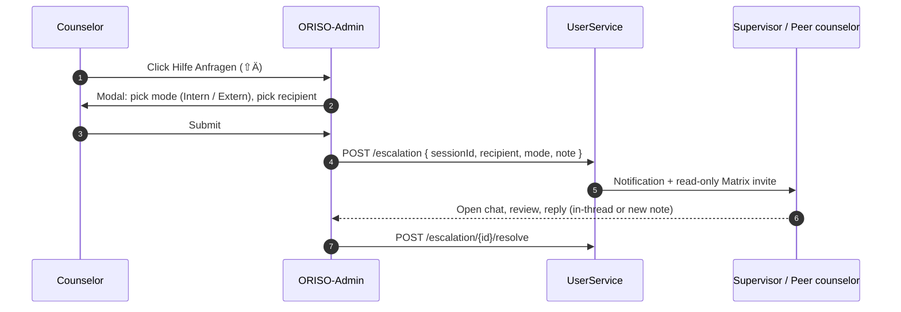

<Info>
Die Figma-Ausgabe vom Mai 2026 ergänzt eine eigene Seite **Benachrichtigungen** und einen strukturierten Ablauf für **Hilfsanfragen / Eskalation** innerhalb der Chatraum-Einstellungen. Zusammen bilden sie die Ebene für asynchrone Nachrichten und Eskalation der Plattform.
</Info>

## 4.8.1 Neuerungen

| Funktion | Ursprung |
|---|---|
| **Benachrichtigungseingang** | Eigene Seite in der Seitenleiste mit Zähler |
| **Systemnachrichten** mit typisierten Bannern (Urlaub, Krankheit, Notfall, …) | Im Chat |
| **Hilfsanfragen** als Dialog `⇧Ä` aus den Chatraum-Einstellungen | Im Chat |
| **E-Mail-Kopie** der Benachrichtigungen (nur bei angegebener E-Mail-Adresse) | Backend |
| **Carimat / skriptgesteuerte Chatbot-Einstiegsnachrichten** | Neuer Ursprung für Systemnachrichten |

## 4.8.2 Benachrichtigungseingang

### Was Nutzende sehen

Eine eigene Seite (`Notifications`), erreichbar über eine Schaltfläche in der Seitenleiste; diese zeigt einen Zähler ungelesener Nachrichten.

Jeder Benachrichtigungseintrag enthält:
- **Typkennzeichnung** (Systembenachrichtigung, Anfrageaktualisierung, Übergabe, wichtige Benachrichtigung, Urlaub, Krankheit, Notfall).
- **Titel** (z. B. *„Ihre Anfrage wurde von einer Beratungsperson angenommen.“*).
- **Inhalt** (z. B. *„Ihre letzte Beratungsanfrage wurde angenommen; Sie können jetzt mit der Beratungsperson chatten.“*).
- **Datum** im Format `MM/DD/YYYY`.
- Schaltfläche **Antworten** (öffnet den betreffenden Chat).
- Aufruf **Chats ansehen** oben im Eingang.

### Quellen der Benachrichtigungen

| Quelle | Beispiel |
|---|---|
| `inquiry.accepted` | „Ihre Anfrage wurde von einer Beratungsperson angenommen.“ |
| `handover.completed` | „Deine Beratung wurde an Gudrun übergeben.“ |
| `appointment.reminder` | „Live Mo 9. Sep 2026 um 18:00 Uhr — Kreis Suchtberatung“ |
| `chat.archived` | „Archivierte Benachrichtigungen sind inaktiv. Der Chat wird in 12 Monaten gelöscht.“ |
| `mfa.required` | „Bitte aktivieren Sie 2FA, um Ihr Konto zu schützen.“ |
| `account.deletion` | „Ihr Konto wurde gelöscht.“ |
| `system.maintenance` | „Wartungsfenster heute 02:00–03:00 UTC.“ |

### Kanäle

- **In der App** (immer).
- **E-Mail** (nur wenn Ratsuchende eine angegeben haben — für Beratende niemals sichtbar).
- **Push** (über Matrix Push Gateway geplant — siehe [Figma-Analyse §4.7](/product/figma-analysis-2026-05#4-7-notification-channels)).

### Speicherung und Aufbewahrung

- Benachrichtigungen sind **personenbezogen zugeordnet**.
- Ungelesen → 90 Tage, danach archiviert.
- Archiviert → zwölf Monate, danach gelöscht.
- Benachrichtigungen der Ratsuchenden werden zusammen mit deren Konto bei Verbindungsabbruch / Kontolöschung entfernt.

## 4.8.3 Hilfsanfragen / interne Eskalation

Ausgelöst über **Chatraum Einstellungen → Hilfe Anfragen (`⇧Ä`)**, mit dem Text:

> *„Eskaliere den Fall intern oder extern ohne den Datenschutz zu vernachlässigen.“*
> *„Wähle intern von einer Person ohne den Datenschutz zu vernachlässigen.“*

### Ablauf

### Modi

| Modus | Verhalten |
|---|---|
| **Intern** | Andere Beratende oder Supervision innerhalb derselben Beratungsstelle auswählen. Sie werden dem Raum hinzugefügt (Matrix-Einladung) — standardmäßig nur lesend. |
| **Extern** | Übergabe oder Eskalation in menschlicher Sprache auslösen (z. B. Krisentelefon, Aufsicht). Externe Empfänger erhalten **niemals** Nachrichteninhalte — nur Metadaten und einen Einladungslink nach ausdrücklicher Zustimmung. |

### Datenschutzgarantien

- Empfänger erhalten denselben E2EE-Schutz wie reguläre Mitglieder.
- Bei externer Eskalation werden nur **nicht aussagekräftige Metadaten** und ein Token zur Rückkontaktaufnahme gesendet.
- Das Prüfprotokoll erfasst das Eskalationsereignis, niemals Nachrichteninhalte.

## 4.8.4 Systemnachrichten im Chat

Eine typisierte Systematik automatisch erzeugter Banner, die im Chat erscheinen können:

| Typschlüssel | Bannertext (DE/EN) | Auslöser |
|---|---|---|
| `inquiry.accepted` | *„Ihre Anfrage wurde von einer Beratungsperson angenommen.“* | Beratende nehmen ein Ticket an |
| `consent.required` | *„Bitte stimmen Sie der Datenschutzerklärung der Beratungsstelle zu.“* | DSGVO-Abfrage Nr. 2 |
| `e2ee.enabled` | *„Ihre Nachrichten sind Ende-zu-Ende verschlüsselt …“* | Raumerstellung |
| `supervision.added` | *„Die Beratungsperson hat eine Supervision zu diesem Chat hinzugefügt, die ihn begleiten wird.“* | Supervision tritt bei |
| `handover.completed` | *„Deine Beratung wurde an {Berater:in} übergeben: Grund {reason}.“* | Übergabe abgeschlossen |
| `live_call.active` | *„Derzeit aktiver Anruf → Videoanruf beitreten“* | Ein LiveKit-Anruf beginnt |
| `live_call.ended` | *„Anrufsitzung beendet.“* | Anruf beendet |
| `chat.archived` | *„Archivierte Benachrichtigungen sind inaktiv. Der Chat wird in 12 Monaten gelöscht.“* | Chat archiviert |
| `holiday`, `sickness`, `emergency`, `law_violation`, `colleague_fired` | Grundspezifischer Text | Übergabe oder Nichtverfügbarkeit von Beratenden |
| `chatbot.onboarding` | Skriptgesteuert, mehrstufig (Carimat) | Erstmaliger Einstieg |
| `chatbot.quick_guide` | Skriptgesteuerte Hilfe | Beratende oder Ratsuchende fragen Anleitung an |

Systemnachrichten haben eine eigene Gestaltung (zentriert, neutrale Farbe), um sie von menschlichen Nachrichten zu unterscheiden.

## 4.8.5 Carimat — skriptgesteuerter Bot

Carimat ist der geplante **regelbasierte** Einstiegsbot der Plattform. Er ist **kein** LLM. Verhalten:

- Sendet die ersten Systemnachrichten (E2EE-Banner, DSGVO-Text).
- Führt neue Ratsuchende optional durch eine mehrstufige Kurzanleitung.
- Reagiert auf ausdrückliche Befehle wie `/help`, `/topic`, `/language`.
- Kann Antworten nicht lesen — er sendet nur vorbereitete Inhalte anhand von Auslösern.

Status: **[NEUE FUNKTION]** — Name in Figma bestätigt; Verhalten vorgeschlagen.

## 4.8.6 Berechtigungen und Einstellungen

Steuerungen je Chat-Typ (siehe [Rollen und Berechtigungen §3.7](/product/roles-permissions#3-7-per-chat-type-permissions-matrix)):

- Benachrichtigungen können je Chat stummgeschaltet werden (`Stummschalten ⇧Ö`).
- Träger-Admins können Hilfsanfragen für einen Chat-Typ vollständig deaktivieren.
- E-Mail-Kopien erfordern die Zustimmung der jeweiligen Person und die Erlaubnis auf Trägerebene.

## 4.8.7 Sonderfälle

- **Person ohne E-Mail-Adresse** aktiviert E-Mail-Kopien → Oberfläche erklärt, dass dies erst nach Hinzufügen einer Adresse verfügbar ist.
- **Benachrichtigung trifft für gelöschtes Pseudonym ein** → Sie wird stillschweigend verworfen; der Absender erhält keinen Zustellfehler.
- **Hilfsanfrage an Beratende im Urlaub** → Fällt auf die nächste verfügbare Supervision der Beratungsstelle zurück.
- **Zeitlimit bei externer Eskalation** → Nach 24 Stunden abbrechen; Beratende informieren; nichts verlässt das System.

## 4.8.8 Verwandte Seiten

- [Gruppenchats](/product/features/group-chats) — Hilfsanfragen befinden sich in den Chatraum-Einstellungen.
- [Übergabe](/product/features/handover) — arbeitet mit Systemnachrichten und Benachrichtigungen zusammen.
- [Rollen und Berechtigungen](/product/roles-permissions).
- [Figma-Analyse](/product/figma-analysis-2026-05).
