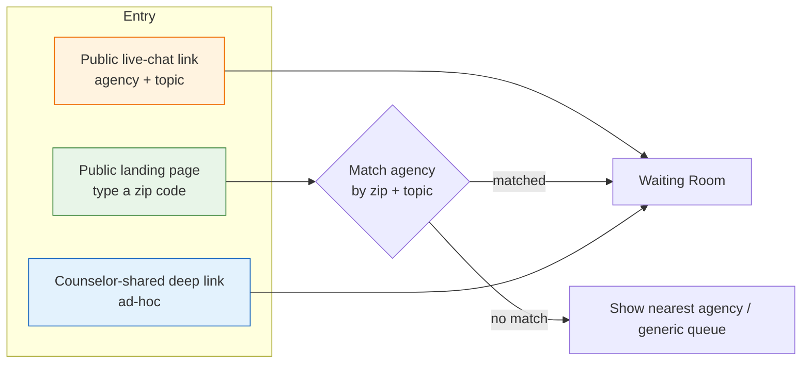

<Info>
„Pincode“ bezeichnet in ORISO **zwei zusammenhängende, aber unterschiedliche Konzepte**: (1) die deutsche **Postleitzahl** (PLZ), mit der Anfragen an regional zuständige Beratende geleitet werden, und (2) den **Live-Chat-Link mit Token**, der für eine bestimmte Kombination aus Beratungsstelle und Thema erzeugt wird. Beide werden hier beschrieben.
</Info>

## 4.3.1 Was „Pincode“ in diesem System bedeutet

| Begriff | Tatsächliche Bedeutung | Speicherort |
|---|---|---|
| **PLZ-basierte Weiterleitung** | Eine von Ratsuchenden eingegebene fünfstellige deutsche Postleitzahl, um regionale Beratende zu finden | Beratungsstellen in `AgencyService` zugeordnet (`agency_postcode_range`) |
| **Live-Chat-Link** | Eine signierte URL der Form `https://app.oriso-dev.site/live-chat/{agencySlug}?topic={topicSlug}` | In `AgencyService` erzeugt und gespeichert |
| **Magic Link (Einladung für Beratende)** | Ein einmalig nutzbarer signierter Link, der die Erstellung eines Keycloak-Kontos startet | Von UserService ausgestellt; **unterscheidet sich** von Live-Chat-Links |

<Warning>
Ein häufiger Fehler in früheren Entwicklungsständen war die Verwechslung von **Live-Chat-Links** mit **Magic Links für Einladungen**. Sie sind verschieden. Live-Chat-Links sind öffentlich, wiederverwendbar und auf ein Thema begrenzt. Magic Links sind privat, einmalig und werden nur für Personaleinladungen verwendet.
</Warning>

## 4.3.2 Wie Nutzende über einen Link oder Code beitreten

Es gibt drei Wege, auf denen Ratsuchende in den Live-Chat-Warteraum gelangen:



### Weg A — direkter Live-Chat-Link (heute bevorzugt)

Die Administration der Beratungsstelle erzeugt im Adminbereich einen Link:

```
https://app.oriso-dev.site/live-chat/schuldnerberatung-mitte?topic=debt
```

Wenn Ratsuchende ihn anklicken:
1. Das Frontend liest `agencySlug` und `topic` aus der URL.
2. Es ruft `AgencyService` auf, um Existenz der Beratungsstelle, Aktivierung des Live-Chats und Verfügbarkeit des Themas zu prüfen.
3. Es ruft `UserService` auf, um eine anonyme Person anzulegen.
4. Es zeigt den Warteraum an.

Der Link ist **idempotent** — er kann auf der öffentlichen Website der Beratungsstelle, auf Instagram oder auf Flyern geteilt werden. Jedes erneute Öffnen desselben Links erzeugt eine neue anonyme Sitzung.

### Weg B — Postleitzahl-Suche (älterer Ablauf)

Ratsuchende besuchen das öffentliche Portal, geben `12345` (ihre PLZ) ein und sehen alle Beratungsstellen, deren Postleitzahlenbereich diese PLZ umfasst. Sie wählen eine aus und gelangen in deren Warteraum.

Dies ist der **historische** Ablauf. Frank bezeichnete ihn im Gespräch als „unflexibel“. Das Team plant, ihn mit Weg A zusammenzuführen, indem die Postleitzahl als zusätzlicher URL-Parameter (`?topic=debt&plz=12345`) angehängt wird — siehe [Annahmen](/product/assumptions).

### Weg C — von Beratenden geteilter Direktlink (ad hoc)

Beratende einer Beratungsstelle können ihren persönlichen Live-Chat-Link im Adminbereich kopieren und gezielt mit einer ratsuchenden Person teilen (z. B. per E-Mail). Der Mechanismus entspricht Weg A, ist aber auf das Hauptthema dieser Beratungsperson festgelegt.

## 4.3.3 Wie Links und Codes erzeugt werden

### Live-Chat-Link erzeugen (Weg A)

Wenn die Administration der Beratungsstelle im Adminbereich **„Live-Chat-Link erzeugen“** anklickt:

1. AgencyService erzeugt einen `AgencyLiveChatLink`-Datensatz mit:
   - `agency_id`
   - `topic_id` (optional — null bedeutet „beliebiges Thema“)
   - `slug` (URL-taugliche Kennung der Beratungsstelle)
   - `enabled` (boolescher Wert)
   - `created_by` (Benutzer-ID der Administration der Beratungsstelle)
2. Die URL wird zusammengesetzt: `{frontend_base}/live-chat/{slug}?topic={topic_slug}`.
3. Die **Administration kann den Link deaktivieren** (setzt `enabled=false`); vorhandene Besucher erhalten eine verständliche Seite „derzeit nicht verfügbar“.

<Note>
Im aktuellen Produktivcode ist die Seite zur Linkerstellung überkompliziert (Franks Formulierung). Die vereinfachte Regel, auf die das Team hinarbeitet: **ein Link je Beratungsstelle und Thema**, mit optionaler Überschreibung. Siehe den Backlog-Eintrag „fix live chat link generation“ aus dem Gespräch vom 2026-05-05.
</Note>

### Logik der PLZ-Weiterleitung (Weg B)

Beratungsstellen besitzen einen oder mehrere Postleitzahlenbereiche:

```sql
agency_postcode_range(
  id, agency_id, postcode_from, postcode_to, topic_id
)
```

Wenn Ratsuchende `10115` eingeben:
- AgencyService fragt `agency_postcode_range` ab, wobei `postcode_from <= '10115' <= postcode_to` gilt.
- Es filtert nach `topic_id`, wenn auch ein Thema ausgewählt wurde.
- Es liefert alle passenden Beratungsstellen nach Relevanz sortiert zurück.

### Magic Link für Einladungen (Einstieg für Beratende — getrennt!)

Ein **eigener** Mechanismus. Plattform- oder Träger-Admins laden Beratende ein; UserService stellt einen einmalig nutzbaren signierten JWT innerhalb einer URL aus. Klick → Keycloak-Seite zur Kontoerstellung → Rollenzuweisung → Anmeldung der Beratungsperson. **Niemals** wiederverwendet.

## 4.3.4 Validierungsregeln

| Feld | Regel |
|---|---|
| Kennung des Live-Chat-Links | Muss je Träger eindeutig sein; Kleinbuchstaben und Bindestriche; 3–64 Zeichen |
| Themenkennung | Muss in der globalen Themenliste enthalten sein (durch Themen-Admins verwaltet) |
| Postleitzahl | Muss eine gültige deutsche PLZ sein (fünf Ziffern, bekannter Bereich) |
| Magic-Link-Einladungstoken | Einmalige Verwendung, Ablauf nach 24 Stunden; an E-Mail und Rolle gebunden; HMAC-signiert |
| Live-Chat-Link-Schalter `enabled` | Muss den Live-Chat-Schalter der Beratungsstelle berücksichtigen (durch UND verknüpft) |

## 4.3.5 Folgen für die Sicherheit

- **Aufzählen öffentlicher Links** — Wer die Kennung einer Beratungsstelle kennt, kann eine Sitzung starten. Dies ist **beabsichtigt** — es gibt nichts zu stehlen: Der Besuch ist anonym und erhält eine leere Warteschlangenposition. Ratenbegrenzung am Ingress ist die Gegenmaßnahme.
- **Vorhersagbarkeit von Pseudonymen** — Pseudonyme werden auf dem Server aus einem großen Namensraum erzeugt; es besteht kein Risiko, dass zwei gleichzeitig anwesende Ratsuchende innerhalb einer Sitzung kollidieren.
- **Kein Token in der URL** — Der Live-Chat-Link enthält **kein** Authentifizierungstoken. Das anonyme Keycloak-Token wird *nach* dem Aufruf ausgestellt. Deshalb kann der Link sicher in sozialen Medien veröffentlicht werden.
- **Magic-Link-Einladungstoken sind anders** — sie enthalten Geheimnisse; als Bearer-Zugangsdaten behandeln; nur HTTPS; HMAC-validiert; einmalig.
- **Trägerübergreifende Linkprüfung** — Die vom Nutzer übergebene Kennung einer Beratungsstelle wird über den Resolver stets auf den Träger begrenzt; Angreifer können keine Kennungen eines anderen Trägers aufzählen.
- **Ratenbegrenzung** — UserService begrenzt `POST /live-chat/anonymous` je IP-Adresse, um eine Dienstverweigerung durch Ticketflut zu verhindern. (IP-Adressen werden **nur** für Ratenbegrenzung im Arbeitsspeicher genutzt und niemals dauerhaft gespeichert — dies wird in der Produktivkonfiguration ausdrücklich durchgesetzt.)

## 4.3.6 Sonderfälle

- **Deaktivierter Link erneut verwendet** → Statische Seite „nicht verfügbar“; 404, wenn die Beratungsstelle gelöscht wurde.
- **Ungültiges Thema in der URL** → Rückfall auf die allgemeine Warteschlange der Beratungsstelle (beliebiges Thema) und Protokollierung einer milden Warnung.
- **Falsche PLZ eingegeben** → Anzeige „keine Treffer in Ihrer Umgebung“ mit einem Aufruf zum plattformweiten Anfrageformular.
- **PLZ passt zu mehreren Beratungsstellen** → Diese werden aufgelistet; Ratsuchende wählen; bei übergebenem Thema wird die Liste gefiltert.
- **Administration löscht einen Link während einer Sitzung** → Aktive Sitzungen laufen weiter; nur neue Aufrufe werden blockiert.
- **Bot verwendet Live-Chat-Link für Ticketflut** → Ratenbegrenzung liefert HTTP 429; Beratende werden nicht mit Bot-Tickets belastet.

## 4.3.7 Planung (aus dem Gespräch)

- Postleitzahl als optionalen Parameter `?plz=...` in den Live-Chat-Link integrieren, damit Beratende gleichzeitig nach Thema *und* Region ausgewählt werden können.
- Die derzeit überkomplizierte Oberfläche zur Linkverwaltung durch einen einzigen Schalter „Link erzeugen“ je Thema ersetzen.
- Eine globale Themenregistrierung hinzufügen, damit jedes Thema einen eigenen kanonischen Live-Chat-Link besitzt, der automatisch von der Beratungsstelle abgeleitet wird.
- Zugeordnete Themen auf dem eigenen Live-Chat-Dashboard der Beratenden anzeigen (damit sie bequem zwei bis drei Themen bedienen können).

## 4.3.8 Verwandte Seiten

- [Live-Chat (4.2)](/product/features/live-chat)
- [Sitzungsverwaltung (4.4)](/product/features/session-management)
- [Annahmen und offene Fragen](/product/assumptions)
