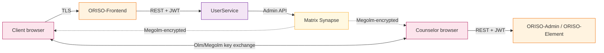
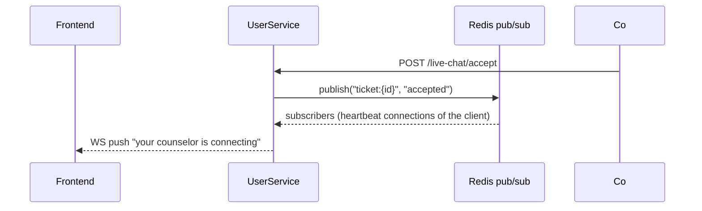

<Info>
Diese Seite vertieft die Entwicklersicht. Die vielen Querverweise zur Architektur ([Abschnitt 2](/product/architecture)) und zum Datenmodell ([Abschnitt 7](/product/data-model)) sind bewusst gesetzt — sie zeigen dasselbe System aus unterschiedlichen Blickwinkeln.
</Info>

## 6.1 Chat- / Transkriptionspipeline

ORISOs „Chat-Pipeline“ ist kürzer als bei vielen Chat-Plattformen, weil die Plattform bewusst **keine Nachrichteninhalte sieht**. Der Ablauf:



Aufgabe jedes Teilstücks:

1. **Ratsuchende → ORISO-Frontend (TLS)** — Oberflächenverkehr, keine Nachrichteninhalte.
2. **Frontend → UserService (REST und Keycloak-JWT)** — nur Steueraufrufe: Ticket erzeugen, annehmen, Heartbeat senden, Sitzung beenden.
3. **UserService → Matrix Synapse (Admin-API)** — UserService ist privilegierter Matrix-Admin: stellt Räume bereit, lädt Personen ein, liest aber **niemals** Nachrichteninhalte.
4. **Browser ↔ Browser (Megolm)** — Nachrichteninhalte fließen als verschlüsselter Text durch Synapse; nur teilnehmende Browser besitzen Entschlüsselungsschlüssel.
5. **Element / ORISO-Element** — Chat-Oberfläche; verwaltet Megolm-Sitzung im Browserarbeitsspeicher.

### Bedeutung

Der Server (und damit missbräuchliche Admins oder eine kompromittierte Datenbank) sieht:

- Dass Sitzung X zwischen Beratungsperson A und Pseudonym Y existiert.
- Dass N Nachrichten zu Zeitpunkten T1…Tn ausgetauscht wurden.
- Nichts Weiteres.

Dies ist eine bewusste Entwurfsbedingung für **jede** künftige Funktion einschließlich KI-Notizen — diese müssen auf Client-Seite bleiben.

### LiveKit-Teil (Video)

Optional. UserService stellt kurzlebigen LiveKit-JWT mit Raumname und Mitgliedsidentität aus; Browser verbindet sich direkt per WebRTC mit LiveKit. Audio/Video wird auf dem Server **nicht aufgezeichnet**.

## 6.2 Datenspeichermodell (dauerhafte Ablage)

Drei logische Gruppen:

### 6.2.1 Maßgebliche relationale Daten — MariaDB

| Datenbank | Verantwortung |
|---|---|
| `tenantservice` | Träger, Rechtstextvorlagen auf Trägerebene (Impressum, Datenrichtlinie, DSGVO), Datenrichtlinienunterschriften |
| `userservice` | Personen, Sitzungen, Live-Chat-Tickets, Beratende, Supervisionsfunktionen, Magic-Link-Ausstellungsprotokoll, Prüfprotokoll |
| `agencyservice` | Beratungsstellen, Live-Chat-Links, PLZ-Bereiche, Beratungsstellen↔Beratende↔Themen-Zuordnungen, Einstellungen |
| `consultingtypeservice` | Themen, Grundkonfiguration |

Alle Datenbanken liegen im selben MariaDB-ClusterIP-Dienst, sind aber **logisch isoliert**. Datenbankübergreifende Joins sind verboten — Dienste rufen einander per REST auf.

### 6.2.2 Maßgebliche Dokumentdaten — MongoDB

| Sammlung | Zweck |
|---|---|
| `consulting_types` | Themenkonfiguration: Titel, Beschreibung, allgemeine DSGVO-Textbausteine, mehrsprachige Bezeichnungen, optionale dynamische Oberflächenmetadaten |

Die Trennung zwischen relationalen und Dokumentdaten ist historisch: Umfangreiche JSON-Themenkonfiguration war einfacher in MongoDB zu halten.

### 6.2.3 Maßgebliche verschlüsselte Nachrichten — PostgreSQL (Synapse)

| Tabelle | Verantwortung |
|---|---|
| `events` | Rohe Matrix-Ereignisse (Nachrichteninhalte als verschlüsselter Text) |
| `rooms` | Raum-ID, Mitglieder, Tombstone-Zustand |
| `e2e_*` | Megolm-Sitzungsmetadaten |

Synapse ist für Backend-Dienste absichtlich **nur lesbar**. Selbst Prüfcode liest diese Datenbank nicht direkt, sondern verwendet die Synapse-Admin-API.

### 6.2.4 Caches und Warteschlangen

- **Redis** — Sitzungscaches, Warteschlangenzähler (damit Warteraum „23 vor Ihnen“ ohne Datenbanküberlastung berechnet), Ingress-Ratenzähler, Anmeldeversuchszähler.
- **RabbitMQ** — asynchrone Aufgaben: Bereinigung veralteter anonymer Personen, geplante Raumlöschung, Magic-Link-Ablauf.

## 6.3 Ereignisfluss (Echtzeit)

Zwei Echtzeitkanäle laufen parallel:

### 6.3.1 Steuerungsebene (UserService ↔ Frontend)

WebSocket-/SSE-Kanal für Ticketzustandsänderungen, Warteschlangenposition und Hinweise „Ihre Beratungsperson verbindet sich“. Als WebSocket oder Long-Poll-Rückfall umgesetzt.



Redis Pub/Sub verteilt Ereignisse an mehrere UserService-Pods, sodass eine mit Pod A verbundene ratsuchende Person das Ereignis auch erhält, wenn Beratende auf Pod B das Ticket annehmen.

### 6.3.2 Chat-Ebene (Matrix ↔ Browser)

Reine Matrix-Synchronisierung: Clients öffnen Long-Poll `/_matrix/client/r0/sync` zu Synapse und erhalten Ereignisse. Chat-Ebene ist von UserService **unabhängig**.

### 6.3.3 Echtzeitgarantien

- **Mindestens einmalige Zustellung** von Steuerereignissen (idempotenter Zustandsautomat behandelt Duplikate).
- **Geordnete Zustellung** von Chat-Nachrichten (Matrix-Garantie).
- **Keine globale Reihenfolge** zwischen Steuer- und Chat-Ebene — Oberfläche muss beide möglichen Ankunftsreihenfolgen vertragen.

## 6.4 Authentifizierung und Berechtigungen

### 6.4.1 AuthN — Keycloak OIDC

Jede Person ist in Keycloak angelegt. Fünf Tokenformen:

| Tokentyp | Ausgestellt für | Realm-Rolle |
|---|---|---|
| Anonymes Ratsuchendentoken | Warteraumbesuch | `anonymous` |
| Benutzertoken (geplant) | Künftig registrierte Ratsuchende | `user` |
| Beratungstoken | Beratende | `consultant` (plus Kennzeichnungen `supervisor-consultant`, `group-chat-consultant`) |
| Admin-Token | Beratungsstellen-/Träger-/Plattform-Admins | `agency-admin`, `tenant-admin`, `user-admin`, … |
| Dienstkonto-Token | Dienstübergreifende Aufrufe | `technical`, `notifications-technical` |

MFA im Keycloak-Anmeldeablauf für `tenant-admin` und `user-admin` durchgesetzt. Für `agency-admin` und `consultant` empfohlen, nicht erzwungen.

### 6.4.2 AuthZ — Spring Security

Jeder Backend-Dienst nutzt Spring Security mit einem auf Keycloak gerichteten JWT-Decoder. Realm-Rollen werden über `Authority.java` auf **gewährte Berechtigungen** abgebildet:

```java
USER_ADMIN(UserRole.USER_ADMIN, List.of(USER_ADMIN, CONSULTANT_UPDATE, CONSULTANT_CREATE)),
TENANT_ADMIN(UserRole.TENANT_ADMIN, singletonList(AuthorityValue.TENANT_ADMIN)),
AGENCY_ADMIN(UserRole.AGENCY_ADMIN, singletonList(AuthorityValue.RESTRICTED_AGENCY_ADMIN)),
CONSULTANT(UserRole.CONSULTANT, List.of(CONSULTANT_DEFAULT, ASSIGN_CONSULTANT_TO_SESSION, VIEW_AGENCY_CONSULTANTS, CREATE_NEW_CHAT, START_CHAT, STOP_CHAT, UPDATE_CHAT)),
ANONYMOUS(UserRole.ANONYMOUS, singletonList(ANONYMOUS_DEFAULT)),
```

Jeder Controller-Endpunkt ist durch `@PreAuthorize("hasAuthority('AUTHORIZATION_xyz')")` geschützt. Sicherheitskritischste Berechtigungen:

- `ASSIGN_CONSULTANT_TO_SESSION` — Live-Chat-Annahme.
- `CREATE_NEW_CHAT`, `START_CHAT`, `STOP_CHAT`, `UPDATE_CHAT` — Chat-Lebenszyklus der Beratenden.
- `RESTRICTED_AGENCY_ADMIN` — Beratungsstellen-Admin.
- `TENANT_ADMIN` / `SINGLE_TENANT_ADMIN` — Träger-Admin.
- `USER_ADMIN` — Plattform-Admin.

### 6.4.3 Trägerbegrenzung

Jede Anfrage wird durch ein JWT-Attribut (z. B. `tenant_id`) **auf den Träger begrenzt**. Dienste wenden einen Trägerfilter auf Speicherungsebene an; trägerübergreifende Abfragen sind über die API physisch unmöglich.

### 6.4.4 MFA

Keycloaks *verpflichtende Aktionen* sind für `tenant-admin` und `user-admin` auf **CONFIGURE_TOTP** oder **WEBAUTHN_REGISTER** eingestellt. Nach erster Anmeldung ist MFA bei jeder weiteren Anmeldung verpflichtend.

## 6.5 Erzeugung und Prüfung von Links und Pseudonymen

### 6.5.1 Pseudonyme (Tier-Adjektiv-Paare)

Pseudonyme werden aus Zufallswerten deterministisch zusammengesetzt, wie *„geschmeidiges Kanninchen Kim“*:

1. Zufälliges Adjektiv aus kuratierter neutraler deutscher Liste wählen (etwa 500 Einträge).
2. Zufälliges Tier aus kuratierter Liste wählen (etwa 200 Einträge).
3. Zufälligen Vornamen aus kuratierter Liste wählen (etwa 3000 Einträge).
4. Zusammensetzen: `{adjective} {animal} {name}`.
5. Nur bei erkannter Kollision innerhalb aktiver Sitzungen der Beratungsstelle einen zufälligen Vier-Byte-Suffix hinzufügen.

Eigenschaften:
- Etwa 500 × 200 × 3000 ≈ **300 Millionen** eindeutige Grundpseudonyme — Kollisionswahrscheinlichkeit bei realistischer Nebenläufigkeit vernachlässigbar.
- Pseudonym ist **kein Geheimnis**, lediglich freundliche Bezeichnung.
- Pseudonym wird für dieselbe Person sitzungsübergreifend **nie wiederverwendet**, weil das System für Ratsuchende kein „Person“-Konzept besitzt.

### 6.5.2 Live-Chat-Links

Format:

```
https://app.oriso-dev.site/live-chat/{agencySlug}?topic={topicSlug}
```

Erzeugung:

1. Beratungsstellen-Admin klickt **Erzeugen**.
2. AgencyService prüft Zugehörigkeit der Stelle zum Admin-Geltungsbereich, erzeugt `AgencyLiveChatLink`-Zeile und berechnet URL.
3. Link ist **nicht signiert** — öffentliche Route. Authentifizierung nach Klick durch Ausgabe des anonymen Tokens.

Prüfung beim Klick:

1. Frontend löst `agencySlug` und `topicSlug` gegen AgencyService auf.
2. Bestätigt `agency.live_chat_enabled = true` und `agency_live_chat_link.enabled = true`.
3. Setzt optional Träger-Weiterleitungsregeln durch (Live-Chat eventuell trägerbeschränkt).
4. Stellt anonyme Keycloak-Person aus.

### 6.5.3 Magic-Link-Einladungen (Mitarbeitendeneinstieg)

Format:

```
https://admin.oriso-dev.site/invite#token={JWT}
```

Token ist kurzlebiger JWT mit Claims:

- `sub` — künftige Benutzer-ID.
- `email` — muss zur Anmeldung passen.
- `role` — bei erster Anmeldung zuzuweisende Realm-Rolle (z. B. `tenant-admin`).
- `agency_id` (optional) — für Beratenden-/Beratungsstellen-Admin-Einladungen.
- `iat`, `exp` (24 Stunden), `jti` (einmalig).

Prüfung:

1. UserService prüft HMAC.
2. Prüft `jti` gegen Redis-Menge bereits genutzter Token; bei vorhandenem Eintrag abweisen.
3. Leitet an Keycloak weiter, wo Person Passwort wählt und MFA einrichtet.
4. Nach erfolgreicher Registrierung erfasst UserService `magic_link.consumed_at` und weist Rolle zu.

Magic Links erscheinen nach Verbrauch **niemals** mehr in URLs (Sitzung nach Registrierung ist normales Keycloak-Token).

### 6.5.4 LiveKit-JWTs (Erweiterung zu Video)

Von UserService ausgestellt, wenn Beratende Video anbieten:

- `sub` — LiveKit-Identität (= Pseudonym/Anzeigename).
- `room` — LiveKit-Raum-ID.
- `grants` — `canPublish`, `canSubscribe` auf `true` gesetzt.
- `exp` — fünf Minuten (danach erneuert).

Beide Mitglieder erhalten eigene JWTs; LiveKit prüft sie beim WebSocket-Verbindungsaufbau.

## 6.6 Bereinigung und Löschung (zuverlässige Datenlöschung)

Ein gemeinsamer geplanter Job — in UserService umgesetzt, durch verzögerte RabbitMQ-Nachrichten ausgelöst — behandelt alle Löschfälle:

| Szenario | Auslöser | Aktion |
|---|---|---|
| Anonymer Heartbeat im Warteraum verloren | `last_seen_at` älter als Grenzwert | Keycloak-Person löschen; Ticketzeile löschen; Warteschlangenplatz freigeben |
| Sitzung regulär beendet | `POST /sessions/{id}/end` | Raum-Tombstone in 48 Stunden planen; Pseudonym sofort anonymisieren |
| Heartbeat aktiver Sitzung verloren | `last_seen_at` älter als fünf Minuten | Zustand auf `Ended` setzen |
| Magic Link abgelaufen | `exp` erreicht | Als verbraucht markieren; Rollenzuweisung zurücknehmen, falls ungenutzt |

Bereinigungsjob schreibt **nur nicht aussagekräftige Sitzungs-IDs** in Protokolle — keine Pseudonyme, keine IP-Adressen.

## 6.7 Konfiguration und Funktionsschalter

- **Live-Chat aktiviert (je Beratungsstelle)** — boolescher Wert auf `agency`.
- **Live-Chat aktiviert (global)** — boolescher Wert auf Träger; bei false darf keine Stelle dieses Trägers Live-Chat anbieten.
- **MFA-Durchsetzung** — verpflichtende Keycloak-Aktion; je Realm-Rolle an/aus.
- **Standard-Browsersprache** — Frontend liest `navigator.language`; Rückfall auf **Englisch** (nicht Deutsch).
- **48 Stunden Nachrichtenaufbewahrung** — einstellbar; darf produktiv nie 48 Stunden überschreiten.
- **Heartbeat-Grenzwert** — Umgebungsvariable; Standards: 30 Sekunden Heartbeat, 90 Sekunden bis Aufgabe, fünf Minuten Pause bis Ende.

## 6.8 Beobachtbarkeit

| Ebene | Werkzeug | Ausgaben |
|---|---|---|
| Verteilte Ablaufverfolgung | SignOZ / OpenTelemetry | Dienstübergreifende Spans (jede Anfrage mit ID gekennzeichnet) |
| Anwendungsprotokolle | SignOZ logs | Strukturiertes JSON; **keine** personenbezogenen Informationen, IP-Adressen oder Nachrichteninhalte |
| Zustand | Health Dashboard | Actuator-Prüfungen je Pod |
| Metriken | Prometheus → SignOZ | Warteschlangengröße, aktive Sitzungen, Bereinigungsverzögerung, MFA-Fehlerrate, Magic-Link-Verbrauchsrate |

## 6.9 Verschlüsselungsübersicht

| Ebene | Mechanismus |
|---|---|
| TLS am Rand | Cert-Manager und Let's Encrypt; HSTS aktiviert |
| Dienst zu Dienst | TLS über Kubernetes-Service-Mesh (oder normales HTTPS je Clustereinrichtung) |
| Datenbank bei Speicherung | Übliche MariaDB-/PostgreSQL-Speicherverschlüsselung plus Spaltenverschlüsselung für persönliche Felder |
| Chat-Nachrichten | Megolm E2EE (Matrix) |
| Pseudonyme in Datenbank | Klartext — keine personenbezogenen Daten, nur Bezeichnungen |
| Magic-Link-Token | HMAC-SHA-256 |
| LiveKit-Berechtigungen | Mit gemeinsamem LiveKit-Geheimnis signierter JWT |

## 6.10 Verbindliche Betriebsregeln (unverhandelbar)

- ❌ Kein `dev`-Modus im Produktivbetrieb. Niemals. (Nach Vorfall von 2026 bekräftigt.)
- ❌ Keine IP-Adressen Ratsuchender dauerhaft in Datenbank oder Protokollen.
- ❌ Keine Nachrichteninhalte in Backend-Protokollen.
- ❌ Keine Archivierung des Pseudonyms anonymer Ratsuchender.
- ❌ Kein KI-Dienst mit rohem verschlüsseltem Text auf Serverseite.
- ✅ Jährliche externe Sicherheitsprüfung des Produktivbetriebs.
- ✅ Bei Speicherung verschlüsselte Sicherungen in getrennter Region.
- ✅ Notfallwiederherstellung: realm.json in Git, damit Keycloak ohne Datenverlust für Mitarbeitende vollständig neu aufgebaut werden kann (Ratsuchende haben konzeptbedingt nichts zu verlieren).
