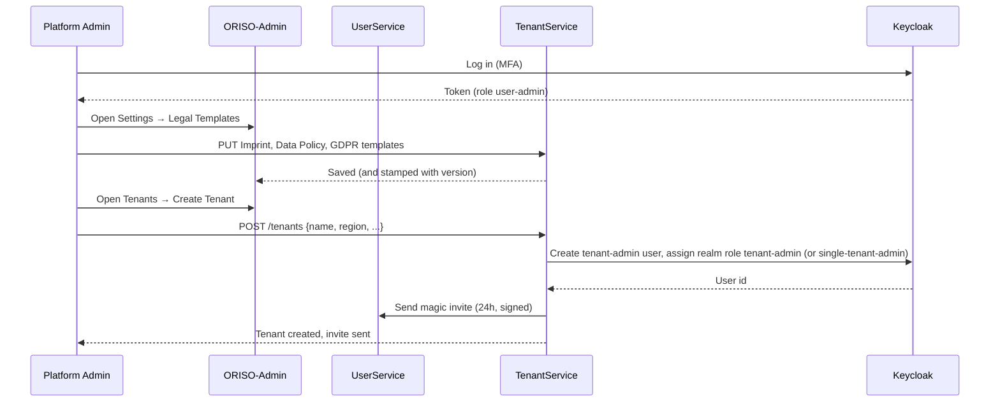
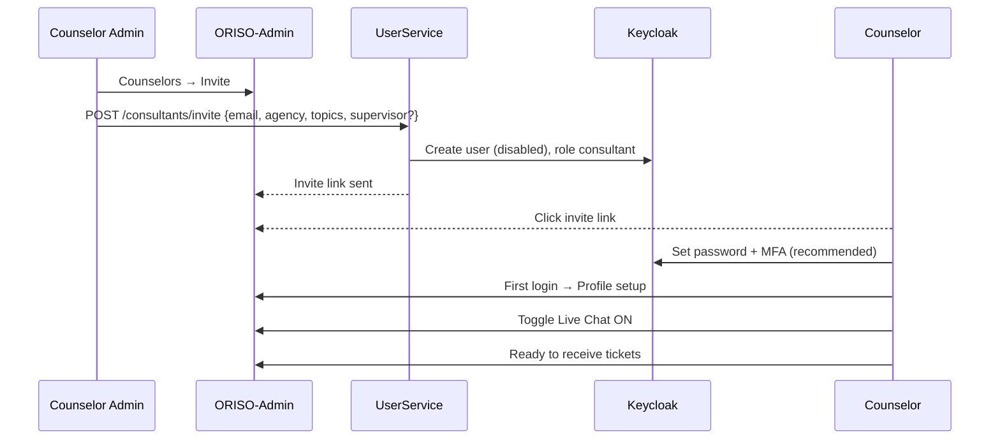
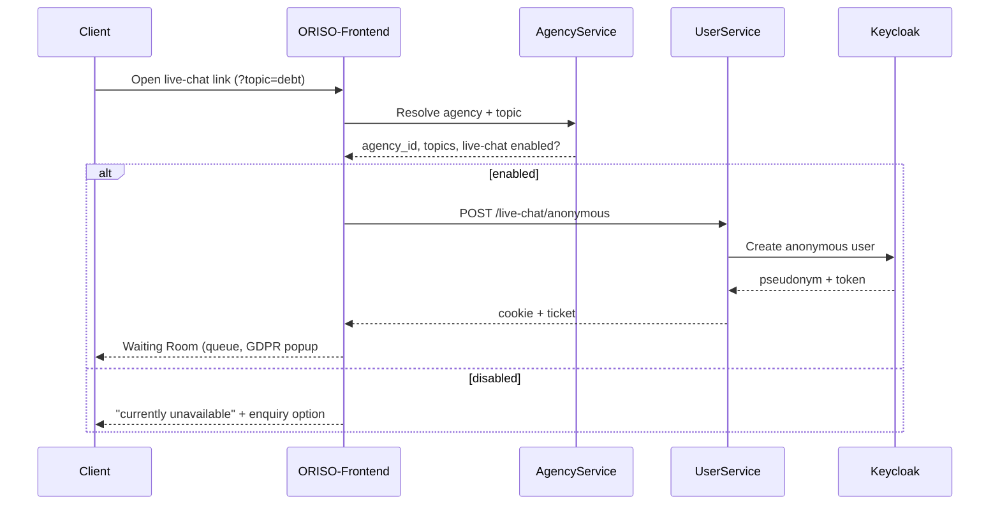

<Info>
Jeder Ablauf beschreibt **(a) das Handeln der Person** und **(b) das Handeln des Systems**, damit Entwicklung ihn umsetzen und Produktmanagement ihn vorstellen kann.
</Info>

## 5.1 Administration erstellt das System

**Rolle**: Plattform-Admin. **Ziel**: Eine neue ORISO-Bereitstellung so vorbereiten, dass Träger aufgenommen werden können.



**Schritte (Nutzersicht)**

1. Mit Keycloak-Zugangsdaten **und MFA** im Adminbereich anmelden.
2. **Einstellungen → Rechtstextvorlagen** öffnen und ausfüllen:
   - **Impressum** der Plattform.
   - **Datenrichtlinie** der Plattform (Vertrag, den der Träger unterzeichnet).
   - **DSGVO-Vereinbarung** der Plattform (Standardtext für Ratsuchende im Warteraum ohne Überschreibung durch Träger/Beratungsstelle).
3. Solange nicht alle drei ausgefüllt sind, bleibt der übrige Adminbereich gesperrt.
4. **Träger → Träger erstellen** mit Name, Region und Kontakt-E-Mail öffnen.
5. Das System sendet künftigen Träger-Admins einen einmaligen Magic Link.
6. Träger-Admins klicken ihn, unterzeichnen die Datenrichtlinie, richten MFA ein und gelangen in ihren Träger.

**Systemsicht**

- TenantService erzeugt bei jeder Änderung einer Rechtstextvorlage einen Versionsdatensatz.
- UserService prüft `Authority.user-admin` auf jeder Rechtstextvorlagenroute.
- Magic Link ist HMAC-signiert, einmalig und an E-Mail sowie Rolle gebunden.

## 5.2 Träger-Admin-Einrichtung (im Auftrag „Supervisor Setup“)

<Note>
Der Auftrag nennt „Supervisor“, aber auf **organisatorischer** Ebene entspricht dies in ORISO am ehesten dem **Träger-Admin**, der eine ganze Region betreut. „Supervision“ bezeichnet innerhalb ORISOs dagegen eine *Funktion* von Beratenden (`supervisor-consultant`) — behandelt in 5.3.
</Note>

**Rolle**: Träger-Admin. **Ziel**: Mindestens eine Beratungsstelle, eine Beratungsstellen-Administration und eine unterzeichnete Datenrichtlinie.

**Schritte**

1. Magic-Link-Einladung von Plattform-Admins erhalten.
2. Link anklicken → Seite **Datenrichtlinie unterzeichnen** mit Vertragstext der Plattform.
3. Bestätigen; System erfasst `tenant_data_policy_signed_at`.
4. MFA-Faktor einrichten (TOTP oder WebAuthn — MFA für Träger-Admins verpflichtend).
5. **Beratungsstellen → Erstellen** öffnen.
6. Name, PLZ-Bereiche und angebotene Standardthemen ausfüllen.
7. Optional **Impressum / Datenrichtlinie / DSGVO** des Trägers für diese Stelle überschreiben.
8. **Beratungsstellen-Admin** per E-Mail einladen.
9. Optional **Beratende** direkt einladen.

**Systemsicht**

- Unterschrift der Datenrichtlinie als Funktionssperre: AgencyService verweigert Erstellung von Beratungsstellen bei null in `tenant_data_policy_signed_at`.
- Eine Beratungsstelle kann erst aktiviert werden, wenn mindestens eine Beratungsperson existiert (verbindliche Regel aus dem Gespräch).
- Einladung für Beratungsstellen-Admins ist erneut ein einmaliger Magic Link.

## 5.3 Beratende anlegen und Nutzung

**Rolle**: Beratungsstellen-Admin (oder Träger-Admin im Kurzweg). **Ziel**: Beratende können Live-Chat-Tickets bearbeiten.



**Schritte (Beratungsstellen-Admin)**

1. **Beratende → Einladen** öffnen.
2. E-Mail eingeben, **Beratungsstelle** und **Themen** wählen, optional **Supervisionsfunktion** aktivieren.
3. System sendet Magic-Link-Einladung.

**Schritte (Beratende)**

4. Einladungslink anklicken.
5. Passwort setzen (Keycloak), MFA einrichten (empfohlen).
6. Mitarbeitendenkonsole öffnen; Profil vervollständigen (Anzeigename, Sprache, Foto).
7. **Live-Chat: AN** schalten.
8. Person erscheint nun im Pool der Beratungsstelle und kann Tickets auswählen.

**Systemsicht**

- Zugewiesene Keycloak-Rollen: `consultant`, bei Kennzeichnung zusätzlich `supervisor-consultant`, gegebenenfalls `group-chat-consultant`.
- AgencyService speichert Zuordnung Beratende↔Beratungsstelle↔Thema.
- UserService erstellt ein Matrix-Konto für die Beratungsperson.

## 5.4 Beitritt Ratsuchender über Link

**Rolle**: anonyme ratsuchende Person. **Ziel**: Warteraum betreten und Beratende erreichen.



**Schritte**

1. Ratsuchende öffnen Link (ohne Registrierung).
2. Sehen eine **Sprachauswahl**, standardmäßig ihre **Browsersprache** (Rückfall Englisch, **nicht** Deutsch — ausdrückliche Anforderung aus dem Gespräch).
3. Sehen animierten Bildschirm „Wir suchen eine passende Beratung“.
4. Sehen **DSGVO-Popup Nr. 1** (Plattformstandard) — „Bestätigen“.
5. Gelangen in Warteraum mit Position, animiertem Atemspiel und Banner „Nachrichten sind Ende-zu-Ende-verschlüsselt und werden nach 48 Stunden automatisch gelöscht“.
6. Geben optional PLZ und Thema ein, um Zuordnung zu verfeinern (Weg B, siehe [Pincode-Chat](/product/features/pincode-chat)).
7. Nach Annahme durch Beratende sehen sie **DSGVO-Popup Nr. 2** (Text der Beratungsstelle).
8. Nach Bestätigung öffnet sich Chat.

**Systemsicht**

- Pseudonym serverseitig erzeugt (zufällige Tier-Adjektiv-Kombination).
- Cookie kurzlebig und auf diese Sitzung beschränkt.
- IP-Adressen **niemals** dauerhaft gespeichert — nur für Ratenbegrenzung im Arbeitsspeicher am Ingress genutzt.

## 5.5 Live-Chat-Aktivierung

**Rolle**: Beratungsstellen-Admin und Beratende. **Ziel**: Live-Chat für eine Stelle und eine Beratungsperson einschalten.

### 5.5.1 Aktivierung auf Beratungsstellenebene (Administration)

1. **Live-Chat-Einstellungen** der Stelle im Adminbereich öffnen.
2. **Live-Chat: aktiviert** umschalten.
3. **Live-Chat-Link** mit optionalem Thema erzeugen.
4. Optional Link in externen Kanälen der Beratungsstelle veröffentlichen.

### 5.5.2 Aktivierung je Beratungsperson (Beratende)

1. **Live-Chat-Tab** im Adminbereich öffnen.
2. **Live-Chat: AN** in persönlichen Einstellungen schalten.
3. Person erscheint nun im Pool der Beratungsstelle.

<Note>
**UX-Regel**: Beratende mit ausgeschaltetem Live-Chat müssen den Bereich weiterhin sehen (deaktiviert), mit klarem Hinweis *„So aktivieren Sie Live-Chat“*. Der Bereich darf **nicht** aus der Navigation verschwinden.
</Note>

### 5.5.3 Erstes Ticket

1. Beratende sehen ein Ticket erscheinen (älteste zuerst).
2. Wählen das älteste.
3. Sehen Systemnachricht *„DSGVO-Einwilligung der ratsuchenden Person ausstehend“*.
4. Nach Bestätigung beginnt verschlüsselter Chat.

## 5.6 Notiz- / Transkripterstellung

<Warning>
**Realitätsprüfung** (siehe auch [4.1](/product/features/transcription)): Heute gibt es produktiv **keine KI-gestützte Transkriptpipeline**. Dieser Ablauf beschreibt (a) den bestehenden Matrix-Chatverlauf und (b) die geplante KI-gestützte Fallnotizfunktion.
</Warning>

### 5.6.1 Heute (nur Chatverlauf)

1. Während aktiver Sitzung sehen Beratende und Ratsuchende den Nachrichtenverlauf in Element/ORISO-Element.
2. Nach Sitzungsende können Beratende den Raum für ≤ 48 Stunden erneut öffnen, um vor manuellen Fallnotizen ihre Erinnerung aufzufrischen.
3. Beratende speichern die Notiz im Adminbereich, zugeordnet den **Beratenden**, nicht den Ratsuchenden (weil diese gelöscht werden).

### 5.6.2 Geplant (KI-gestützt)

1. Beratende klicken nach Sitzungsende **„Fallnotiz erzeugen“** in der Chat-Oberfläche.
2. Browser **entschlüsselt** letzte N Nachrichten lokal (Megolm).
3. Browser **bereinigt personenbezogene Informationen** (Namen, E-Mail-Adressen, Kontonummern).
4. Browser sendet bereinigten Text an **selbst betriebenen KI-Zusammenfassungsdienst**.
5. KI liefert Zusammenfassung in Stichpunkten.
6. Beratende bearbeiten und speichern.
7. Notiz den Beratenden zugeordnet, bei Speicherung verschlüsselt, nur über nicht aussagekräftige session_id verknüpft.

```mermaid
flowchart LR
  S[Session ends]:::end --> Op{Counselor opts in?}
  Op -->|no| Hand[Manual note]:::manual
  Op -->|yes| Dec[Decrypt locally]:::ai
  Dec --> Scrub[PII scrub locally]:::ai
  Scrub --> AI[Self-hosted summarizer]:::ai
  AI --> Edit[Counselor edits]:::ai
  Edit --> Save[Save case note<br/>opaque session_id]:::save

  classDef end fill:#ffebee,stroke:#c62828
  classDef manual fill:#eeeeee,stroke:#616161
  classDef ai fill:#e8f5e8,stroke:#2e7d32
  classDef save fill:#e3f2fd,stroke:#1565c0
```
