# Understand Anything: reliable source evidence

Developers need a graph that tells them which revision it describes, keeps uncertain
relationships visibly uncertain, and fails when an update is incomplete. This directory
owns the ORISO graph producer, delivery client, semantic models, platform builder and
compatibility patch. It replaces machine-local scripts with a reproducible release.
Delivery is tracked in [ORISO-Docs#110](https://github.com/OpenResilienceInitiative/ORISO-Docs/issues/110)
and [ORISO-Docs#129](https://github.com/OpenResilienceInitiative/ORISO-Docs/issues/129) (one daily build
from `main`, published once, shown on understand.oriso.org). How the graph reaches readers is
described in [`docs/understand-anything-delivery.md`](../../docs/understand-anything-delivery.md).

A current graph is source evidence. It does not establish that a deployed application,
encrypted conversation, deletion or notification works for a real user. Ordered flows link
to source and test definitions; only separately recorded executions establish runtime results.

## One generation, one source vector

```mermaid
flowchart LR
  R[Fetch every declared source ref] --> S[Immutable source snapshots]
  S --> X[Extract identities and dependencies]
  X --> E[Assess semantic claims and ordered flows]
  E --> A[Build platform and supergraph]
  A --> V[Validate schema, identities, coverage and checksums]
  V --> P[Atomic current pointer]
  P --> D[Download named immutable generation]
  D --> C[Validate then atomically publish local cache]
  C --> U[Same source for Codex, Claude and viewer]
```



`bundle/` owns the generation contract, publication, transport and rollback. A manifest
binds full source SHAs and refs, successful fetch timestamps, graph files, checksums,
coverage and the generation identifier. Graphs and metadata are sealed together. A failed
required source, build, validation or transfer leaves the last complete generation intact.
`current` is a symlink to an immutable generation; readers resolve it once and fetch that
specific generation. `previous` preserves a complete rollback package.

The producer tracks `main` — released code — for every public ORISO repository. ORISO-E2E
and ORISO-Infra are private and deliberately not inputs. The exact inventory is in
`bundle/pipeline.py`; archived repositories still have to fetch successfully. No cached ref
is silently substituted after a failed fetch. Source checkout files are never reset by the
producer: analysis runs in detached snapshots.

## Install a producer and consumer together

`toolchain.lock.json` pins the upstream repository commit, ORISO patch checksum, Node image
digest, package manager and TypeScript version. `package-lock.json` pins the ORISO dependency
tree. The upstream MIT license remains in the installed upstream checkout. The ORISO patch
is maintained beside its tests; upstream caches are not edited during development.

```bash
# Hosted producer: builds inside the exact locked Node container.
# Agent profile installation is deliberately excluded from this deployment.
python3 install.py --runtime-root /opt/oriso-understand/toolchain --docker

# macOS / local: optionally expose the installed tools to an agent profile.
python3 install.py --runtime-root /path/to/oriso-ua-runtime \
  --profile /path/to/agent-profile
```

Choose explicit absolute directories. Installation creates a content-addressed release,
then updates `current` after successful dependency installation and core/dashboard builds.
It preserves `previous`. The optional `--profile` flag exposes the same reviewed `oriso-graph` skill to `.agents`
(Codex) and `.claude`, and supplies `bin/ua-pull` and `bin/ua-dashboard`. Put that `bin` on
PATH. Existing non-symlink skill/launcher files are refused rather than overwritten.
Older personal plugin caches can remain installed as historical tools; the ORISO entrypoints
must use this release. Hosted deployment must omit `--profile`; it installs runtime tooling only.
Do not point ORISO workflows at a generic unpatched prebuilt viewer.

## Build: once a day in GitHub Actions

`.github/workflows/ua-graph-refresh.yml` builds one generation at 02:40 UTC from `main`,
verifies it against the live refs and publishes it on the `ua-graph-latest` release.
understand.oriso.org installs it at 04:15 UTC with `site/ua-site-sync.sh` — the website builds
nothing. PreDev no longer runs a producer. To build locally the way CI does:

```bash
TOOLING=/path/to/oriso-ua-runtime/current/tooling
bash "$TOOLING/ua-refresh.sh" refresh --base /path/to/sources \
  --tools "$TOOLING" --publish-root /path/to/published
bash "$TOOLING/ua-refresh.sh" verify --base /path/to/sources \
  --publish-root /path/to/published
```

`ua-node` runs the locked image; `UA_NATIVE_NODE=1` is an explicit local-development option.
`UA_CORE` can select a test core, while installed releases derive the pinned core path.
`UA_MOUNT_ROOT` controls the Docker filesystem mount; `UA_BASE` is the graph input root and
must not be confused with the mount root. Aggregate tools write only to explicit staging
outputs. The retired overlay command fails with migration instructions.

A generation is valid for 36 hours (`bundle.contract.MAX_AGE`): one daily build with slack,
never a skipped day.

## Pull and use the graph

Run inside the relevant Git checkout:

```bash
ua-pull
ua-pull --verify
ua-pull --path
ua-pull --platform-only --path
ua-dashboard --platform-only
```

The default channel is HTTPS `https://understand.oriso.org/ua` — the generation the website
shows (override with `ORISO_UA_CHANNEL` or `--via-https <base>`; optional `ORISO_UA_AUTH` from
the environment, never written to manifests or logs). `--via-ssh` remains for a self-hosted
store and needs `ORISO_UA_SSH_ALIAS` (and `ORISO_UA_REMOTE_ROOT`); there is no default host.
`--from <store>` is the offline transport used by integration tests.

The cache is outside the checkout under the platform cache directory. The client does not
overwrite tracked graphs or introduce skip-worktree flags. `--migrate-legacy` (also `--unlock`)
backs up existing graph files, clears old hiding flags, and records a cache pointer using
Git's resolved `info/exclude` path, so linked worktrees work too. Historical graph files are
kept intact. A different checkout must be accepted deliberately with
`--allow-different-checkout`; its status is `VALID-DIFFERENT-CHECKOUT`, never “fresh”. Working
on `dev` against a graph of `main` is exactly this case.

`--verify` fetches the expected source ref and checks the full SHA; an unavailable origin is
a failed verification. `--path` resolves an already validated cached generation for consumers;
it is not proof of a newly fetched source ref. Validate freshness before making a current-code
claim. Structural age, semantic review state and delivery time are different facts.

## What relationships mean

- Java overloads use declaring types and signatures; ambiguous legacy identities are retained
  in the migration map rather than collapsed into one method.
- TypeScript dependencies use project resolution and symbol binding. Unresolved, external or
  unsupported imports/calls remain visible in coverage, not fabricated as confirmed calls.
- `calls_unconfirmed` is a hint. `mentions` and `proposes_for` convey discovery/proposal.
  These relationships stay separately typed; individual detailed edges are dashed.
  Overview connections summarize multiple relations and must be expanded before interpreting them.
- `governs` requires accepted status, explicit scope, accountable owner and a checked
  supersession state. A textual repository mention does not create authority.
- Semantic claims carry source revisions, ranges/fingerprints, dates and evidence. Changed
  source invalidates claims. Legacy prose remains explicitly dated orientation. The initial
  four ordered walkthroughs cover asker deletion, anonymous enquiry creation, account
  invitations and request.new timeline notifications; they do not certify whole journeys.

## Validation and rollback

```bash
# Set UA_CORE to the installed core's absolute dist/index.js path.
npm test
python3 -m unittest discover -s test -p '*_test.py'
```

Regression tests exercise malformed/old/future content, source mismatch, duplicate identities,
partial transfers, process interruption/concurrency, linked worktrees, semantic invalidation,
ADR authority, actual Java grammar and TypeScript resolution. The consumer patch rejects
invalid ORISO graphs instead of silently dropping relationships. Both the producer and the
consumer enforce the same generation contract before moving their pointers.

Use `ua-pull --rollback` for the local cache, then reverify the older source explicitly.
For a producer rollback, use the bundle storage rollback function under its publication
lock; never copy individual files from an earlier run. Toolchain rollback is a separate
atomic pointer change to the previous content-addressed release. Keep graph generations and
compatible toolchain releases together for diagnosis. Do not delete the previous generation
while a reader may still be using it.

See `provenance/imported-sources.json` for the preserved PreDev input hashes, and
`provenance/remediation-matrix.md` for the acceptance and verification record.
